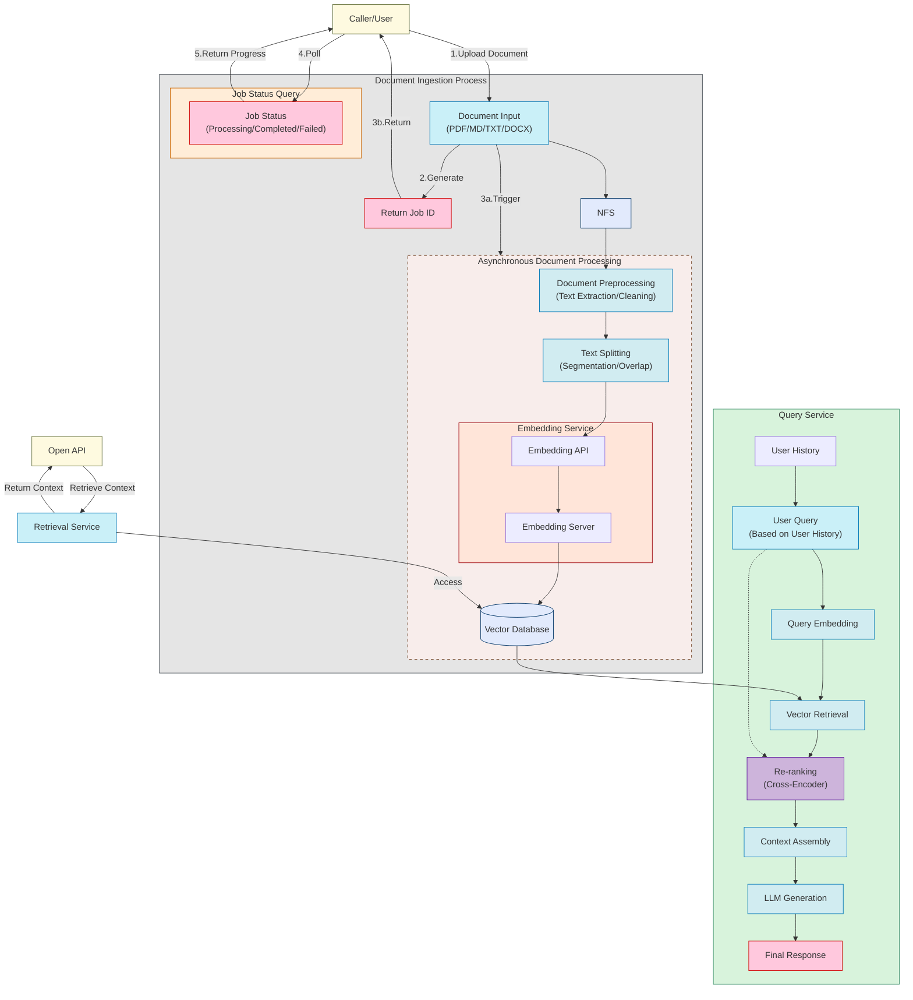

<div align="center">
  
  <br />
  <p>
    <strong>Knowledge Base Management Based on RAG (Retrieval-Augmented Generation)</strong>
  </p>

  <p>
    <a href="https://github.com/rag-web-ui/rag-web-ui/blob/main/LICENSE"></a>
    <a href="#"></a>
    <a href="#"></a>
    <a href="#"></a>
    <a href="#"></a>
  </p>

  <p>
    <a href="#features">Features</a> •
    <a href="#quick-start">Quick Start</a> •
    <a href="#rag-evaluation">RAG Evaluation</a> •
    <a href="#deployment-guide">Deployment</a> •
    <a href="#architecture">Architecture</a> •
    <a href="#development">Development</a> •
    <a href="#contributing">Contributing</a>
  </p>
</div>

## 📖 Introduction
RAG Web UI is an intelligent dialogue system based on RAG (Retrieval-Augmented Generation) technology that helps build intelligent Q&A systems based on your own knowledge base. By combining document retrieval and large language models, it achieves accurate and reliable knowledge-based question answering services.

The system supports multiple **LLM** deployment options, including cloud services like **OpenAI** and **DeepSeek**, as well as local model deployment through **Ollama**, meeting privacy and cost requirements in different scenarios.

It also provides OpenAPI interfaces for convenient knowledge base access via API calls.

## ✨ Features
- 📚 **Intelligent Document Management**
  - Support for multiple document formats (PDF, DOCX, Markdown, Text)
  - Automatic document chunking and vectorization
  - Support for async document processing and incremental updates

- 🤖 **Advanced Dialogue Engine**
  - Precise retrieval and generation based on RAG
  - Support for multi-turn contextual dialogue
  - Support for reference citations in conversations

- 🎯 **Robust Architecture**
  - Frontend-backend separation design

## 🖼️ Screenshots

<div align="center">
  
  <p><em>Knowledge Base Management Dashboard</em></p>

  
  <p><em>Document Processing Dashboard</em></p>

  
  <p><em>Document List</em></p>

  
  <p><em>Intelligent Chat Interface with References</em></p>

  
  <p><em>API Key Management</em></p>

  
  <p><em>API Reference</em></p>
</div>


## ✨ Prompt Service & Dynamic Prompt Support

We’ve introduced a dynamic Prompt Service that centralizes and simplifies prompt management. Prompts are now stored in the database, versioned, and editable without code changes—enabling flexible tuning, fallback defaults, and future admin support.

👉 See full prompt service documentation » [PROMPT_SERVICE.md](PROMPT_SERVICE.md)


## 🔬 RAG Evaluation

Evaluate your RAG pipeline performance using RAGAS metrics with the built-in evaluation system.

```bash
# Start evaluation dashboard
./rag-evaluate

# Proper shutdown (prevents disk space issues)
./rag-evaluate-stop
# or use Ctrl-C (now handles cleanup automatically)
```

**⚠️ Important**: Always use proper shutdown methods. Improper termination can accumulate 1-2GB of Docker artifacts per session.

For complete evaluation documentation: [`backend/RAG_evaluation/README.md`](backend/RAG_evaluation/README.md)

 ##  Project Flowchart



## 🚀 Quick Start

### Prerequisites

- Docker & Docker Compose v2.0+
- Node.js 18+
- Python 3.9+
- 8GB+ RAM

### Installation

1. Clone the repository
```bash
git clone https://github.com/rag-web-ui/rag-web-ui.git
cd rag-web-ui
```

2. Configure environment variables

You can check the details in the configuration table below.

```bash
cp .env.example .env
```

3. Start services(development server)
```bash
docker compose up -d --build
```

### Verification

Access the following URLs after service startup:

- 🌐 Frontend UI: http://127.0.0.1.nip.io
- 📚 API Documentation: http://127.0.0.1.nip.io/docs

## 🔌 MCP Server Setup (Required)

RAG Web UI now depends on a running **MCP (Model Context Protocol) server** for querying knowledge bases. This server provides the **knowledge base query layer** for RAG Web UI. Without it, the application will not function correctly.

### 1. MCP Server Repository

We use the [Vector Knowledge Base MCP Server](https://github.com/akvo/vector-knowledge-base-mcp-server/). Please follow the installation guide in that repository to set up and run the MCP server.

### 2. Environment Variables

In your `.env` file, configure the MCP server connection:

```env
# MCP Servers config
KNOWLEDGE_BASES_MCP=https://api.knowledge.example.com/mcp/
KNOWLEDGE_BASES_API_KEY=supersecretapikey
KNOWLEDGE_BASES_API_ENDPOINT=https://api.knowledge.example.com
```

- `KNOWLEDGE_BASES_MCP` → MCP base URL (server endpoint)
- `KNOWLEDGE_BASES_API_KEY` → API key for authentication
- `KNOWLEDGE_BASES_API_ENDPOINT` → API endpoint for queries

### 3. Verification

By default, the MCP server runs on **port 8100**. After starting both the MCP server and RAG Web UI, confirm connectivity:

```bash
curl http://127.0.0.1:8100/api/health
```

Expected output includes a successful MCP server connection.
You can also test by uploading a document and sending a query in the Web UI.

## ⚙️ Job Processing (Celery + RabbitMQ + Flower)

RAG Web UI supports asynchronous background task processing using Celery, RabbitMQ, and Flower.
This setup enables scalable execution of background jobs such as chat workflows, document embedding, and large knowledge base processing — without blocking FastAPI’s main thread.

**NOTE**: You can find Celery tasks code  under `app.tasks` folder.

### 🧩 Components Overview

| Component       | Description                                                                                            |
| --------------- | ------------------------------------------------------------------------------------------------------ |
| 🐍 **Celery**   | Distributed task queue used for executing long-running jobs (e.g. chat generation, document chunking). |
| 🐇 **RabbitMQ** | Message broker that routes task messages between FastAPI and Celery workers.                           |
| 🌸 **Flower**   | Web-based monitoring UI for tracking Celery workers, tasks, and queues in real-time.                   |


### 🧠 How It Works

1. When an API endpoint (e.g. `/api/apps/jobs`) is called, a Celery task is queued into RabbitMQ.
2. The Celery worker process (running in its own container) listens for new jobs.
3. The worker executes the job asynchronously — for example, running a chat generation workflow or document embedding pipeline.
4. Job progress and results can be monitored in Flower or stored in your internal jobs database table.

This allows you to handle high-volume workloads, parallel processing, and non-blocking user responses.

### 🧰 Environment Configuration

In your `.env` file, add:

```bash
# RABBITMQ CONFIGURATION
RABBITMQ_USER=rabbitmq
RABBITMQ_PASS=rabbitmq
RABBITMQ_HOST=rabbitmq
RABBITMQ_PORT=5672

# FLOWER CONFIGURATION
FLOWER_USER=admin
FLOWER_PASSWORD=admin123
FLOWER_PORT=5555
```

**NOTE**: You don’t need to manually define `CELERY_BROKER_URL` or `CELERY_RESULT_BACKEND`.
They are automatically constructed inside `app/celery_app.py` using the RabbitMQ configuration above.

### 🌼 Monitoring Celery with Flower

Flower provides a **web-based monitoring dashboard** to observe workers and job progress.

**Access Flower Dashboard**
Open: http://127.0.0.1:5555

**Authentication**
Flower is password-protected to prevent unauthorized access.
Use the credentials defined in your `.env` file:

| Variable          | Default    | Description               |
| ----------------- | ---------- | ------------------------- |
| `FLOWER_USER`     | `admin`    | Username for Flower login |
| `FLOWER_PASSWORD` | `admin`    | Password for Flower login |

Login via:

```bash
Username: admin
Password: admin
```

#### 🌸 Flower Interface Overview

After logging in, you can:
1. View Registered Tasks
2. Track Task States
3. Monitor Workers
4. View Task History & Results

#### 🧾 Check Registered Tasks

To verify task registration inside a running container:

```bash
docker compose exec celery-worker celery -A app.celery_app inspect registered
```

Expected output:

```bash
-> celery@worker-name: OK
    * tasks.execute_chat_job_task
```

### 🧹 Debugging Tips

| Problem                            | Possible Cause                           | Solution                                                                                 |
| ---------------------------------- | ---------------------------------------- | ---------------------------------------------------------------------------------------- |
| Task not showing in Flower         | Task not registered or wrong module path | Ensure task module is inside `app/tasks/` and use correct `@celery_app.task(name="...")` |
| `NotRegistered('tasks.add')` error | Worker didn’t load the task              | Restart worker: `docker compose restart celery-worker`                                   |
| Flower not accessible              | Port conflict or container issue         | Check with `docker logs flower` and ensure port `5555` is exposed                        |
| Password not working               | `.env` not loaded correctly              | Rebuild containers after editing `.env`: `docker compose up -d --build`                  |


## 🏗️ Architecture

### Backend Stack

- 🐍 **Python FastAPI**: High-performance async web framework
- 🗄️ **MySQL**: Relational
- 🔗 **Langchain**: LLM application framework
- 🔒 **JWT + OAuth2**: Authentication

### Frontend Stack

- ⚛️ **Next.js 14**: React framework
- 📘 **TypeScript**: Type safety
- 🎨 **Tailwind CSS**: Utility-first CSS
- 🎯 **Shadcn/UI**: High-quality components
- 🤖 **Vercel AI SDK**: AI integration

## 📈 Performance Optimization

The system is optimized in the following aspects:

- ⚡️ Incremental document processing and async chunking
- 🔄 Streaming responses and real-time feedback
- 📑 Vector database performance tuning
- 🎯 Distributed task processing

## 📖 Development Guide

```bash
docker compose -f docker-compose.dev.yml up -d --build
```

## 🔧 Configuration

### Core Configuration

| Parameter                   | Description                | Default   | Required |
| --------------------------- | -------------------------- | --------- | -------- |
| MYSQL_SERVER                | MySQL Server Address       | localhost | ✅        |
| MYSQL_USER                  | MySQL Username             | postgres  | ✅        |
| MYSQL_PASSWORD              | MySQL Password             | postgres  | ✅        |
| MYSQL_DATABASE              | MySQL Database Name        | ragwebui  | ✅        |
| SECRET_KEY                  | JWT Secret Key             | -         | ✅        |
| ACCESS_TOKEN_EXPIRE_MINUTES | JWT Token Expiry (minutes) | 30        | ✅        |


### Celery & RabbitMQ Configuration

| Parameter       | Description                         | Default    | Required |
| --------------- | ----------------------------------- | ---------- | -------- |
| `RABBITMQ_USER` | RabbitMQ username                   | `rabbitmq` | ✅        |
| `RABBITMQ_PASS` | RabbitMQ password                   | `rabbitmq` | ✅        |
| `RABBITMQ_HOST` | RabbitMQ hostname or container name | `rabbitmq` | ✅        |
| `RABBITMQ_PORT` | RabbitMQ port                       | `5672`     | ✅        |

### Flower Monitoring Configuration

| Parameter         | Description               | Default    | Required |
| ----------------- | ------------------------- | ---------- | -------- |
| `FLOWER_USER`     | Flower dashboard username | `admin`    | ✅        |
| `FLOWER_PASSWORD` | Flower dashboard password | `admin`    | ✅        |
| `FLOWER_PORT`     | Port number for Flower UI | `5555`     | ✅        |

### MCP Configuration

| Parameter                    | Description                                | Example Value                          | Required |
| ---------------------------- | ------------------------------------------ | -------------------------------------- | -------- |
| KNOWLEDGE_BASES_MCP          | MCP Base URL (server endpoint)             | https://api.knowledge.example.com/mcp/ | ✅        |
| KNOWLEDGE_BASES_API_KEY      | API key for MCP authentication             | supersecretapikey                      | ✅        |
| KNOWLEDGE_BASES_API_ENDPOINT | MCP API query endpoint (used for requests) | https://api.knowledge.example.com      | ✅        |


### LLM Configuration

| Parameter         | Description           | Default                   | Applicable            |
| ----------------- | --------------------- | ------------------------- | --------------------- |
| CHAT_PROVIDER     | LLM Service Provider  | openai                    | ✅                     |
| OPENAI_API_KEY    | OpenAI API Key        | -                         | Required for OpenAI   |
| OPENAI_API_BASE   | OpenAI API Base URL   | https://api.openai.com/v1 | Optional for OpenAI   |
| OPENAI_MODEL      | OpenAI Model Name     | gpt-4                     | Required for OpenAI   |
| DEEPSEEK_API_KEY  | DeepSeek API Key      | -                         | Required for DeepSeek |
| DEEPSEEK_API_BASE | DeepSeek API Base URL | -                         | Required for DeepSeek |
| DEEPSEEK_MODEL    | DeepSeek Model Name   | -                         | Required for DeepSeek |
| OLLAMA_API_BASE   | Ollama API Base URL   | http://localhost:11434    | Required for Ollama   |
| OLLAMA_MODEL      | Ollama Model Name     | llama2                    | Required for Ollama   |

### Embedding Configuration

| Parameter                   | Description                | Default                | Applicable                    |
| --------------------------- | -------------------------- | ---------------------- | ----------------------------- |
| OPENAI_API_KEY              | OpenAI API Key             | -                      | Required for OpenAI Embedding |
| DASH_SCOPE_API_KEY          | DashScope API Key          | -                      | Required for DashScope        |


### Other Configuration

| Parameter | Description      | Default       | Required |
| --------- | ---------------- | ------------- | -------- |
| TZ        | Timezone Setting | Asia/Shanghai | ❌        |

## Testing

### Backend Testing

The backend uses pytest for testing. All test commands run inside the Docker container and automatically install test dependencies as needed.

#### Prerequisites

Ensure Docker containers are running:

#### Test Commands

**Run All Tests**
```bash
cd backend
./test.sh
```
Runs the complete test suite with verbose output.

**Run Unit Tests Only**
```bash
cd backend
./test-unit.sh
```
Runs only unit tests, excluding integration and end-to-end tests.

**Run Tests in Watch Mode**
```bash
cd backend
./test-watch.sh
```
Continuously runs tests when files change.

## 🤝 Contributing

We welcome community contributions!

### Contribution Process

1. Fork the repository
2. Create a feature branch (`git checkout -b feature/AmazingFeature`)
3. Commit changes (`git commit -m 'Add some AmazingFeature'`)
4. Push to branch (`git push origin feature/AmazingFeature`)
5. Create a Pull Request

### Development Guidelines

- Follow [Python PEP 8](https://pep8.org/) coding standards
- Follow [Conventional Commits](https://www.conventionalcommits.org/)

### 🚧 Roadmap

- [x] Knowledge Base API Integration
- [ ] Workflow By Natural Language
- [ ] Multi-path Retrieval
- [x] Support Multiple Models
- [x] Support Multiple Vector Databases

## 🔧 Troubleshooting

For common issues and solutions, please refer to our [Troubleshooting Guide](docs/troubleshooting.md).

## 📄 License

This project is licensed under the [Apache-2.0 License](LICENSE)

## Note

This project is for learning and sharing RAG knowledge only. Please do not use it for commercial purposes. It is not ready for production use and is still under active development.

## 🙏 Acknowledgments

Thanks to these open source projects:

- [FastAPI](https://fastapi.tiangolo.com/)
- [Langchain](https://python.langchain.com/)
- [Next.js](https://nextjs.org/)


---

<div align="center">
  If this project helps you, please consider giving it a ⭐️
</div>
