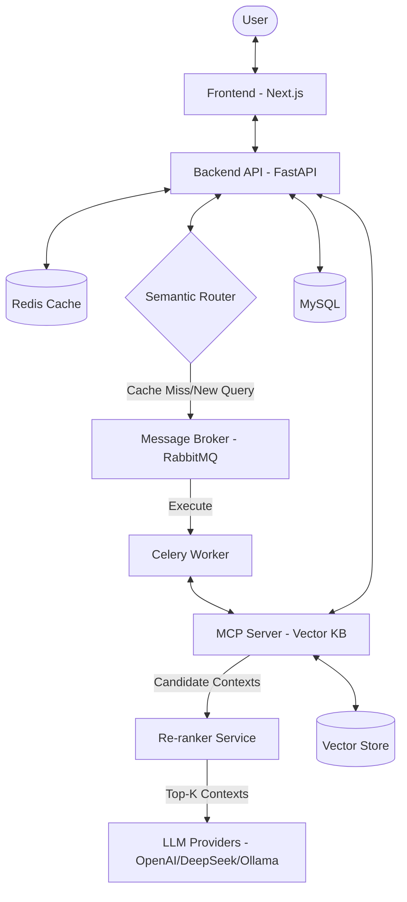

# Architecture: Akvo RAG

## 1. System Overview
Akvo RAG is built on a decoupled, asynchronous architecture designed for scalability and flexibility. It separates the user interface, API coordination, heavy background processing, and vector knowledge management.

## 2. Tech Stack Selection

| Component | Technology | Rationale |
| :--- | :--- | :--- |
| **Frontend** | Next.js 14 | App Router, Server Components, and seamless React integration. |
| **Backend** | FastAPI | High performance, asynchronous by nature, and excellent OpenAPI support. |
| **Caching Layer** | Redis | Crucial for semantic caching to serve repeated queries instantly, minimizing token usage and latency (TTFT). |
| **Database** | MySQL | Reliable relational storage for metadata, user accounts, and prompt templates. |
| **Task Queue** | RabbitMQ + Celery | Robust asynchronous task management and horizontal scalability for workers. |
| **Knowledge Base** | MCP Server | Standardized Model Context Protocol for vector search and document processing. |
| **Re-ranker** | BGE-Reranker / Cohere | Drastically improves context relevance, allowing smaller `top_k` retrieval, saving LLM tokens. |
| **Style** | Tailwind CSS | Rapid UI development with a utility-first approach. |

## 3. Component Design

### 3.1 Backend API (FastAPI)
- **Auth**: JWT-based authentication and Argon2 password hashing.
- **Routers**:
    - `auth`: Login, registration, and token management.
    - `knowledge-base`: Metadata management for KBs.
    - `chat`: Direct query coordination and history.
    - `prompt`: Dynamic Prompt Service for LLM instructions.
    - `websocket`: Real-time communication for streaming and status updates.

### 3.2 Celery Worker & RAG Optimization
- **`upload_task`**: Handles file parsing, chunking, and sending embeddings to the MCP server.
- **`chat_task`**: Coordinates multi-step workflows. **Performance critical**: Limits context window size using strict token counting before hitting the LLM.
- **Semantic Router**: Intercepts queries to check the **Redis Cache** for semantically identical past queries, returning instant results and avoiding LLM costs entirely.
- **Re-ranking**: Post-retrieval filtering that sorts the top 20 VDB results down to the most relevant 3-5 results, severely cutting down on LLM token consumption while boosting accuracy.

### 3.3 MCP Server (External Dependency)
- Provides a unified interface for vector operations.
- Manages the underlying vector database (e.g., Chroma, Qdrant).
- Performs initial rough similarity search before re-ranking.

## 4. Data Flow

### 4.1 Document Ingestion Flow
1. **API**: Receives file upload -> saves to disk -> creates metadata in MySQL.
2. **API**: Dispatches `upload_task` to RabbitMQ.
3. **Worker**: Picks up task -> parses file -> generates chunks.
4. **Worker**: Sends chunks to **MCP Server** for indexing.
5. **Worker**: Updates status in MySQL -> notifies Frontend via WebSocket/Polling.

### 4.2 Optimized RAG Query Flow (High Performance)
1. **API**: Receives question.
2. **API (Semantic Router)**: Checks **Redis Cache** for a semantic match. If hit -> Return instantly.
3. **API**: If miss, calls **MCP Server** to retrieve broad context (`top_k=20`).
4. **Worker/API**: Passes context to **Re-ranker** to filter down to strict, high-value chunk limits (`top_k=5`).
5. **API**: Combines refined context + question + prompt (from Prompt Service).
6. **API**: Sends to **LLM Provider**.
7. **API**: Streams response back to **Frontend** via Server-Sent Events (SSE) for instant Time-to-First-Token (TTFT).
8. **API**: Saves the semantic result asynchronously to Redis for future queries.

## 5. Security Architecture
- **JWT**: All protected endpoints require a valid Bearer token.
- **CORS**: Configured in Nginx/FastAPI to allow only trusted origins.
- **Environment Secrets**: All keys (OpenAI, DB, RabbitMQ) are managed via `.env`.

## 6. Infrastructure & Deployment
- **Docker Compose**: Orchestrates all services (mysql, rabbitmq, backend, worker, frontend, flower, nginx).
- **Nginx**: Acts as a reverse proxy and serves the frontend on port 80.
- **Monitoring**: Flower provides a real-time view of Celery workers and task status.
