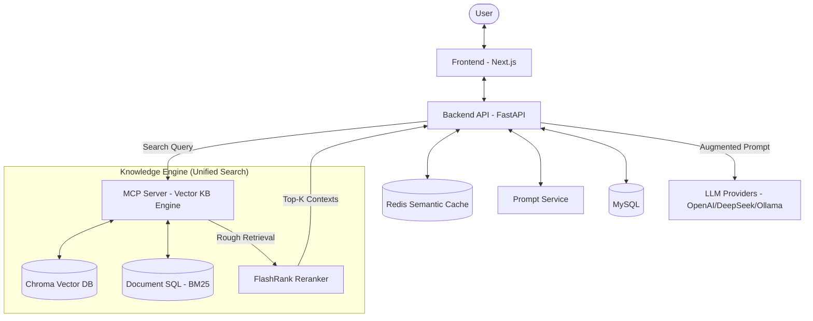

# Architecture: Akvo RAG

## 1. System Overview
Akvo RAG is built on a decoupled, asynchronous architecture designed for scalability and flexibility. It separates the user interface, API coordination, heavy background processing, and vector knowledge management.

## 2. Tech Stack Selection

| Component | Technology | Rationale |
| :--- | :--- | :--- |
| **Frontend** | Next.js 14 | App Router, Server Components, and seamless React integration. |
| **Backend** | FastAPI | High performance, asynchronous by nature, and excellent OpenAPI support. |
| **Caching Layer** | Redis | Crucial for semantic caching to serve repeated queries instantly, minimizing token usage and latency (TTFT). |
| **Database** | MySQL | Reliable relational storage for metadata, user accounts, and prompt templates. |
| **Task Queue** | RabbitMQ + Celery | Robust asynchronous task management and horizontal scalability for workers. |
| **Knowledge Base** | MCP Server | Standardized Model Context Protocol for vector search and document processing. |
| **Re-ranker** | BGE-Reranker / Cohere | Drastically improves context relevance, allowing smaller `top_k` retrieval, saving LLM tokens. |
| **Style** | Tailwind CSS | Rapid UI development with a utility-first approach. |

## 3. Component Design

### 3.1 Backend API (FastAPI)
- **Auth**: JWT-based authentication and Argon2 password hashing.
- **Routers**:
    - `auth`: Login, registration, and token management.
    - `knowledge-base`: Metadata management for KBs.
    - `chat`: Direct query coordination and history.
    - `prompt`: Dynamic Prompt Service for LLM instructions.
    - `websocket`: Real-time communication for streaming and status updates.
- **Intent Classification Node**: Pre-processes queries to distinguish between `knowledge_query`, `small_talk`, and `memory_query`.

### 3.2 Celery Worker & RAG Optimization
- **`upload_task`**: Handles file parsing, chunking, and sending embeddings to the MCP server.
- **`chat_task`**: Coordinates multi-step workflows. **Performance critical**: Limits context window size using strict token counting before hitting the LLM.
- **History Sanitization**: Automatically strips internal base64 context and `__LLM_RESPONSE__` markers from chat history to prevent token limit blow-up.
- **Error-Aware Workflow**: Implements fail-fast logic in the LangGraph coordinator to prevent cascading failures during API or service interruptions.
- **Semantic Router (Cache)**: Intercepts queries to check the **Redis Cache** for semantically identical past queries, returning instant results and avoiding LLM costs entirely.
- **Cache Invalidation Component**: Since `akvo-rag` has exclusive access to the MCP Server, it surgically purges cached semantic answers in Redis exactly at the moment it successfully calls an MCP endpoint to add or delete documents from a Knowledge Base.
- **Re-ranking**: Post-retrieval filtering that sorts the top 20 VDB results down to the most relevant 3-5 results, severely cutting down on LLM token consumption while boosting accuracy.

### 3.3 MCP Server (Unified Knowledge Engine)
- **Parallel Retrieval**: Executes concurrent searches across all assigned Knowledge Bases using `asyncio.gather`.
- **Hybrid Search**: Implements a dual-stream retrieval (Vector similarity + BM25 keyword) for maximum resilience and precision.
- **Server-Side Reranking**: Filters and re-scores candidates using `FlashRank` before returning them to the orchestrator, significantly reducing network payload and client-side processing.
- **Health & Monitoring**: Provides specialized endpoints to verify the connection status of ChromaDB and MinIO.

## 4. Data Flow

### 4.1 Document Ingestion & Cache Invalidation Flow
1. **API**: Receives file upload -> saves to disk -> creates metadata in MySQL.
2. **API**: Dispatches `upload_task` to RabbitMQ.
3. **Worker**: Picks up task -> parses file -> generates chunks.
4. **Worker**: Sends chunks to **MCP Server** for indexing.
5. **Worker**: **CRITICAL**: Upon successful indexing, the worker sends a purge command to **Redis** to clear all cached semantic answers tagged with this KB ID.
6. **Worker**: Updates status in MySQL -> notifies Frontend via WebSocket/Polling.

### 4.2 Optimized RAG Query Flow (High Performance)
1. **API (Semantic Cache)**: Intercepts query; checks **Redis** for 0.95+ semantic match. If hit -> Return instantly (`~300ms`).
2.  **API (Status Streaming)**: If miss, initiates SSE stream with progress markers (e.g., `event: searching`).
3.  **API/MCP (Parallel Hybrid Search)**: Calls MCP Engine to retrieve candidates from multiple KBs simultaneously using both Vector and BM25 streams.
4. **MCP (Reranking)**: Filters candidates down to the global `TOP_K` (from System Settings) using local `FlashRank`.
5. **API**: Combines refined context + history + current settings.
6. **API**: Streams LLM tokens back to Frontend.
7. **API**: Saves the final result asynchronously to **Redis** for future high-confidence hits.

## 5. Security Architecture
- **JWT**: All protected endpoints require a valid Bearer token.
- **CORS**: Configured in Nginx/FastAPI to allow only trusted origins.
- **Environment Secrets**: All keys (OpenAI, DB, RabbitMQ) are managed via `.env`.

## 6. Infrastructure & Deployment
- **Docker Compose**: Orchestrates all services (mysql, rabbitmq, backend, worker, frontend, flower, nginx).
- **Nginx**: Acts as a reverse proxy and serves the frontend on port 80.
- **Monitoring**: Flower provides a real-time view of Celery workers and task status.
