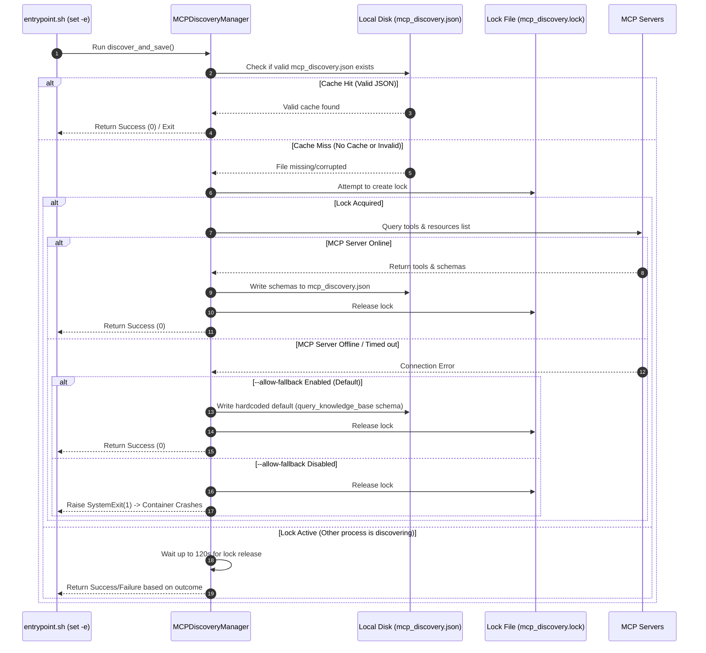

# Feature Documentation: MCP Discovery Mechanism

## 1. Overview
The **MCP Discovery Manager** (`mcp_clients.mcp_discovery_manager`) is a critical startup component of the Akvo RAG backend. It acts as an abstraction and caching layer between the FastAPI application/Celery workers and external Model Context Protocol (MCP) servers (such as `knowledge_bases_mcp` and `weather_mcp`).

Instead of querying the MCP servers directly during every user query (which introduces latency and coupling), the application queries them once at startup, validates their tool schemas, and caches the result in a shared JSON file (`mcp_discovery.json`). The **Scoping Agent** uses this cached schema to guide the LLM's tool calls and validate inputs before execution.

---

## 2. Discovery Lifecycle and Data Flow

The following sequence diagram outlines the startup check, locking, discovery, and fallback mechanism:



---

## 3. Key Design Components

### 3.1 Lock File Protocol (`mcp_discovery.lock`)
To prevent race conditions during Docker compose scaling (e.g., when the `backend` and multiple `celery_worker` containers start simultaneously and attempt to execute discovery concurrently), the manager implements a cooperative filesystem lock:
- **Acquiring Lock**: Creates a file called `mcp_discovery.lock`.
- **Lock Timeout**: Locks are considered stale after **300 seconds** to prevent deadlocks if a container crashes mid-discovery.
- **Lock Contention**: If a container finds an active lock, it blocks and polls the disk every 2 seconds (up to 120 seconds timeout) waiting for the file to disappear.

### 3.2 Schema Validation
Before writing the cached discovery definitions, the manager strictly validates that the response contains:
- `tools`: A dictionary mapping server names to a list of tools.
- `resources`: A dictionary mapping server names to a list of resources.
- Every tool entry must have `name`, `description`, and a valid JSON Schema object under `inputSchema`.

### 3.3 Fallback Mode (Fail-Safe)
If the backend is started while the core MCP server is offline, the manager falls back (when `--allow-fallback` is set) to writing a hardcoded template for the **`knowledge_bases_mcp`** server, allowing the backend to boot.
- This template defines the minimum query tool: `query_knowledge_base`.
- This ensures the Scoping Agent doesn't crash on boot, and can still initialize its system prompts.

---

## 4. Developer Cheat Sheet

### Force Rediscovery
To bypass the cached file and force the system to query active MCP servers (e.g., when you register new tools/servers):
```bash
./dev.sh exec backend python -m mcp_clients.mcp_discovery_manager --force
```

### Inspect Cached Schemas
To inspect the cached tools, view the cached file on the backend filesystem:
```bash
# View all available tools and resources recognized by the Scoping Agent
cat backend/mcp_discovery.json
```

### Debugging Startup Crashes
If the backend container keeps crashing on start with exit code 1, check the compose logs. It usually means:
1. The MCP servers are offline.
2. `--allow-fallback` was disabled or the fallback schema failed validation.
3. The lock file (`mcp_discovery.lock`) was left behind by a terminated session (delete the lock file manually to resolve).
