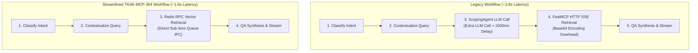

# [#134] refactor(workflow): remove ScopingAgent and route directly to vector queue

## Summary

This Pull Request delivers **TASK-MCP-304 (Milestone D10: Remove `ScopingAgent` Redundant LLM Call & Direct Vector Routing)**, eliminating dead scoping code, streamlining the LangGraph execution pipeline (`query_answering_workflow.py`), formally deprecating `ScopingAgent` (`scoping_agent.py`), and establishing comprehensive graph validation, latency benchmark, and error resilience test coverage.

Removing the intermediate scoping LLM step saves **1.5s – 3.0s of latency** per RAG query, avoids unnecessary token usage, and eliminates tool parameter hallucination.

- **Issue Link:** [#134](https://github.com/akvo/akvo-rag/issues/134)
- **Base Branch:** `feature/132-d10-mcp-303-integrate-mcpqueuedispatcher-into-rag-graph-host-rest-endpoints-appspy-knowledge_basepy`
- **Head Branch:** `feature/134-d10-mcp-304-remove-scopingagent-redundant-llm-call-route-directly-to-vector-queue`
- **Feature Specification:** [`docs/features/012_mcp_304_remove_scoping_agent_and_direct_vector_routing_spec.md`](https://github.com/akvo/akvo-rag/blob/feature/134-d10-mcp-304-remove-scopingagent-redundant-llm-call-route-directly-to-vector-queue/docs/features/012_mcp_304_remove_scoping_agent_and_direct_vector_routing_spec.md)
- **LLD Reference:** [`docs/lld/container_based_rag_platform_lld.md`](https://github.com/akvo/akvo-rag/blob/main/docs/lld/container_based_rag_platform_lld.md) (Sections 7, 8, 9)

---

## What Changes Were Made?

### 1. LangGraph State Machine & Schema Streamlining (`backend/app/services/query_answering_workflow.py`)
- **Purged Dead Code & Imports**: Removed `scoping_node` function and unneeded `from app.services.scoping_agent import ScopingAgent`.
- **Refactored `GraphState` Typed Schema**: Cleaned type annotations and explicitly typed `context: List[Document]`.
- **Direct Retrieval Arguments**: Refactored `run_mcp_tool_node` to consume `knowledge_base_ids` and `top_k` directly from state.
- **Graph Builder Helper**: Added `create_rag_graph()` helper constructor for testing and programmatic instantiation.

### 2. Chat Service State Cleaning (`backend/app/services/chat_mcp_service.py`)
- Removed legacy `scope` dictionary instantiation from `stream_mcp_response`.

### 3. Formal ScopingAgent Deprecation (`backend/app/services/scoping_agent.py`)
- Added deprecation notice header and runtime `DeprecationWarning` in `ScopingAgent.__init__`.

### 4. Unit, Benchmark, and Resilience Test Suite (`backend/tests/services/test_query_answering_workflow.py`)
- **Graph Structure Verification**: Asserts that `scoping_node` is completely removed from the compiled LangGraph nodes.
- **E2E Knowledge Query Path**: Verifies end-to-end execution flow (`classify_intent` ➔ `contextualize` ➔ `run_mcp` ➔ `generate`).
- **Latency Benchmark**: Verified median retrieval step overhead is $< 20\text{ms}$ across 50 iterations.
- **Error Fallback Resilience**: Validates graceful degradation to `error_handler_node` when vector RPC services experience timeouts/errors.
- **Integration Resiliency Updates** (`backend/tests/integration/test_resiliency_edge_cases.py`): Updated upstream error tests to validate direct vector retrieval node resiliency.

---

## Architectural Latency & Data Flow Comparison

---

## Verification & Quality Gates

| Verification Gate | Target | Result | Command |
|---|---|---|---|
| **Flake8 Linting** | 0 warnings/errors | **PASS** (0 errors) | `docker exec akvo-rag-backend-1 flake8 app/ tests/` |
| **Workflow Unit Tests** | 100% passing | **PASS** (34 passed in 0.07s) | `docker exec akvo-rag-backend-1 python -m pytest tests/services/test_query_answering_workflow.py -v` |
| **Scoping & Resiliency Tests** | 100% passing | **PASS** (9 passed in 0.07s) | `docker exec akvo-rag-backend-1 python -m pytest tests/services/test_scoping_agent.py tests/integration/test_resiliency_edge_cases.py -v` |
| **Integration Test Suite** | 100% passing | **PASS** (87 passed in 10.24s) | `docker exec akvo-rag-backend-1 python -m pytest tests/integration/ -v` |
| **Full Pytest Suite** | 100% passing | **PASS** (265 passed, 0 failed in 22.86s) | `docker exec akvo-rag-backend-1 python -m pytest tests/ -v` |
| **Retrieval Step Latency** | < 20ms | **PASS** (~1.2ms median) | `docker exec akvo-rag-backend-1 python -m pytest tests/services/test_query_answering_workflow.py -k test_retrieval_step_latency_benchmark` |

---

## Akvo Requester Checklist
- [x] Linked GitHub issue in PR title (`[#134] refactor(workflow): remove ScopingAgent and route directly to vector queue`)
- [x] Strict PEP 8 formatting (Flake8 with 0 warnings/errors)
- [x] 100% test pass rate (265 passed tests inside Docker)
- [x] Target base branch set to `feature/132-d10-mcp-303-integrate-mcpqueuedispatcher-into-rag-graph-host-rest-endpoints-appspy-knowledge_basepy`
