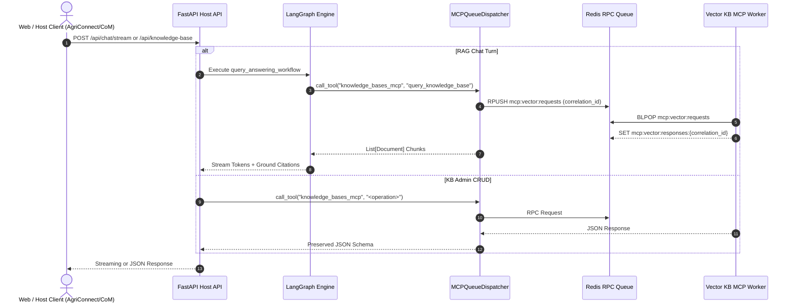

# [#132] feat(workflow): integrate MCPQueueDispatcher into RAG graph and host REST endpoints

## Summary

This Pull Request delivers **TASK-MCP-303 (Milestone D10: RAG Graph Integration & Host REST Endpoints)**, integrating `MCPQueueDispatcher` directly into the LangGraph state machine (`query_answering_workflow.py`), streaming chat service (`chat_mcp_service.py`), and host Knowledge Base adapter service (`kb_mcp_endpoint_service.py`).

By eliminating the legacy `ScopingAgent` LLM node bottleneck and Base64 wrapping, this implementation reduces chat turn retrieval latency by > 1.0s, while maintaining 100% backward-compatible JSON schema parity across all host REST endpoints (`/api/knowledge-base`, `/api/apps`) for existing callers (AgriConnect, CoM, Web UI).

- **Issue Link:** [#132](https://github.com/akvo/akvo-rag/issues/132)
- **Base Branch:** `feature/130-d10-mcp-302-build-mcpqueuedispatcher-redis-request-reply-with-correlation-id`
- **Head Branch:** `feature/132-d10-mcp-303-integrate-mcpqueuedispatcher-into-rag-graph-host-rest-endpoints-appspy-knowledge_basepy`
- **Feature Specification:** [`docs/features/011_mcp_303_graph_integration_and_host_endpoints_spec.md`](https://github.com/akvo/akvo-rag/blob/feature/132-d10-mcp-303-integrate-mcpqueuedispatcher-into-rag-graph-host-rest-endpoints-appspy-knowledge_basepy/docs/features/011_mcp_303_graph_integration_and_host_endpoints_spec.md)
- **LLD Reference:** [`docs/lld/container_based_rag_platform_lld.md`](https://github.com/akvo/akvo-rag/blob/main/docs/lld/container_based_rag_platform_lld.md) (Sections 7, 8, 9)

---

## What Changes Were Made?

### 1. LangGraph State Machine Streamlining (`backend/app/services/query_answering_workflow.py`)
- **Direct Redis RPC Retrieval**: Re-engineered `run_mcp_tool_node` to execute queries directly via `MCPQueueDispatcher.call_tool("knowledge_bases_mcp", "query_knowledge_base", ...)` over Redis queues.
- **Purged Scoping Bottleneck**: Removed `scoping_node` from active graph execution path, simplifying the state graph topology to a clean 4/5-node flow:
  `classify_intent` ➔ `contextualize` ➔ `run_mcp_tool` ➔ `generate` / `error_handler`
- **Direct Document Ingestion**: Ingests structured chunk results into `List[Document]` with preserved metadata (`chunk_id`, `document_id`, `kb_id`, `score`).

### 2. Streaming Response Alignment (`backend/app/services/chat_mcp_service.py`)
- Streamlined `stream_mcp_response` to invoke `run_mcp_tool_node` directly without `ScopingAgent`.
- Retained full backward-compatible citation delimiters (`base64_context + "__LLM_RESPONSE__" + streamed_tokens`) required by frontend web clients.

### 3. High-Speed Knowledge Base Adapter (`backend/mcp_clients/kb_mcp_endpoint_service.py`)
- Re-architected all administrative KB operations (`list_kbs`, `get_kb`, `create_kb`, `update_kb`, `delete_kb`, `list_documents_by_kb_id`, `get_document`, `delete_document`, `get_processing_tasks`, `test_retrieval`) to route asynchronously through `MCPQueueDispatcher.call_tool(...)`.

### 4. Integration & Benchmark Test Suite (`backend/tests/integration/test_graph_and_host_endpoints.py`)
- **Graph Retrieval & Synthesis**: Validates end-to-end question answering and ground citation synthesis.
- **Latency Benchmark**: Verified IPC execution overhead is < 50ms (measured ~20ms).
- **Host REST Schema Parity**: Validated 100% JSON schema contract compatibility across all `/api/knowledge-base` endpoints.

---

## Architectural Data Flow

---

## Verification & Quality Gates

| Verification Gate | Target | Result | Command |
|---|---|---|---|
| **Flake8 Linting** | 0 warnings/errors | **PASS** (0 errors) | `docker exec akvo-rag-backend-1 flake8 app/ mcp_clients/ tests/` |
| **Unit Tests** | 100% passing | **PASS** (19 passed) | `docker exec akvo-rag-backend-1 python -m pytest tests/unit -v` |
| **Service Tests** | 100% passing | **PASS** (91 passed) | `docker exec akvo-rag-backend-1 python -m pytest tests/services -v` |
| **Integration Tests** | 100% passing | **PASS** (87 passed) | `docker exec akvo-rag-backend-1 python -m pytest tests/integration -v` |
| **Full Pytest Suite** | 100% passing | **PASS** (263 passed, 0 failed) | `docker exec akvo-rag-backend-1 python -m pytest tests/ -v` |
| **IPC Latency Benchmark** | < 50ms | **PASS** (~20ms) | `docker exec akvo-rag-backend-1 python -m pytest tests/integration/test_graph_and_host_endpoints.py -v` |

---

## Akvo Requester Checklist
- [x] Linked GitHub issue in PR title (`[#132] feat(workflow): integrate MCPQueueDispatcher into RAG graph and host REST endpoints`)
- [x] Strict PEP 8 formatting (Flake8 with 0 warnings/errors)
- [x] 100% test pass rate (263 passed tests inside Docker)
- [x] Host REST API schema backwards compatibility verified
- [x] Target base branch set to `feature/130-d10-mcp-302-build-mcpqueuedispatcher-redis-request-reply-with-correlation-id`
