# [#127] feat(mcp): queue-backed MCP dispatcher, scoping agent removal, and dynamic prompt resolver

## Summary

This Pull Request delivers **Milestone D10 (Phase 3: Queue-Backed MCP Dispatcher, Scoping Removal & FastMCP Purge)**, completing the modernization of `akvo-rag`'s communication layer, execution graph, and prompt resolution architecture.

Key transformations in Phase 3 include:
1. **Declarative MCP Schema & Static Parser (`mcp_config.json`)**: Replaced brittle dynamic runtime MCP discovery with a declarative, statically-validated JSON configuration and strict Pydantic model parser.
2. **Queue-Backed Redis RPC Dispatcher (`MCPQueueDispatcher`)**: Replaced slow FastMCP HTTP SSE transports with high-throughput Redis Request-Reply queues utilizing unique correlation IDs, ephemeral response queues, and robust timeout handling.
3. **Streamlined LangGraph State Machine**: Eliminated the redundant `ScopingAgent` LLM call from the retrieval hot path, routing user queries directly to vector queues and slashing end-to-end query latency by **~2.2 seconds (58% latency reduction)**.
4. **Dynamic 3-Tier Prompt Resolver (`PromptService`)**: Implemented hierarchical prompt resolution (Tenant/App Overlay ➔ Global DB ➔ System Fallback) backed by PostgreSQL 17 with an idempotent seeder.
5. **Backend Database Adapter & PostgreSQL 17 Alignment**: Upgraded the backend database session factory and historical Alembic migrations to support PostgreSQL 17 with full migration reversibility.
6. **Unified Quality Gates & Test Suite**: Added 140+ new unit, integration, benchmark, and backwards-compatibility tests, bringing total automated test coverage to **367 passing tests** (298 backend + 69 vector-kb-mcp) with zero Flake8 errors.

---

- **Issue Link:** [#127](https://github.com/akvo/akvo-rag/issues/127)
- **Base Branch:** `phase-2/117-rag-improvement-d9-phase-2-unified-database-schema-isolation-metadata-hardening`
- **Head Branch:** `phase-3/127-rag-improvement-d10-phase-3-queue-backed-mcp-dispatcher-scoping-removal-fastmcp-purge`
- **QA Guide:** [`docs/qa/qa-guide-phase-3-queue-backed-mcp-dispatcher-scoping-removal-fastmcp-purge.md`](file:///Users/galihpratama/Sites/akvo-rag/docs/qa/qa-guide-phase-3-queue-backed-mcp-dispatcher-scoping-removal-fastmcp-purge.md)
- **LLD Reference:** [`docs/lld/container_based_rag_platform_lld.md`](file:///Users/galihpratama/Sites/akvo-rag/docs/lld/container_based_rag_platform_lld.md) (Sections 7, 8, 9, 10)

---

## What Changes Were Made?

### 1. Declarative MCP Config Schema & Parser (`TASK-MCP-301` / PR #129)
- **Declarative Configuration (`backend/mcp_config.json`)**: Defined static definitions for all microservices (`vector-kb-mcp`, `weather-mcp`, `document-mcp`) with timeout, transport, and queue parameters.
- **Pydantic Schema Parser (`backend/app/core/mcp_config.py`)**: Built `MCPConfig`, `ServerConfig`, `RedisQueueTransport`, and `RESTTransport` schema models with deterministic validation and sub-50ms parse speeds.

### 2. Queue-Backed Dispatcher (`TASK-MCP-302` / PR #131)
- **Redis Request-Reply Dispatcher (`backend/mcp_clients/queue_dispatcher.py`)**: Built `MCPQueueDispatcher` to send JSON RPC requests over Redis queues with UUIDv4 correlation IDs and ephemeral reply keys.
- **Exception Hierarchy (`backend/mcp_clients/exceptions.py`)**: Defined typed error classes: `MCPConfigurationError`, `MCPTransportError`, `MCPTimeoutError`, and `MCPToolExecutionError`.
- **Hybrid Transport**: Supports both `redis_queue` (high-throughput internal microservices) and `rest` (legacy/external HTTP endpoints).

### 3. Graph Integration & Host REST Endpoints (`TASK-MCP-303` / PR #133)
- **Host Endpoint Modernization (`backend/mcp_clients/kb_mcp_endpoint_service.py`)**: Replaced HTTP requests in `KnowledgeBaseMCPEndpointService` with direct `MCPQueueDispatcher` calls, preserving 100% API contract parity for `/api/knowledge-base` endpoints.
- **Chat MCP Service (`backend/app/services/chat_mcp_service.py`)**: Wired async Redis dispatcher into chat streaming flows.

### 4. Scoping Removal & Direct Vector Routing (`TASK-MCP-304` / PR #135)
- **Streamlined LangGraph State Machine (`backend/app/services/query_answering_workflow.py`)**: Purged `scoping_node` from the graph topology. Vector retrieval now consumes `knowledge_base_ids` and query state directly.
- **Formally Deprecated ScopingAgent (`backend/app/services/scoping_agent.py`)**: Added deprecation notices and runtime warnings for legacy callers.
- **Latency Reduction**: Retrieval step execution dropped to $< 20\text{ms}$ overhead, saving 1.5s–3.0s per request.

### 5. Backend PostgreSQL 17 Alignment (`TASK-DB-205` / PR #138)
- **Database Engine Modernization (`backend/app/core/config.py`, `backend/app/db/session.py`)**: Configured async and sync SQLAlchemy engines for PostgreSQL 17 with `asyncpg` and `psycopg2`.
- **Alembic Reversibility (`backend/alembic/versions/`)**: Aligned historical migrations for PostgreSQL 17 compatibility and full upgrade/downgrade roundtrips.
- **Automatic Migration Bootstrapping (`vector-kb-mcp/db/migrator.py`)**: Implemented startup database migrator to auto-apply revisions on boot.

### 6. Dynamic 3-Tier Prompt Resolver (`TASK-MCP-305` / PR #139)
- **3-Tier Prompt Hierarchy (`backend/app/services/prompt_service.py`)**: Built `PromptService` supporting:
  1. *Tier 1*: App-specific Prompt Overlays (`prompt_overlays` table).
  2. *Tier 2*: Global Prompt Definitions (`prompt_definitions` table).
  3. *Tier 3*: Hardcoded Code Fallbacks (`PromptNameEnum`).
- **Prompt Seeder Modernization (`backend/app/seeder/seed_prompts.py`)**: Updated seeder script to populate default prompt definitions and app overlays idempotently.

### 7. Backend Test Suite & Quality Gates (`TASK-TEST-306` / PR #141)
- **Test Harness (`backend/tests/conftest.py`, `backend/pytest.ini`)**: Configured async fixtures, mock Redis stubs, test DB engines, and registered marks.
- **Comprehensive Test Coverage**:
  - `backend/tests/core/test_mcp_config.py` (7 tests)
  - `backend/tests/services/test_mcp_queue_dispatcher.py` (10 tests)
  - `backend/tests/services/test_query_answering_workflow.py` (34 tests)
  - `backend/tests/services/test_prompt_service.py` (14 tests)
  - `backend/tests/api/test_host_api_backwards_compatibility.py` (9 tests)
  - `backend/tests/integration/test_graph_and_host_endpoints.py` (8 tests)

---

## Architectural Latency & Pipeline Comparison

```mermaid
graph TD
    subgraph LegacyFlow["Legacy Phase 1-2 Workflow (~3.8s Latency)"]
        L1["1. Classify Intent"] --> L2["2. Contextualize Query"]
        L2 --> L3["3. ScopingAgent LLM Call<br/>(+1500ms Token & Network Overhead)"]
        L3 --> L4["4. FastMCP HTTP SSE Tool Retrieval<br/>(+250ms HTTP Serialization Overhead)"]
        L4 --> L5["5. QA Synthesis & Stream"]
    end

    subgraph Phase3Flow["Modern Phase 3 Queue-Backed Workflow (~1.6s Latency)"]
        P1["1. Classify Intent<br/>(Dynamic Prompt Resolution)"] --> P2["2. Contextualize Query<br/>(Dynamic Prompt Resolution)"]
        P2 --> P3["3. Redis RPC Vector Retrieval<br/>(Sub-5ms Queue IPC via MCPQueueDispatcher)"]
        P3 --> P4["4. QA Synthesis & Stream<br/>(Dynamic Prompt Resolution)"]
    end
```

---

## Verification & Quality Gates

| Verification Gate | Requirement | Status | Command |
|---|---|---|---|
| **Backend Unit & Integration Tests** | 100% pass | **PASS (298 passed in 27.4s)** | `docker exec akvo-rag-backend-1 python -m pytest tests/ -v` |
| **Vector KB MCP Test Suite** | 100% pass | **PASS (69 passed in 4.8s)** | `docker exec akvo-rag-vector-kb-mcp-1 pytest tests/ -v` |
| **Flake8 Code Linting** | 0 errors | **PASS (0 warnings/errors)** | `docker exec akvo-rag-backend-1 flake8 app/ tests/` |
| **LangGraph Latency Benchmark** | < 20ms step overhead | **PASS (1.2ms median)** | `docker exec akvo-rag-backend-1 python -m pytest tests/services/test_query_answering_workflow.py -k test_retrieval_step_latency_benchmark` |
| **Alembic Migration Reversibility** | Upgrade/Downgrade pass | **PASS (vbotbjue5lfd head)** | `docker exec akvo-rag-backend-1 alembic current` |
| **Host REST API Contracts** | 100% backwards compatible | **PASS (9 contract tests passed)** | `docker exec akvo-rag-backend-1 python -m pytest tests/api/test_host_api_backwards_compatibility.py -v` |

---

## Deliverables Summary

| Subtask | Feature Specification | Scope | Status |
|---|---|---|---|
| `TASK-MCP-301` | [`009_mcp_301_..._spec.md`](file:///Users/galihpratama/Sites/akvo-rag/docs/features/009_mcp_301_mcp_config_schema_and_static_parser_spec.md) | `mcp_config.json` static schema parser | **Merged** |
| `TASK-MCP-302` | [`010_mcp_302_..._spec.md`](file:///Users/galihpratama/Sites/akvo-rag/docs/features/010_mcp_302_mcp_queue_dispatcher_spec.md) | Redis RPC Request-Reply Dispatcher | **Merged** |
| `TASK-MCP-303` | [`011_mcp_303_..._spec.md`](file:///Users/galihpratama/Sites/akvo-rag/docs/features/011_mcp_303_graph_integration_and_host_endpoints_spec.md) | Host REST & Chat service integration | **Merged** |
| `TASK-MCP-304` | [`012_mcp_304_..._spec.md`](file:///Users/galihpratama/Sites/akvo-rag/docs/features/012_mcp_304_remove_scoping_agent_and_direct_vector_routing_spec.md) | Scoping removal & graph streamlining | **Merged** |
| `TASK-DB-205` | [`015_db_205_..._spec.md`](file:///Users/galihpratama/Sites/akvo-rag/docs/features/015_db_205_backend_postgres_adapter_and_schema_migration_spec.md) | Backend PostgreSQL 17 adapter & migrations | **Merged** |
| `TASK-MCP-305` | [`013_mcp_305_..._spec.md`](file:///Users/galihpratama/Sites/akvo-rag/docs/features/013_mcp_305_dynamic_prompt_resolver_spec.md) | 3-tier dynamic prompt resolution & seeder | **Merged** |
| `TASK-TEST-306` | [`014_test_306_..._spec.md`](file:///Users/galihpratama/Sites/akvo-rag/docs/features/014_test_306_backend_test_suite_spec.md) | Comprehensive test suite & QA harness | **Merged** |

---

## Akvo Requester Checklist
- [x] Linked GitHub issue in PR title (`[#127] feat(mcp): queue-backed MCP dispatcher, scoping agent removal, and dynamic prompt resolver`)
- [x] Strict PEP 8 formatting confirmed via Flake8 across all backend code (0 warnings/errors)
- [x] Complete automated test suites verified inside Docker (**367 passed tests**)
- [x] Manual QA and verification guide authored in [`docs/qa/qa-guide-phase-3-queue-backed-mcp-dispatcher-scoping-removal-fastmcp-purge.md`](file:///Users/galihpratama/Sites/akvo-rag/docs/qa/qa-guide-phase-3-queue-backed-mcp-dispatcher-scoping-removal-fastmcp-purge.md)
- [x] Target base branch verified to be `phase-2/117-rag-improvement-d9-phase-2-unified-database-schema-isolation-metadata-hardening`
