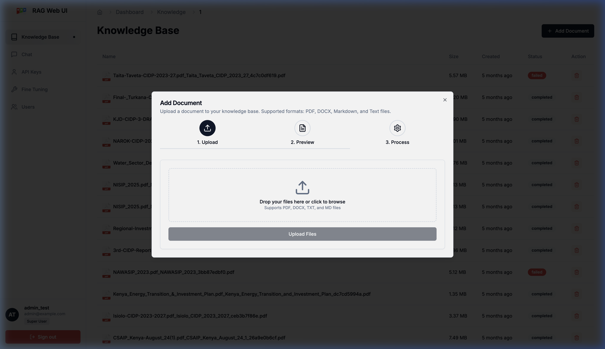
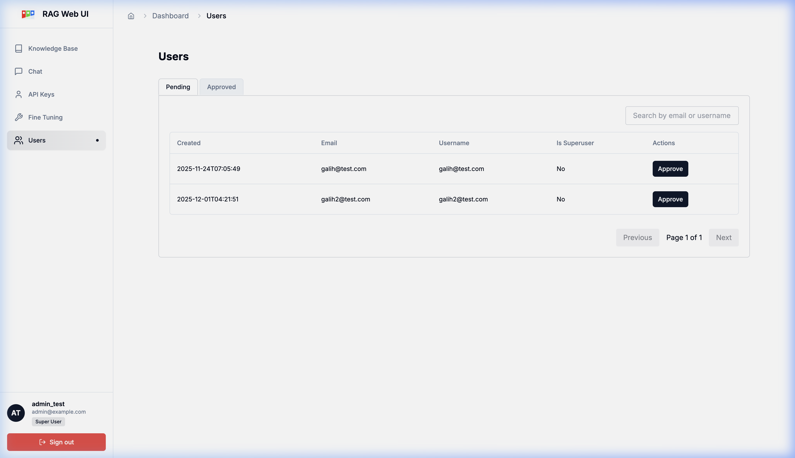

# Admin Guide: Akvo RAG

This guide is intended for administrators who manage the Knowledge Bases and users within Akvo RAG.

## 1. Knowledge Base Management

The Knowledge Base (KB) is the core of the RAG system. It contains the documents that the AI uses to answer questions.

### 1.1 Creating a Knowledge Base
1.  **Access Knowledge Base Page**: Ensure you are on the **Knowledge Base** management page (accessible via the sidebar).
2.  **Initialize New KB**: Click the **"New Knowledge Base"** button at the top right of the list.
3.  **Configure Settings**:
    *   **Name**: Provide a clear, descriptive title.
    *   **Description**: Briefly explain the content. This helps the AI understand the context of the documents.
    *   **Privacy**: Set to **Public** for team-wide access or **Private** for restricted projects.
4.  **Save**: Click **"Create"** to initialize the vector storage and database entries.

### 1.2 Data Ingestion (Uploading Documents)
Adding documents is a multi-step process that ensures your data is correctly parsed and indexed.

1.  **Select a KB**: Click on a Knowledge Base from the list (e.g., "TDT Library").
2.  **Open Upload Interface**: Click the **"Add Document"** button in the top right corner.
3.  **Upload Files**:
    *   Drag and drop files into the dashed area or click to browse your local storage.
    *   *Supported formats:* PDF, DOCX, TXT, and Markdown (MD).
4.  **Process**: Click **"Upload Files"**. You can follow the progress through the **Upload**, **Preview**, and **Process** stages.

### 1.3 Managing Documents & Status
After uploading, you can monitor and manage individual files within the Knowledge Base detail view.

*   **Verification (Ingestion Status)**:
    *   `completed` (Green): The file is successfully indexed and ready for AI queries.
    *   `processing`: The file is currently being parsed and vectorized in the background.
    *   `failed` (Red): Ingestion failed; check the file size or format and retry.
*   **Administration Tasks**:
    *   **Delete Document**: Click the red trash icon in the **Action** column to remove a specific file.
    *   **Test Retrieval**: Click the magnifying glass icon next to a KB in the list to test search accuracy before chatting.
    *   **Delete KB**: Use the trash icon on the main list page to remove an entire collection.

## 2. User Management

Administrators can manage who has access to the system and their roles.

### 2.1 Managing Users
- **Active Status**: You can enable or disable user accounts.
- **Role Assignment**: Assign users as regular users or superusers (administrators).
- **Approval Flow**: If self-registration is enabled, admins can approve new sign-ups here.

## 3. Maintenance Protocols
- **Purging Cache**: If you update documents in a KB, the semantic cache is automatically invalidated to ensure users receive the most up-to-date information.
- **Self-Healing**: The system handles large context automatically by stripping unnecessary metadata, ensuring long conversations remains stable.
