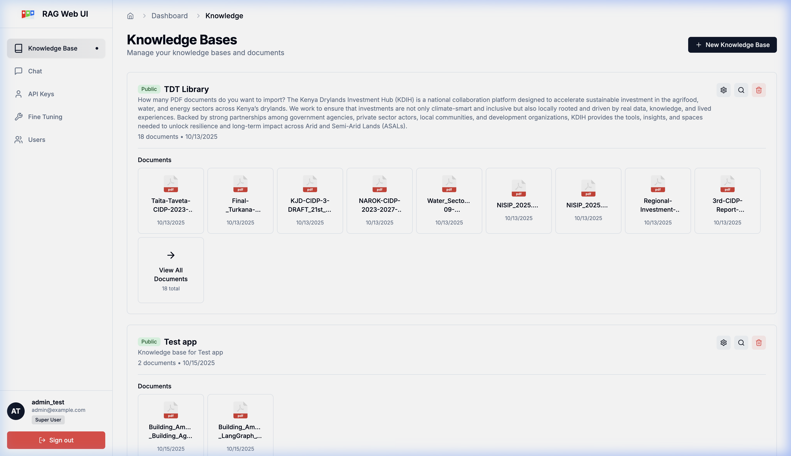
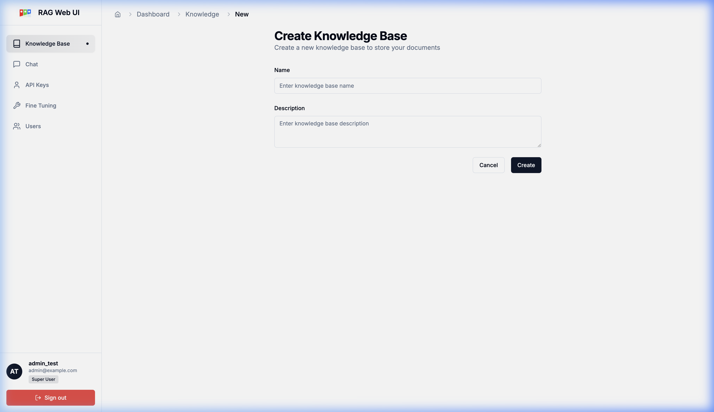

# Admin Guide: Akvo RAG

This guide is intended for administrators who manage the Knowledge Bases and users within Akvo RAG.

## 1. Knowledge Base Management

The Knowledge Base (KB) is the core of the RAG system. It contains the documents that the AI uses to answer questions.

### 1.1 Creating a Knowledge Base
1. Click on the **"New Knowledge Base"** button.
2. Provide a name and description that helps the AI understand what topics this KB covers.
3. Save to initialize the vector storage for this KB.

### 1.2 Data Ingestion (Uploading Documents)
- **Supported Formats**: PDF, TXT, DOCX.
- **Process**: Once a KB is created, click "Upload" or drag and drop your files.
- **Background Jobs**: The system will automatically chunk and embed your documents. You can monitor the status of these background tasks to see when the documents are ready for querying.

## 2. User Management

Administrators can manage who has access to the system and their roles.

### 2.1 Managing Users
- **Active Status**: You can enable or disable user accounts.
- **Role Assignment**: Assign users as regular users or superusers (administrators).
- **Approval Flow**: If self-registration is enabled, admins can approve new sign-ups here.

## 3. Maintenance Protocols
- **Purging Cache**: If you update documents in a KB, the semantic cache is automatically invalidated to ensure users receive the most up-to-date information.
- **Self-Healing**: The system handles large context automatically by stripping unnecessary metadata, ensuring long conversations remains stable.
