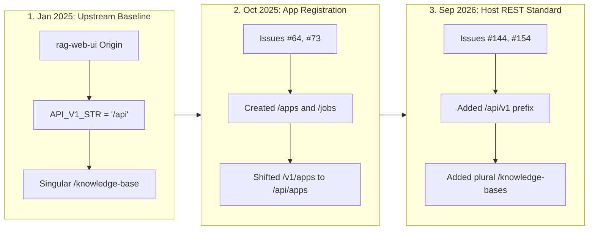

# Architectural Guide: API Routing Audit, Duplication Root-Cause & Consolidation Plan

> **Document ID:** `DOC-ARCH-ROUTING-001`  
> **Topic:** Complete Route Inventory, Prefix Duplications (`/api` vs `/api/v1`, `/knowledge-base` vs `/knowledge-bases`), and Safe Step-by-Step Consolidation  
> **Status:** `PROPOSED (BMAD Party Mode Approved)`  
> **Target System:** Akvo RAG Core Gateway, Next.js Web UI, and AgriConnect Host Integration  
> **Author:** Antigravity BMAD Multi-Agent Architecture Council  

---

## 1. Executive Summary & 5W1H Discovery

### 1.1 Context & Problem Statement
During our comprehensive codebase audit across `akvo-rag`, multiple layers of route duplication and routing aliases were discovered in [`backend/app/main.py`](file:///backend/app/main.py) and [`backend/app/api/api_v1/api.py`](file:///backend/app/api/api_v1/api.py):
1. **Dual Prefixing (`/api/` vs `/api/v1/`):** All core API endpoints are registered under both `/api/...` and `/api/v1/...`.
2. **Pluralization Aliases (`/knowledge-base` vs `/knowledge-bases`):** Knowledge base endpoints are registered under both singular and plural collection nouns, creating a 4-way URL permutation for every KB handler.
3. **Separate Host Tenant Routes (`/api/v1/apps/knowledge-bases`):** A distinct set of endpoints with similar names exists specifically for host applications (AgriConnect / WASHConnect).
4. **Dead & Broken Routes:** Legacy prototype routes (such as `/openapi/knowledge/{id}/query`) and orphan files (`backend/app/api/api_v1/util/util_user.py`) remain in the repository.

This document identifies the exact historical and architectural root causes for these duplications, maps every endpoint to its actual consumers (Next.js UI vs AgriConnect vs External Clients), and establishes a **safe, zero-regression 3-stage consolidation plan**.

### 1.2 5W1H Discovery Lens

| Dimension | Specification |
|---|---|
| **Who** | Backend engineers, Frontend developers, QA engineers, and AgriConnect integration teams. |
| **What** | Audit all API routes, explain duplicate aliases, identify dead code, and define the migration path to a single standard REST API. |
| **Where** | `backend/app/main.py`, `backend/app/api/api_v1/`, `frontend/src/`, `frontend/next.config.js`, and `docs/qa/qa-guide-agriconnect-integration.md`. |
| **When** | **Phase 5 Clean-up & Post-Monorepo Polish** — immediate dead code purge in Phase 5; full frontend route migration in the subsequent release cycle. |
| **Why** | Eliminates confusing Swagger `/docs` bloat, hardens security boundaries, removes dead code, and aligns with modern REST API standards without breaking live deployments. |
| **How** | Step-by-step phased migration: (1) Purge 100% dead routes, (2) Migrate Next.js frontend callers to `/api/v1/` and plural nouns, (3) Deprecate and remove backend duplicate router mounts. |

---

## 2. BMAD Party Mode Council Deliberation 🎭

### 2.1 Multi-Perspective Council Synthesis

* **🏗️ Winston (System Architect):**  
  "The current duplication was an intentional backwards-compatibility bridge. The upstream baseline (`rag-web-ui`) started with `/api` and singular `/knowledge-base`. When we integrated AgriConnect and standardized on Section 7.3 REST contracts (`/api/v1/knowledge-bases`), dual router mounting was introduced to prevent breaking the Next.js frontend. Our goal is to unify everything under `/api/v1/` with plural resource collections."

* **💻 Amelia (Senior Developer):**  
  "We must not remove `/api/` or `/knowledge-base` aliases abruptly in the backend without updating all 17 Next.js frontend pages. The Next.js client currently uses `api.get('/api/knowledge-base')` through the reverse proxy rewrite `source: '/api/:path*'`. Once we update the frontend API client and `next.config.js`, we can cleanly decommission the backend aliases."

* **🧪 Murat (Test Architect):**  
  "Our automated test suite has tests targeting both paths: `test_document_upload.py` tests `/api/knowledge-base`, while `test_app_knowledge_base_endpoints.py` tests `/api/apps/knowledge-bases`. In Phase 5 (`TASK-INT-503`), we will update all test suites to assert against the standard `/api/v1/` endpoints."

* **🛡️ Rachel (Adversarial Security Red Team):**  
  "From a security standpoint:
  1. **Auth Parity:** Both `/api/` and `/api/v1/` enforce the exact same dependency-injected security guards (`get_current_user` / `get_current_app`), so there is no authentication bypass.
  2. **Attack Surface Reduction:** Dead routes like `/openapi/knowledge/{id}/query` (which raises unhandled 400s) and unused endpoints like `PUT /api/auth/user` must be deleted immediately.
  3. **Strict Domain Separation:** Maintain strict authorization isolation between User JWT tokens (human UI users) and App Access Tokens `tok_...` (tenant-scoped host applications)."

---

## 3. Historical Timeline & Root Cause Analysis



### 3.1 Root Cause: `/api/` vs `/api/v1/`
1. **Initial Baseline:** The upstream open-source project hardcoded `API_V1_STR = "/api"` in `config.py` and built the Next.js UI around `/api/...`.
2. **Server-to-Server Apps:** When the app registration system was built, it was initially placed under `/v1/` (commit `b68fb36`), then moved to `settings.API_V1_STR` (`/api/apps`, commit `e9a1828`).
3. **AgriConnect Standardization:** In Issue `#154` (commit `21faf37`), external hosts required versioned REST URLs (`/api/v1/apps/jobs`, `/api/v1/chat`). To avoid breaking the existing Next.js frontend, `main.py` mounted routers twice:
   ```python
   app.include_router(api_router, prefix=settings.API_V1_STR) # -> /api/... (Next.js Frontend)
   app.include_router(api_router, prefix="/api/v1")          # -> /api/v1/... (AgriConnect & External)
   ```

### 3.2 Root Cause: `knowledge-base` vs `knowledge-bases`
1. **Singular Naming Legacy:** Early UI implementations used singular `/knowledge-base`.
2. **REST Pluralization Standard:** Modern REST best practices and host specifications require plural collection nouns (`/knowledge-bases`, `/users`, `/chats`).
3. **The Alias Bridge:** In Issue `#144` (commit `2c557b0`), `knowledge-bases` was mounted as an alias so external clients could use standard plural paths without breaking the Next.js frontend.

### 3.3 User Knowledge Bases vs Host Tenant Knowledge Bases (`apps/knowledge-bases`)
These two route sets look similar but have distinct authentication, authorization, and multi-tenancy models:

| Route Group | Authentication Method | Multi-Tenancy / Scoping | Intended Consumer |
|---|---|---|---|
| **`/api/v1/knowledge-bases`** (or `/api/knowledge-base`) | **User JWT Bearer** (`get_current_user`) | Scoped to individual user or global admin view | Akvo RAG Web UI Dashboard |
| **`/api/v1/apps/knowledge-bases`** | **App Access Token `tok_...`** (`get_current_app`) | **Strictly Tenant-Isolated:** Filtered by `app_id` (AgriConnect only accesses its own linked KBs) | AgriConnect & WASHConnect Host Apps |

---

## 4. Complete Route Inventory & Usage Matrix

```
┌───────────────────────────────────────────────┬────────┬─────────────────────────┬───────────────────────────────┐
│ Endpoint URL                                  │ Method │ Primary Consumer        │ Status & Recommendation       │
├───────────────────────────────────────────────┼────────┼─────────────────────────┼───────────────────────────────┤
│ /openapi/knowledge/{id}/query                 │ GET    │ None (Raises 400 error) │ 🛑 DEAD CODE - Purge          │
│ /api/auth/test-token                          │ POST   │ Legacy Unit Tests       │ ⚠️ UNUSED - Deprecate / Purge │
│ /api/auth/user                                │ PUT    │ Legacy Unit Tests       │ ⚠️ UNUSED - Deprecate / Purge │
│ /api/prompt/ (root POST)                      │ POST   │ None (PUT used instead) │ ⚠️ REDUNDANT - Purge          │
│ /api/knowledge-base/cleanup                   │ POST   │ None                    │ ⚠️ UNUSED - Purge             │
│ /api/api_v1/util/util_user.py                 │ N/A    │ None (No imports)       │ 🗑️ ORPHAN FILE - Delete       │
├───────────────────────────────────────────────┼────────┼─────────────────────────┼───────────────────────────────┤
│ /api/auth/login, /token, /me, /reset-password │ POST   │ Next.js Frontend        │ ✅ ACTIVE - Standardize on v1 │
│ /api/knowledge-base/*                         │ ALL    │ Next.js Frontend        │ ✅ ACTIVE - Standardize on v1 │
│ /api/chat/*                                   │ ALL    │ Next.js Frontend        │ ✅ ACTIVE - Standardize on v1 │
│ /api/prompt/*                                 │ ALL    │ Next.js Frontend        │ ✅ ACTIVE - Standardize on v1 │
│ /api/system-settings/*                        │ ALL    │ Next.js Frontend        │ ✅ ACTIVE - Standardize on v1 │
│ /api/users/*                                  │ ALL    │ Next.js Frontend        │ ✅ ACTIVE - Standardize on v1 │
│ /api/api-keys/*                               │ ALL    │ Next.js Frontend        │ ✅ ACTIVE - Standardize on v1 │
├───────────────────────────────────────────────┼────────┼─────────────────────────┼───────────────────────────────┤
│ /api/v1/apps/register                         │ POST   │ AgriConnect Host Setup  │ ✅ ACTIVE (Tenant Host Auth)  │
│ /api/v1/apps/me, /rotate, /revoke             │ ALL    │ Host Token Management   │ ✅ ACTIVE (Tenant Host Auth)  │
│ /api/v1/apps/jobs                             │ POST   │ AgriConnect (Chat/Upld) │ ✅ ACTIVE (Tenant Host Auth)  │
│ /api/v1/apps/knowledge-bases/*                │ ALL    │ AgriConnect KB Sync     │ ✅ ACTIVE (Tenant Host Auth)  │
│ /api/v1/apps/documents/*                      │ ALL    │ AgriConnect Doc Sync    │ ✅ ACTIVE (Tenant Host Auth)  │
│ /ws/chat                                      │ WS     │ Demo & External Embeds  │ ✅ ACTIVE (Visitor UUID Auth) │
└───────────────────────────────────────────────┴────────┴─────────────────────────┴───────────────────────────────┘
```

---

## 5. Step-by-Step Route Consolidation Strategy

```mermaid
graph TD
    subgraph Step 1: Immediate Dead Route Purge [Phase 5: TASK-CLEAN-502]
        P1["Delete backend/app/api/openapi/ directory"]
        P2["Delete backend/app/api/api_v1/util/util_user.py"]
        P3["Remove unused PUT /auth/user & POST /prompt/"]
    end

    subgraph Step 2: Frontend Standardized Migration [Phase 5 / Post-Monorepo]
        F1["Update frontend/next.config.js rewrite to /api/v1/:path*"]
        F2["Update frontend Axios/fetch client base URL to /api/v1"]
        F3["Refactor frontend /api/knowledge-base -> /api/v1/knowledge-bases"]
    end

    subgraph Step 3: Backend Duplicate Mount Decommissioning
        B1["Set API_V1_STR = '/api/v1' in config.py"]
        B2["Remove duplicate include_router(..., prefix='/api') in main.py"]
        B3["Remove singular /knowledge-base alias in api.py"]
        B4["Update test suite assertions to /api/v1/ paths"]
    end

    Step 1 --> Step 2
    Step 2 --> Step 3
```

---

### Step 1: Immediate Dead Code & Broken Route Purge (Phase 5: `TASK-CLEAN-502`)
* **Actions:**
  1. Delete `backend/app/api/openapi/` entirely (`api.py` and `knowledge.py`).
  2. Remove `openapi_router` include from `backend/app/main.py`.
  3. Remove static reference to `/openapi/knowledge/{id}/query` in `frontend/src/app/dashboard/api-keys/page.tsx`.
  4. Delete orphan file `backend/app/api/api_v1/util/util_user.py`.
  5. Remove unused handlers: `POST /api/prompt/` (root) and `PUT /api/auth/user`.
* **Zero Breaking Risk:** None of these endpoints are called by the frontend or host apps.

---

### Step 2: Next.js Frontend Standardized Migration
* **Target Files:** `frontend/next.config.js` and `frontend/src/`
* **Actions:**
  1. Update reverse proxy rewrite in `frontend/next.config.js`:
     ```javascript
     async rewrites() {
       return [
         {
           source: "/api/v1/:path*",
           destination: `${backendUrl}/api/v1/:path*`,
         },
       ];
     }
     ```
  2. Update frontend Axios/API helper (`frontend/src/lib/api.ts` or `frontend/src/utils/api.ts`) default prefix to `/api/v1`.
  3. Perform a clean search-and-replace across `frontend/src/`:
     - `/api/auth/` ➔ `/api/v1/auth/`
     - `/api/chat` ➔ `/api/v1/chat`
     - `/api/knowledge-base` ➔ `/api/v1/knowledge-bases`
     - `/api/prompt` ➔ `/api/v1/prompt`
     - `/api/system-settings` ➔ `/api/v1/system-settings`
     - `/api/users` ➔ `/api/v1/users`
     - `/api/api-keys` ➔ `/api/v1/api-keys`

---

### Step 3: Backend Router Clean-up & Alias Removal
* **Target Files:** `backend/app/main.py`, `backend/app/core/config.py`, `backend/app/api/api_v1/api.py`
* **Actions:**
  1. Set canonical API prefix in `backend/app/core/config.py`:
     ```python
     API_V1_STR: str = "/api/v1"
     ```
  2. Streamline `backend/app/main.py`:
     ```python
     # Include clean versioned routers
     app.include_router(api_router, prefix=settings.API_V1_STR) # /api/v1/...
     app.include_router(v1_router, prefix=settings.API_V1_STR)  # /api/v1/apps/...
     app.include_router(ws_router)                              # /ws/...
     ```
  3. Streamline `backend/app/api/api_v1/api.py`:
     ```python
     api_router.include_router(auth.router, prefix="/auth", tags=["auth"])
     api_router.include_router(knowledge_base.router, prefix="/knowledge-bases", tags=["knowledge-bases"])
     api_router.include_router(chat.router, prefix="/chat", tags=["chat"])
     api_router.include_router(api_keys.router, prefix="/api-keys", tags=["api-keys"])
     api_router.include_router(prompt.router, prefix="/prompt", tags=["prompt"])
     api_router.include_router(system_settings.router, prefix="/system-settings", tags=["system-settings"])
     api_router.include_router(users.router, prefix="/users", tags=["users"])
     ```
  4. Update backend test runners and pytest fixtures to request `/api/v1/...`.

---

## 6. Verification & Quality Gates

```bash
# 1. Verify Swagger /docs renders clean, un-duplicated endpoints
curl -s http://localhost:8010/openapi.json | jq '.paths | keys'

# 2. Run backend test suite asserting 100% pass on /api/v1 endpoints
docker exec akvo-rag-backend-1 python -m pytest tests/ -v

# 3. Verify AgriConnect integration suite
docker exec akvo-rag-backend-1 python -m pytest tests/integration/test_agriconnect_integration.py -v

# 4. Verify Next.js frontend build and lint
docker exec akvo-rag-frontend-1 pnpm lint
docker exec akvo-rag-frontend-1 pnpm build
```

---

## 7. Summary & Recommended Action Plan

| Phase | Scope of Work | Risk Level | Target Release |
|---|---|:---:|---|
| **Phase A** | Purge dead OpenAPI router, orphan `util_user.py`, and unused endpoints. | **Zero** | Current Sprint (`TASK-CLEAN-502`) |
| **Phase B** | Update Next.js frontend to use `/api/v1/` and `/knowledge-bases`. | **Low** | Next Sprint Frontend Polish |
| **Phase C** | Remove duplicate `/api/` and singular `/knowledge-base` mounts from backend. | **Low** | Backend Harmonization Milestone |
