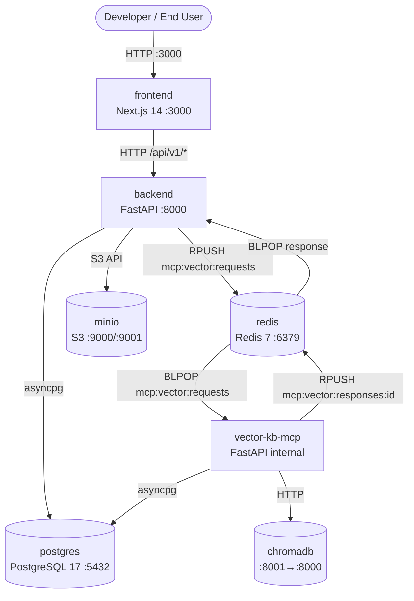
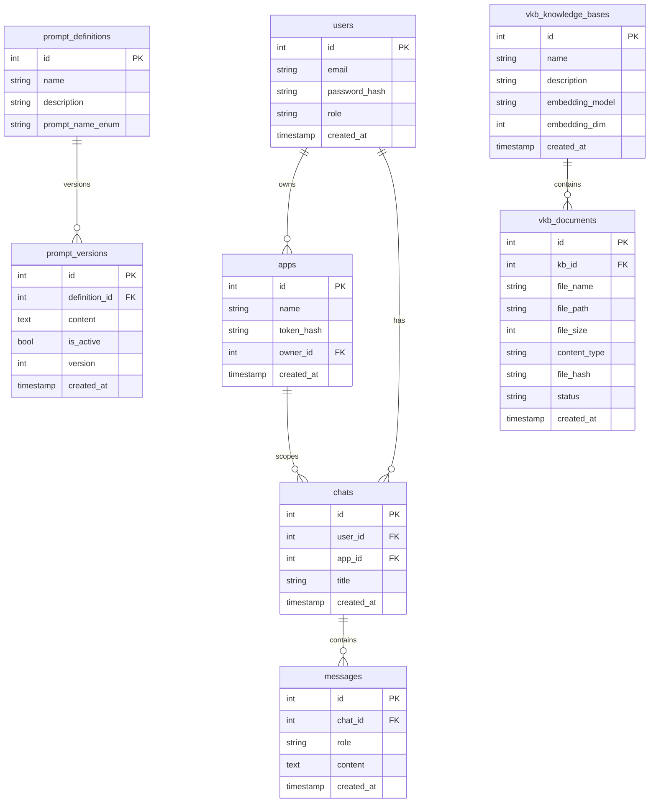

# Architecture Map: Akvo RAG

> **Auto-generated reference** — last updated: 2026-09-08
> Sources: `docker-compose.yml`, `docker-compose.dev.yml`, `backend/mcp_config.json`, `alembic/`, `vector-kb-mcp/alembic/`

---

## 1. Container Topology



### Container Summary

| Container | Image | Host Port | Restart | Purpose |
|-----------|-------|-----------|---------|---------|
| `frontend` | Build from `frontend/` | `3000` | always | Web UI (Next.js 14, SSE streaming) |
| `backend` | Build from `backend/` | `8000` | always | Core FastAPI: LangGraph, LLMFactory, PromptService, S3 upload |
| `vector-kb-mcp` | Build from `vector-kb-mcp/` | internal | always | Vector KB microservice: Redis RPC worker, ChromaDB ingestion |
| `postgres` | `postgres:17-alpine` | `5432` | always | Unified relational store (two Alembic schema owners) |
| `redis` | `redis:7-alpine` | `6379` | always | MCP RPC queues + async ingestion task queues |
| `chromadb` | `chromadb/chroma:latest` | `8001→8000` | always | Vector embeddings store |
| `minio` | `minio/minio:latest` | `9000`,`9001` | always | S3-compatible document storage (MinIO console on 9001) |

---

## 2. Inter-Service Communication: Redis RPC Contract

All tool calls from `backend` to `vector-kb-mcp` are dispatched via Redis request-reply queues. This is the **only** IPC channel between the two services.

### Message Flow

```
backend                                redis                         vector-kb-mcp
  │                                      │                                │
  │── RPUSH mcp:vector:requests ─────────▶│                                │
  │   {"id": "<uuid>", "tool": "...",    │                                │
  │    "args": {...}}                     │                                │
  │                                      │── BLPOP mcp:vector:requests ──▶│
  │                                      │                                │── process tool call
  │                                      │◀─ RPUSH mcp:vector:responses:{id}
  │◀─ BLPOP mcp:vector:responses:{id} ──│                                │
  │   {"result": {...}, "error": null}   │                                │
```

### Request Envelope Schema

```json
{
  "id": "550e8400-e29b-41d4-a716-446655440000",
  "tool": "query_knowledge_base",
  "args": {
    "query": "string",
    "knowledge_base_ids": [1, 2],
    "top_k": 5,
    "score_threshold": 0.0
  }
}
```

### Response Envelope Schema

```json
{
  "result": { ... },
  "error": null
}
```

### Registered MCP Tools (`backend/mcp_config.json`)

#### `knowledge_bases_mcp` — transport: `redis_queue`

| Tool | Description |
|------|-------------|
| `query_knowledge_base` | Semantic vector search across KB chunks |
| `list_knowledge_bases` | Paginated list of all KBs |
| `get_knowledge_base` | Details for a specific KB by ID |
| `create_knowledge_base` | Create a new KB (embedding model, dim) |
| `update_knowledge_base` | Update KB name/description |
| `delete_knowledge_base` | Delete KB and all vector chunks |
| `list_documents` | Paginated docs in a KB, filterable by status |
| `get_document` | Status and metadata for a single document |
| `register_document` | Register an uploaded doc's metadata |
| `ingest_document` | Trigger async ingestion into ChromaDB |
| `process_document` | Process/chunk document into vector store |
| `delete_document` | Delete doc and its indexed chunks |
| `preview_documents` | Preview parsed chunks before indexing |
| `get_processing_tasks` | Poll async ingestion task status |

#### `weather_mcp` — transport: `rest` (optional, example)

| Tool | Endpoint | Method |
|------|----------|--------|
| `get_weather_forecast` | `/forecast` | POST |
| `get_current_weather` | `/current` | POST |
| `get_historical_weather` | `/historical` | POST |

---

## 3. Database Schema (PostgreSQL 17)

Two isolated Alembic migration chains share a single PostgreSQL 17 instance.



### Alembic Migration Ownership

| Owner Service | Migration Table | Location |
|---|---|---|
| `backend` | `alembic_version` | `backend/alembic/` |
| `vector-kb-mcp` | `alembic_version_vkb` | `vector-kb-mcp/alembic/` |

**Rule**: Never run `alembic upgrade head` in a service for tables it does not own.

---

## 4. MinIO Object Storage Layout

```
minio/
└── documents/               # Default bucket
    └── kb_{kb_id}/
        └── {doc_id}_{filename}   # e.g. documents/kb_3/42_irrigation_report.pdf
```

- **Bucket**: `documents` (created automatically on first upload)
- **Path convention**: `documents/kb_{kb_id}/{doc_id}_{original_filename}`
- **Public access**: None — all access is through backend S3 client with `MINIO_ROOT_USER`/`MINIO_ROOT_PASSWORD` credentials
- **Console**: http://localhost:9001

---

## 5. LLM Routing Architecture (Dual-Tier)

The backend uses a **dual-tier LLM factory** to minimize latency and cost:

| Tier | Model Variable | Default | Used For |
|------|----------------|---------|----------|
| FAST | `OPENAI_MODEL_FAST` | `gpt-4o-mini` | Intent routing, KB selection (pre-retrieval nodes) |
| SYNTHESIS | `OPENAI_MODEL_SYNTHESIS` | `gpt-4o` | Grounded answer generation (post-retrieval) |

### LangGraph RAG Workflow Nodes

```
User Query
    │
    ▼
[intent_router]      ← FAST model
    │
    ├─→ [kb_selector]        ← FAST model  (ASQ: auto-select KBs)
    │       │
    │       ▼
    │   [vector_retrieval]   → Redis RPC → vector-kb-mcp
    │       │
    ▼       ▼
[synthesis_node]     ← SYNTHESIS model  (grounded answer + citations)
    │
    ▼
SSE Stream → frontend
```

---

## 6. API Catalog

### Backend REST API (`/api/v1/`) — requires JWT bearer token

| Method | Path | Description |
|--------|------|-------------|
| `POST` | `/auth/login` | Login, returns JWT |
| `POST` | `/auth/register` | Register new user |
| `GET` | `/chats` | List user's chats |
| `POST` | `/chats` | Create a new chat |
| `GET` | `/chats/{id}/messages` | Get chat message history |
| `POST` | `/jobs` | Submit a RAG query (SSE stream) |
| `GET` | `/knowledge-bases` | List all knowledge bases |
| `POST` | `/knowledge-bases` | Create knowledge base |
| `POST` | `/knowledge-bases/{id}/documents/upload` | Upload document |
| `DELETE` | `/knowledge-bases/{id}/documents/{doc_id}` | Delete document |
| `GET` | `/prompts` | List prompt definitions |
| `PUT` | `/prompts/{id}/versions/{vid}/activate` | Activate a prompt version |

### Backend Tenant API (`/api/v1/apps/`) — requires `Authorization: Bearer tok_...`

| Method | Path | Description |
|--------|------|-------------|
| `POST` | `/apps/register` | Register a host application |
| `GET` | `/apps/knowledge-bases` | List tenant's accessible KBs |
| `POST` | `/apps/knowledge-bases/{id}/documents/upload` | Upload document (tenant) |
| `POST` | `/apps/jobs` | Submit RAG query (tenant scoped, SSE) |

> Full Swagger UI: http://localhost:8000/docs

---

## 7. Prompt Service Architecture

Dynamic prompts are managed database-side. No redeployment required.

```
PromptNameEnum (enum)
    └── PromptService.get_prompt(name) → str
            └── DB: prompt_definitions → prompt_versions (is_active=True)
```

**Seed command**: `docker compose exec backend python -m app.seeder.seed_prompts`

See [PROMPT_SERVICE.md](../PROMPT_SERVICE.md) for full API reference.

---

## 8. Key File Locations

| File / Directory | Purpose |
|---|---|
| `docker-compose.yml` | Production container topology |
| `docker-compose.dev.yml` | Development topology (hot-reload volumes) |
| `.env` / `.env.example` | All runtime configuration |
| `backend/mcp_config.json` | Declarative MCP tool registry |
| `backend/app/` | Core FastAPI application |
| `backend/app/llm/factory.py` | Dual-tier LLM factory (FAST / SYNTHESIS) |
| `backend/app/services/prompt_service.py` | Dynamic prompt management |
| `backend/app/graph/` | LangGraph RAG workflow nodes |
| `backend/mcp_clients/` | Redis RPC dispatcher + REST adapters |
| `backend/alembic/` | Core schema migrations (`alembic_version`) |
| `vector-kb-mcp/app/` | Vector KB microservice application |
| `vector-kb-mcp/app/worker/` | Redis RPC worker (BLPOP consumer) |
| `vector-kb-mcp/alembic/` | KB schema migrations (`alembic_version_vkb`) |
| `frontend/` | Next.js 14 TypeScript application |
| `docs/` | All developer and operational documentation |
| `backend/RAG_evaluation/` | RAGAS evaluation framework |
