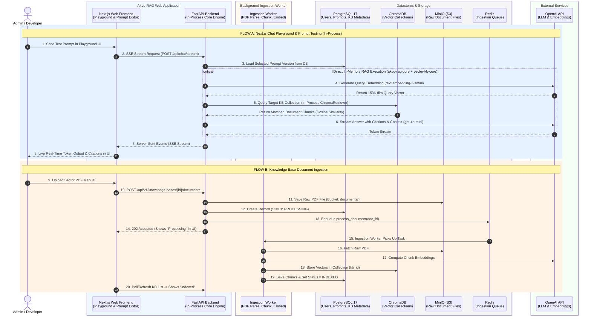
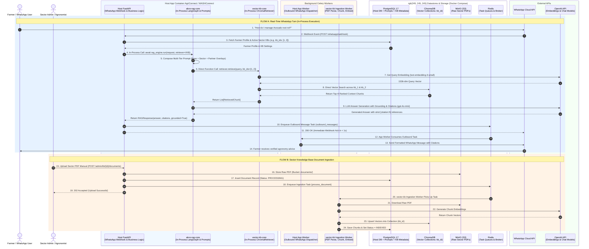

# Docker Compose Setup & Container Interaction Sequence Diagrams (Option C)

This document provides the complete **Mermaid Sequence Diagrams** illustrating the containers, volumes, background workers, and real-time interactions for **both deployment modes** in Option C:
1. **Mode 1: Standalone `akvo-rag` + `vector-kb`** (With Next.js UI, Chat Playground SSE streaming, Prompt Editor, and PDF Uploads).
2. **Mode 2: Embedded `xxxconnect` (AgriConnect / WASHConnect)** (In-process WhatsApp Bot with Celery Outbound Worker).

You can copy the code snippets directly into the [Mermaid Live Editor](https://dedenbangkit.github.io/mermaid-live-editor/) to view and export high-resolution PNG/SVG images.

---

## 1. Mode 1 Sequence Diagram: Standalone `akvo-rag` + `vector-kb`

> **Use Case:** Used by Product Admins, Prompt Engineers, and Developers for prompt lifecycle management, live chat playground testing, and managing Knowledge Bases.

### Mode 1 Docker Compose Containers (`akvo-rag/docker-compose.dev.yml`)

| Service Name | Container Image / Source | Role in Standalone Mode 1 | Ports |
|---|---|---|---|
| `frontend` | `akvo-rag/frontend` (Next.js 14) | Admin Web Dashboard, Prompt Editor & Chat Playground | `3000:3000` |
| `backend` | `akvo-rag/backend` (FastAPI) | Auth, Admin REST APIs, and in-process RAG engine | `8000:8000` |
| `ingestion-worker` | `vector-kb` Celery Worker | Background PDF chunking and Chroma embedding | Internal |
| `postgres` | `postgres:17-alpine` | Users, prompt versions, apps, document records | `5432:5432` |
| `chromadb` | `chromadb/chroma:latest` | Vector collections (`kb_{id}`) | `8000:8000` |
| `minio` | `minio/minio:latest` | Object storage for uploaded PDF files | `9000:9000`, `9001:9001` |
| `redis` | `redis:7-alpine` | Task queue broker for document ingestion | `6379:6379` |

---

## 2. Mode 2 Sequence Diagram: Embedded `xxxconnect` (AgriConnect / WASHConnect)

> **Use Case:** Production partner deployments serving farmers and citizens over WhatsApp with sub-second response times, zero internal network hops, and in-process `akvo-rag-core` + `vector-kb-core` execution.

### Mode 2 Docker Compose Containers (`xxxconnect/docker-compose.yml`)

| Service Name | Container Image / Source | Role in Embedded Mode 2 | Ports |
|---|---|---|---|
| `app` | `xxxconnect/backend` | FastAPI WhatsApp webhook handler with embedded `akvo-rag-core` and `vector-kb-core` | `8000:8000` |
| `app-worker` | `xxxconnect` Celery Worker | Outbound WhatsApp message dispatcher with automatic retries | Internal |
| `ingestion-worker` | `vector-kb` Celery Worker | Background sector document parser & embedder (from `vector-kb` repository) | Internal |
| `postgres` | `postgres:17-alpine` | Partner CRM data, farmer profiles, and KB metadata | `5432:5432` |
| `chromadb` | `chromadb/chroma:latest` | Vector collections for partner domain manuals | `8000:8000` |
| `minio` | `minio/minio:latest` | Object storage for partner PDFs | `9000:9000` |
| `redis` | `redis:7-alpine` | Celery broker for outbound WhatsApp & ingestion | `6379:6379` |

---

## 3. Key Architectural Benefits of Option C

1. **Exact Parity Between Modes:**
   - Both Mode 1 (Standalone Web UI) and Mode 2 (Embedded Host App) execute the **identical in-process engine** (`akvo-rag-core` + `vector-kb-core`), ensuring that prompt behavior in the playground matches WhatsApp production 100%.
2. **Zero Internal HTTP / FastMCP Latency:**
   - Vector retrieval is performed via direct in-memory Python function calls to ChromaDB (`< 100ms`), completely eliminating the 4 internal HTTP hops and FastMCP SSE streaming bottlenecks.
3. **Resilient Circuit Breaker:**
   - If ChromaDB or OpenAI experiences transient downtime, the in-process engine safely catches exceptions and returns a graceful fallback message without crashing WhatsApp turns or leaving users hanging.
