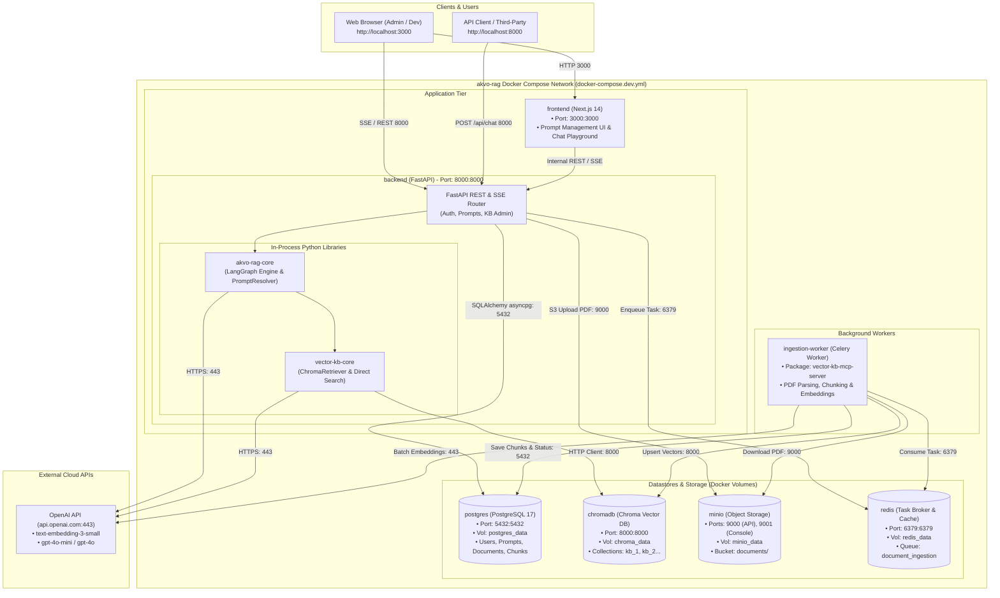
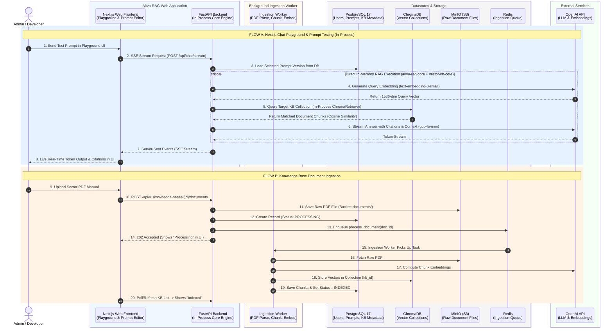
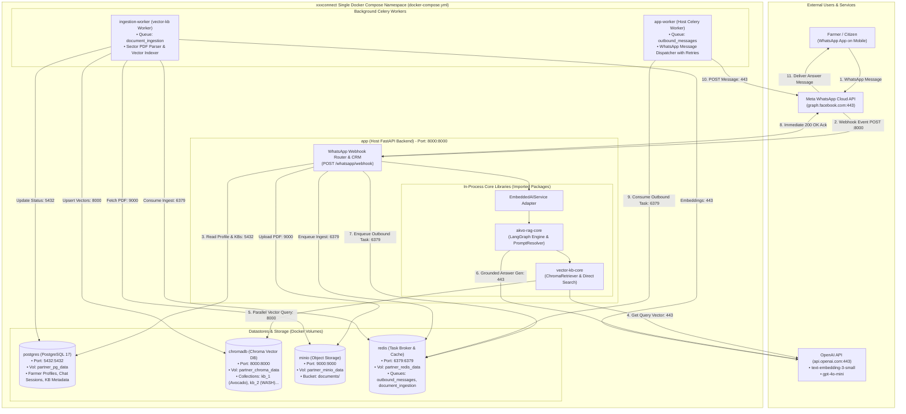
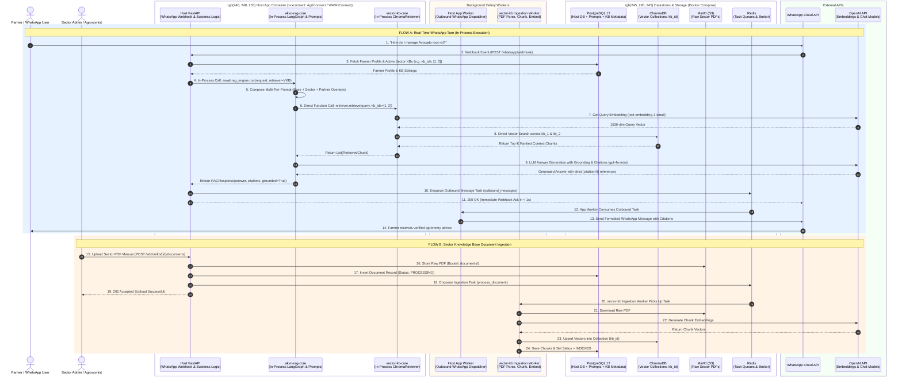

# Docker Compose Architecture & Interaction Diagrams (Option C)

This document provides the complete **Mermaid Architecture Flowcharts** and **Sequence Diagrams** detailing the Docker Compose setup, container boundaries, networks, volumes, and runtime interactions for **both deployment topologies**:
1. **Setup 1: Standalone `akvo-rag` + `vector-kb`** (`docker-compose.dev.yml` / `docker-compose.yml`)
2. **Setup 2: Embedded `xxxconnect` (AgriConnect / WASHConnect)** (`xxxconnect/docker-compose.yml`)

You can copy the code snippets below directly into the [Mermaid Live Editor](https://dedenbangkit.github.io/mermaid-live-editor/) to view and export high-resolution PNG/SVG diagrams.

---

## 1. Setup 1: Standalone `akvo-rag` + `vector-kb`

> **Target Audience:** Developers, Admins, and Prompt Engineers managing prompts, testing RAG queries in the playground, and managing knowledge bases.

### 1.1 Docker Compose Architecture & Container Interaction Flowchart

### 1.2 Mode 1 Sequence Diagram: Standalone Interaction

### 1.3 Mode 1 Container Specification Table

| Container Name | Image / Source | Port Mapping | Volume / Storage | Primary Function |
|---|---|---|---|---|
| **`frontend`** | `akvo-rag/frontend` (Next.js 14) | `3000:3000` | Bind mount for dev | Admin UI, Prompt Versioning, Chat Playground |
| **`backend`** | `akvo-rag/backend` (FastAPI) | `8000:8000` | Bind mount for dev | REST API, In-process `akvo-rag-core` & `vector-kb-core` |
| **`ingestion-worker`**| `vector-kb` Celery worker | Internal | Code mount | Background PDF parsing, chunking, and embedding |
| **`postgres`** | `postgres:17-alpine` | `5432:5432` | `postgres_data:/var/lib/postgresql/data` | Relational database (users, prompts, document records) |
| **`chromadb`** | `chromadb/chroma:latest` | `8000:8000` | `chroma_data:/chroma/chroma` | Persistent vector collections (`kb_{id}`) |
| **`minio`** | `minio/minio:latest` | `9000:9000`, `9001:9001` | `minio_data:/data` | S3 object storage for uploaded PDF files |
| **`redis`** | `redis:7-alpine` | `6379:6379` | `redis_data:/data` | Task broker for document ingestion queue |

---

## 2. Setup 2: Embedded `xxxconnect` (AgriConnect / WASHConnect)

> **Target Audience:** Production partner deployments serving farmers and citizens over WhatsApp with sub-second response times and zero internal network hops.

### 2.1 Docker Compose Architecture & Container Interaction Flowchart

### 2.2 Mode 2 Sequence Diagram: Embedded WhatsApp Flow

### 2.3 Mode 2 Container Specification Table

| Container Name | Image / Source | Port Mapping | Volume / Storage | Primary Function |
|---|---|---|---|---|
| **`app`** | `xxxconnect/backend` (FastAPI) | `8000:8000` | Code bind mount | WhatsApp webhook receiver with embedded `akvo-rag-core` and `vector-kb-core` |
| **`app-worker`** | `xxxconnect` Celery worker | Internal | Code bind mount | Outbound WhatsApp message dispatcher with automatic retries |
| **`ingestion-worker`**| `vector-kb` Celery worker | Internal | Code bind mount | Sector document parser & vector embedder |
| **`postgres`** | `postgres:17-alpine` | `5432:5432` | `partner_pg_data:/var/lib/postgresql/data` | Partner CRM data, farmer profiles, prompt overlays, KB metadata |
| **`chromadb`** | `chromadb/chroma:latest` | `8000:8000` | `partner_chroma_data:/chroma/chroma` | Sector vector collections (`kb_1`, `kb_2`...) |
| **`minio`** | `minio/minio:latest` | `9000:9000` | `partner_minio_data:/data` | Object storage for partner PDFs |
| **`redis`** | `redis:7-alpine` | `6379:6379` | `partner_redis_data:/data` | Celery task broker for outbound WhatsApp & document ingestion |

---

## 3. Direct Architectural Comparison

| Dimension | Mode 1: Standalone `akvo-rag` + `vector-kb` | Mode 2: Embedded `xxxconnect` |
|---|---|---|
| **Primary Entrypoint** | Next.js Web UI (`http://localhost:3000`) | Meta WhatsApp Cloud API Webhook (`POST :8000`) |
| **In-Process RAG Libraries** | `akvo-rag-core` + `vector-kb-core` inside `backend` container | `akvo-rag-core` + `vector-kb-core` inside `app` container |
| **Response Mechanism** | Server-Sent Events (SSE) streaming tokens to UI | Asynchronous Celery worker dispatching to WhatsApp |
| **Ingestion Worker** | `ingestion-worker` (from `vector-kb`) | `ingestion-worker` (from `vector-kb`) |
| **Database Engine** | Single PostgreSQL 17 (Prompt & Document tables) | Single PostgreSQL 17 (Host CRM + Document tables) |
| **Vector Engine** | Single ChromaDB (Sub-100ms direct lookup) | Single ChromaDB (Sub-100ms direct lookup) |
| **Number of Workloads** | **3 workloads** (`frontend`, `backend`, `ingestion-worker`) | **3 workloads** (`app`, `app-worker`, `ingestion-worker`) |
