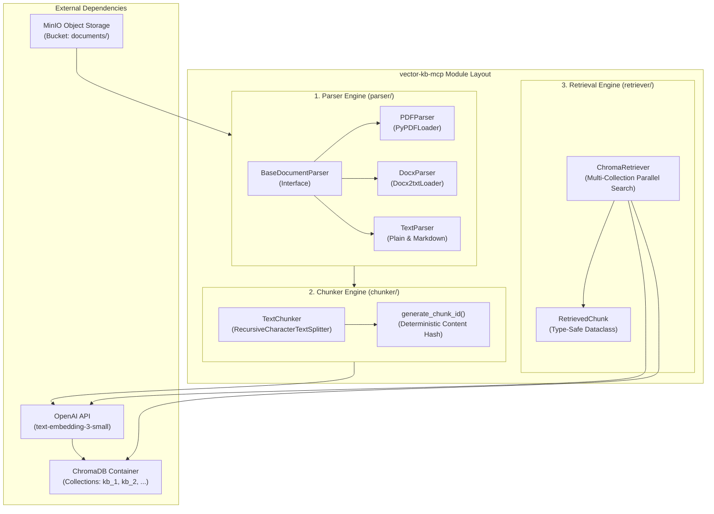
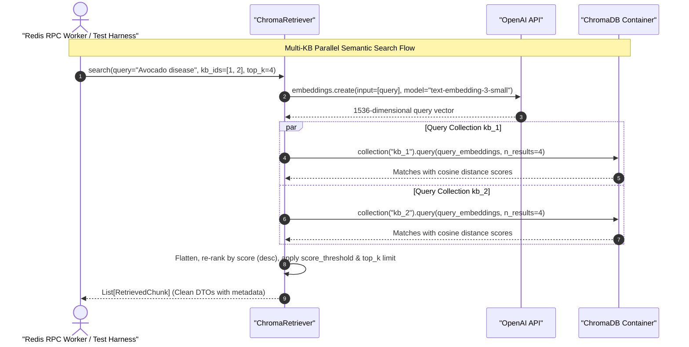

# Feature Specification: Vector-KB Parsers, Chunkers & Chroma Retriever

> **Feature ID:** `002_mono_102_vector_kb_parsers_chunkers_and_chroma_retriever_spec`  
> **Task Ref:** `TASK-MONO-102`  
> **Target Branch:** `epic/rag-monorepo-mcp`  
> **Status:** `PROPOSED (Under Review)`  
> **Estimated Effort:** `2.5 hrs (Vibe-Coding) / 2.0 days (Traditional)`  
> **Author:** Antigravity Architect / AI Infrastructure Engineer  
> **Source Repository:** `vector-knowledge-base-mcp-server` (`/Users/galihpratama/Sites/vector-knowledge-base-mcp-server`)  
> **Upstream Reference:** [docs/lld/container_based_rag_platform_lld.md](file:///Users/galihpratama/Sites/akvo-rag/docs/lld/container_based_rag_platform_lld.md) (Sections 5, 8, 9)

---

## 1. Overview & 5W1H Requirements Discovery

### 1.1 Problem Statement
In the legacy architecture, document parsing, text chunking, and ChromaDB vector queries lived in the external `vector-knowledge-base-mcp-server` repository. Queries were wrapped in FastMCP HTTP endpoints and encoded with Base64 payloads, which added unnecessary latency, serialization overhead, and maintenance friction.

For Option C monorepo consolidation, we are porting and refactoring the core extraction, chunking, and similarity search algorithms into the self-contained `akvo-rag/vector-kb-mcp/` directory with clean, direct Python interfaces and zero Base64/FastMCP wrappers.

### 1.2 5W1H Discovery Lens

| Dimension | Specification |
|---|---|
| **Who** | `vector-kb-mcp` microservice, backend RAG workflow, and background document ingestion consumer. |
| **What** | Extract, clean, and decouple document parsers (PDF, DOCX, TXT, MD), token chunking (`RecursiveCharacterTextSplitter`), and multi-KB ChromaDB direct vector retrieval into `vector-kb-mcp/`. |
| **Where** | `vector-kb-mcp/parser/`, `vector-kb-mcp/chunker/`, `vector-kb-mcp/retriever/`, and `vector-kb-mcp/requirements.txt`. |
| **When** | **Phase 1, Step 2** — immediately after `TASK-MONO-101` Docker infrastructure is initialized. |
| **Why** | Eliminates Base64 encoding overhead, decouples parsing from HTTP transports, standardizes token chunk boundaries, and enables sub-50ms parallel multi-KB vector retrieval. |
| **How** | Pure async Python 3.11 modules using `pypdf`, `docx2txt`, `langchain-text-splitters`, `chromadb`, and `AsyncOpenAI` for embedding generation (`text-embedding-3-small`). |

---

## 2. Architecture & Module Design

### 2.1 Component Architecture



### 2.2 Retrieval & Parsing Sequence Flow



---

## 3. Detailed Technical Specifications

### 3.1 Directory Structure (`vector-kb-mcp/`)

```text
vector-kb-mcp/
├── parser/
│   ├── __init__.py
│   ├── base.py                 # Abstract BaseDocumentParser
│   ├── pdf_parser.py           # PDF extraction using PyPDFLoader / pypdf
│   ├── docx_parser.py          # Word document extraction using docx2txt
│   └── text_parser.py          # Plain text and Markdown parser
├── chunker/
│   ├── __init__.py
│   ├── text_chunker.py         # RecursiveCharacterTextSplitter wrapper
│   └── hashing.py              # SHA256 deterministic chunk ID generator
├── retriever/
│   ├── __init__.py
│   ├── models.py               # RetrievedChunk dataclass & SearchFilter DTO
│   └── chroma_retriever.py     # Direct ChromaDB client & parallel multi-KB search
├── requirements.txt            # Standalone dependencies
└── pyproject.toml / setup.cfg  # Type checking & lint configuration
```

---

### 3.2 Parser Engine (`vector-kb-mcp/parser/`)

#### `parser/base.py`:
```python
from abc import ABC, abstractmethod
from dataclasses import dataclass, field
from typing import Dict, Any, List

@dataclass(frozen=True)
class ParsedPage:
    page_number: int
    text: str
    metadata: Dict[str, Any] = field(default_factory=dict)

@dataclass(frozen=True)
class ParsedDocument:
    file_name: str
    total_pages: int
    pages: List[ParsedPage]
    metadata: Dict[str, Any] = field(default_factory=dict)

class BaseDocumentParser(ABC):
    @abstractmethod
    async def parse(self, file_path: str, file_name: str) -> ParsedDocument:
        """Parse raw file from filesystem into structured pages."""
        pass
```

#### Supported File Types:
* **PDF (`.pdf`):** Extracts text page-by-page using `pypdf`, preserving page numbers in chunk metadata for exact PDF page citations.
* **DOCX (`.docx`, `.doc`):** Extracts paragraphs using `docx2txt`.
* **Plain Text / Markdown (`.txt`, `.md`):** Direct UTF-8 decoding with clean whitespace normalization.

---

### 3.3 Chunker Engine (`vector-kb-mcp/chunker/`)

#### `chunker/text_chunker.py`:
```python
from typing import List, Dict, Any
from dataclasses import dataclass, field
from langchain.text_splitter import RecursiveCharacterTextSplitter
from .hashing import generate_chunk_id
from parser.base import ParsedDocument

@dataclass(frozen=True)
class DocumentChunkDTO:
    chunk_id: str
    chunk_index: int
    content: str
    content_hash: str
    token_count: int
    metadata: Dict[str, Any] = field(default_factory=dict)

class TextChunker:
    def __init__(
        self,
        chunk_size: int = 1000,
        chunk_overlap: int = 200,
        separators: List[str] = None
    ):
        self.chunk_size = chunk_size
        self.chunk_overlap = chunk_overlap
        self.splitter = RecursiveCharacterTextSplitter(
            chunk_size=chunk_size,
            chunk_overlap=chunk_overlap,
            separators=separators or ["\n\n", "\n", ". ", " ", ""]
        )

    def chunk_document(self, doc: ParsedDocument, kb_id: int) -> List[DocumentChunkDTO]:
        chunks: List[DocumentChunkDTO] = []
        chunk_idx = 0
        
        for page in doc.pages:
            splits = self.splitter.split_text(page.text)
            for split_text in splits:
                if not split_text.strip():
                    continue
                
                meta = {
                    **page.metadata,
                    "page_number": page.page_number,
                    "file_name": doc.file_name,
                    "kb_id": kb_id
                }
                
                chunk_hash, chunk_id = generate_chunk_id(
                    kb_id=kb_id,
                    file_name=doc.file_name,
                    chunk_content=split_text,
                    chunk_metadata=meta
                )
                
                chunks.append(DocumentChunkDTO(
                    chunk_id=chunk_id,
                    chunk_index=chunk_idx,
                    content=split_text,
                    content_hash=chunk_hash,
                    token_count=len(split_text.split()),  # approximation
                    metadata=meta
                ))
                chunk_idx += 1
                
        return chunks
```

---

### 3.4 Direct ChromaDB Retriever (`vector-kb-mcp/retriever/`)

#### `retriever/chroma_retriever.py`:
```python
import asyncio
from dataclasses import dataclass, field
from typing import List, Dict, Any, Optional
import chromadb
from chromadb.api import ClientAPI
from openai import AsyncOpenAI

@dataclass(frozen=True)
class RetrievedChunk:
    chunk_id: str
    kb_id: int
    document_id: str
    content: str
    score: float
    metadata: Dict[str, Any] = field(default_factory=dict)

class ChromaRetriever:
    def __init__(
        self,
        chroma_client: ClientAPI,
        openai_client: AsyncOpenAI,
        embedding_model: str = "text-embedding-3-small"
    ):
        self.chroma = chroma_client
        self.openai = openai_client
        self.embedding_model = embedding_model

    async def _embed_query(self, query: str) -> List[float]:
        response = await self.openai.embeddings.create(
            input=[query],
            model=self.embedding_model
        )
        return response.data[0].embedding

    async def _query_single_collection(
        self,
        collection_name: str,
        query_vector: List[float],
        top_k: int
    ) -> List[RetrievedChunk]:
        try:
            # Run blocking chroma query in async threadpool
            collection = await asyncio.to_thread(
                self.chroma.get_collection, name=collection_name
            )
            results = await asyncio.to_thread(
                collection.query,
                query_embeddings=[query_vector],
                n_results=top_k,
                include=["documents", "metadatas", "distances"]
            )
            
            chunks: List[RetrievedChunk] = []
            if not results or not results["documents"] or not results["documents"][0]:
                return []
                
            docs = results["documents"][0]
            metas = results["metadatas"][0] if results["metadatas"] else [{}] * len(docs)
            distances = results["distances"][0] if results["distances"] else [0.0] * len(docs)
            ids = results["ids"][0] if results["ids"] else [""] * len(docs)

            for doc_text, meta, dist, cid in zip(docs, metas, distances, ids):
                # Convert cosine distance to cosine similarity score (1 - distance)
                similarity_score = round(1.0 - float(dist), 4)
                chunks.append(RetrievedChunk(
                    chunk_id=cid,
                    kb_id=int(meta.get("kb_id", 0)),
                    document_id=str(meta.get("document_id", "")),
                    content=doc_text,
                    score=similarity_score,
                    metadata=meta
                ))
            return chunks
        except Exception:
            # Collection may not exist yet if KB is empty
            return []

    async def search(
        self,
        query: str,
        kb_ids: List[int],
        top_k: int = 4,
        score_threshold: Optional[float] = None
    ) -> List[RetrievedChunk]:
        if not kb_ids or not query.strip():
            return []

        # 1. Generate query vector
        query_vector = await self._embed_query(query)

        # 2. Query collections in parallel
        tasks = [
            self._query_single_collection(f"kb_{kbid}", query_vector, top_k)
            for kbid in kb_ids
        ]
        results_nested = await asyncio.gather(*tasks, return_exceptions=False)

        # 3. Flatten, rank and filter
        all_chunks: List[RetrievedChunk] = []
        for res in results_nested:
            all_chunks.extend(res)

        # Sort by similarity score descending
        all_chunks.sort(key=lambda c: c.score, reverse=True)

        # Apply threshold if specified
        if score_threshold is not None:
            all_chunks = [c for c in all_chunks if c.score >= score_threshold]

        return all_chunks[:top_k]
```

---

### 3.5 Standalone Requirements (`vector-kb-mcp/requirements.txt`)

```text
# Core Python & Async
pydantic>=2.7.0
redis>=5.0.0

# Document Extraction
pypdf>=4.2.0
docx2txt>=0.8
unstructured>=0.13.0

# Text Splitting & LangChain Core
langchain>=0.2.0
langchain-community>=0.2.0
langchain-text-splitters>=0.2.0

# Vector Database & Embeddings
chromadb>=0.5.0
openai>=1.30.0

# Database & Migrations
sqlalchemy>=2.0.30
asyncpg>=0.29.0
alembic>=1.13.0

# Testing
pytest>=8.2.0
pytest-asyncio>=0.23.0
fakeredis>=2.23.0
```

---

## 4. Verification & Quality Gates

### 4.1 Automated Test Plan (`vector-kb-mcp/tests/`)
1. **Parser Unit Tests (`test_parser.py`):**
   - Parse sample PDF with 3 pages $\rightarrow$ verify `total_pages == 3`, text extracted per page.
   - Parse sample DOCX $\rightarrow$ verify paragraphs extracted correctly.
   - Parse empty/corrupted file $\rightarrow$ verify graceful exception handling.
2. **Chunker Unit Tests (`test_chunker.py`):**
   - Chunk 5000-character document with `chunk_size=1000, chunk_overlap=200` $\rightarrow$ verify correct number of chunks.
   - Verify SHA256 chunk hash determinism (`generate_chunk_id` produces identical IDs for identical content).
3. **Retriever Unit Tests (`test_retriever.py`):**
   - Mock Chroma client and mock OpenAI client $\rightarrow$ verify parallel collection dispatch and score ranking across `kb_1` and `kb_2`.
   - Assert `score_threshold` filter drops low-similarity chunks.

---

## 5. Subtask Breakdown & Estimation

| Subtask ID | Description | Target Files | Vibe Est. | Trad. Est. | Confidence |
|---|---|---|:---:|:---:|:---:|
| `SUB-102.1` | Port and refactor Document Parsers (PDF, DOCX, TXT) from legacy repo into `vector-kb-mcp/parser/` | `vector-kb-mcp/parser/` `[NEW]` | 0.8 hr | 0.6 day | High (95%) |
| `SUB-102.2` | Port Text Chunker & SHA256 deterministic ID generator into `vector-kb-mcp/chunker/` | `vector-kb-mcp/chunker/` `[NEW]` | 0.5 hr | 0.4 day | High (98%) |
| `SUB-102.3` | Implement `ChromaRetriever` with async parallel multi-KB search and score ranking | `vector-kb-mcp/retriever/` `[NEW]` | 0.8 hr | 0.6 day | High (95%) |
| `SUB-102.4` | Create `vector-kb-mcp/requirements.txt` and verify dependencies resolve | `vector-kb-mcp/requirements.txt` `[NEW]` | 0.4 hr | 0.4 day | High (99%) |
| **TOTAL** | | | **2.5 hrs** | **2.0 days** | **High** |

---

## 6. Definition of Done (DoD)

- [ ] `vector-kb-mcp/parser/` cleanly parses PDF, DOCX, and TXT files without FastMCP dependencies.
- [ ] `vector-kb-mcp/chunker/` splits text deterministically with metadata preservation (page numbers, filename, KB ID).
- [ ] `vector-kb-mcp/retriever/ChromaRetriever` performs parallel multi-KB similarity searches with zero Base64 wrappers.
- [ ] `vector-kb-mcp/requirements.txt` contains clean, pinned dependencies with no conflicts.
- [ ] Code complies with `mypy --strict` type annotations.
