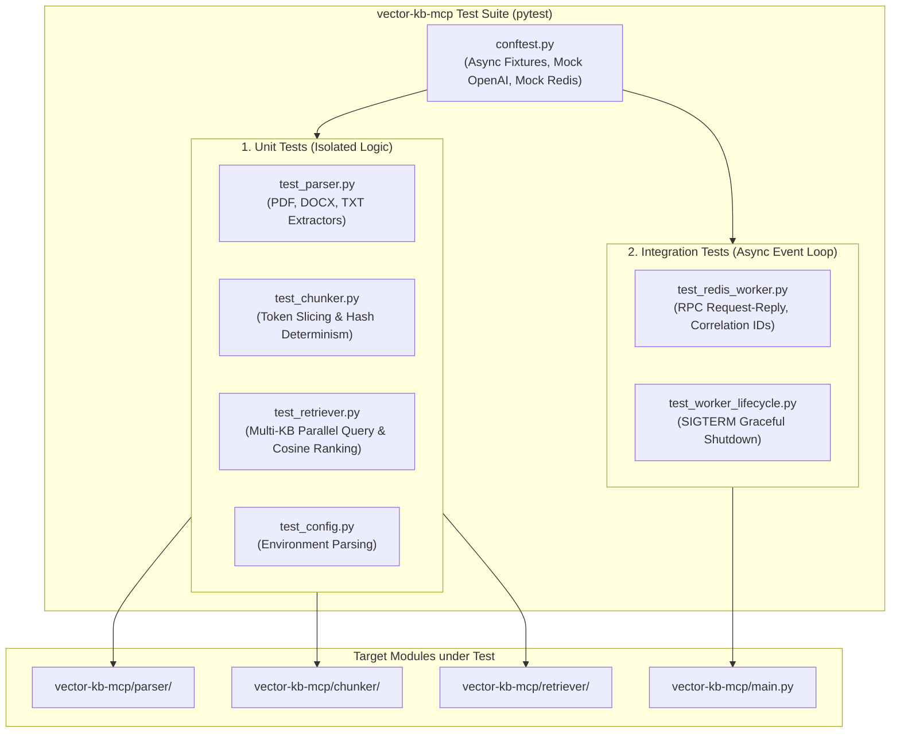

# Feature Specification: Vector-KB Unit & Integration Test Suite

> **Feature ID:** `004_test_104_vector_kb_test_suite_spec`
> **Task Ref:** `TASK-TEST-104`
> **Target Branch:** `epic/rag-monorepo-mcp`
> **Status:** `IMPLEMENTED`
> **Estimated Effort:** `1.5 hrs (Vibe-Coding) / 1.0 day (Traditional)`
> **Author:** Antigravity Architect / Senior QA & Test Architect
> **Source Repository:** `vector-knowledge-base-mcp-server` (`/Users/galihpratama/Sites/vector-knowledge-base-mcp-server`)
> **Upstream Reference:** [docs/lld/container_based_rag_platform_lld.md](file:///Users/galihpratama/Sites/akvo-rag/docs/lld/container_based_rag_platform_lld.md) (Sections 9, 10)

---

## 1. Overview & 5W1H Requirements Discovery

### 1.1 Problem Statement
The new `vector-kb-mcp` microservice replaces the legacy FastMCP server with custom async parsing, token chunking, direct multi-KB ChromaDB querying, and a native async Redis RPC worker loop. To ensure high reliability and zero regressions before Phase 2 database integration, `vector-kb-mcp` requires an isolated, automated unit and integration test suite achieving $\ge 85\%$ code coverage that runs deterministically in $< 10\text{s}$ both locally and inside Docker.

### 1.2 5W1H Discovery Lens

| Dimension | Specification |
|---|---|
| **Who** | `vector-kb-mcp` microservice developers, CI runners, and QA engineers. |
| **What** | Implement a comprehensive unit and integration test suite for document parsers, chunkers, `ChromaRetriever`, and the Redis RPC event loop. |
| **Where** | `vector-kb-mcp/tests/` (`conftest.py`, `test_parser.py`, `test_chunker.py`, `test_retriever.py`, `test_redis_worker.py`, `pytest.ini`, `test.sh`). |
| **When** | **Phase 1, Step 4** — quality verification gate concluding Phase 1 before Phase 2 database migration. |
| **Why** | Guarantees that parsers extract text accurately, chunk hashes remain deterministic across releases, vector similarity queries rank correctly, and Redis RPC messages never hang. |
| **How** | `pytest` and `pytest-asyncio` test framework with `fakeredis.aioredis` async broker mocks, `unittest.mock` OpenAI embeddings, and ChromaDB in-memory test clients. |

---

## 2. Test Architecture & Coverage Matrix

### 2.1 Test Suite Topology



### 2.2 Test Coverage Matrix & Quality Targets

| Test File | Component Under Test | Scope & Assertion Targets | Target Coverage | Execution Time |
|---|---|---|:---:|:---:|
| `test_parser.py` | `vector-kb-mcp/parser/` | PDF page-by-page extraction, DOCX paragraph parsing, TXT normalization, corrupted file handling. | $\ge 90\%$ | $< 1.5\text{s}$ |
| `test_chunker.py` | `vector-kb-mcp/chunker/` | `RecursiveCharacterTextSplitter` token limits, chunk overlaps, SHA256 deterministic ID hashing. | $\ge 95\%$ | $< 0.5\text{s}$ |
| `test_retriever.py` | `vector-kb-mcp/retriever/` | Async embedding creation, parallel multi-collection dispatch (`kb_1`, `kb_2`), cosine ranking, `score_threshold`. | $\ge 85\%$ | $< 1.0\text{s}$ |
| `test_redis_worker.py` | `vector-kb-mcp/main.py` | `BLPOP` message parsing, `TOOL_HANDLERS` dispatch, `RPUSH` to `mcp:vector:responses:{id}`, 60s TTL, invalid JSON error handling. | $\ge 85\%$ | $< 2.0\text{s}$ |
| `test_worker_lifecycle.py`| `vector-kb-mcp/main.py` | Signal handling (SIGINT/SIGTERM), graceful event loop termination, connection closing. | $\ge 80\%$ | $< 1.0\text{s}$ |
| **TOTAL** | | **Full standalone vector microservice** | **$\ge 85\%$** | **$< 6.0\text{s}$** |

---

## 3. Detailed Test Specifications

### 3.1 Test Configuration & Shared Fixtures (`vector-kb-mcp/tests/conftest.py`)

```python
import pytest
import pytest_asyncio
import fakeredis.aioredis
from unittest.mock import AsyncMock, MagicMock
from dataclasses import dataclass
from typing import List

@dataclass
class MockEmbeddingData:
    embedding: List[float]

@dataclass
class MockEmbeddingResponse:
    data: List[MockEmbeddingData]

@pytest.fixture
def mock_openai_client():
    client = MagicMock()
    client.embeddings = MagicMock()
    # Return deterministic 1536-dimensional vector for tests
    mock_vector = [0.05] * 1536
    client.embeddings.create = AsyncMock(
        return_value=MockEmbeddingResponse(data=[MockEmbeddingData(embedding=mock_vector)])
    )
    return client

@pytest.fixture
def mock_chroma_client():
    client = MagicMock()
    mock_collection = MagicMock()
    mock_collection.query = MagicMock(return_value={
        "ids": [["chunk-1", "chunk-2"]],
        "documents": [["First test document paragraph", "Second test document paragraph"]],
        "metadatas": [[{"kb_id": 1, "file_name": "test.pdf"}, {"kb_id": 1, "file_name": "test.pdf"}]],
        "distances": [[0.15, 0.40]]
    })
    client.get_collection = MagicMock(return_value=mock_collection)
    return client

@pytest_asyncio.fixture
async def fake_redis():
    server = fakeredis.FakeServer()
    r = fakeredis.aioredis.FakeRedis(server=server, decode_responses=True)
    yield r
    await r.flushall()
    await r.aclose()
```

---

### 3.2 Parser Unit Tests (`tests/test_parser.py`)
* **Test Cases:**
  1. `test_pdf_parser_extracts_all_pages()`: Generates a temporary 2-page PDF in-memory, parses via `PDFParser`, asserts `total_pages == 2` and page metadata contains `page_number: 1` and `page_number: 2`.
  2. `test_docx_parser_extracts_text()`: Parses mock Word document, asserts extracted text preserves paragraphs.
  3. `test_text_parser_utf8_handling()`: Parses `.txt` and `.md` files, asserts UTF-8 encoding and newline normalization.
  4. `test_parser_unsupported_extension()`: Asserts that passing an unsupported extension (e.g. `.exe`) raises a descriptive `ValueError`.

---

### 3.3 Chunker Unit Tests (`tests/test_chunker.py`)
* **Test Cases:**
  1. `test_text_chunker_splits_within_size_bounds()`: Chunks a 3500-char string with `chunk_size=1000, chunk_overlap=200`, asserts all chunk lengths $\le 1000$ and overlaps contain duplicate boundary text.
  2. `test_generate_chunk_id_determinism()`: Calls `generate_chunk_id` twice with identical parameters, asserts that `chunk_id_1 == chunk_id_2` and `chunk_hash_1 == chunk_hash_2`.
  3. `test_generate_chunk_id_uniqueness()`: Calls `generate_chunk_id` with slightly different text, asserts hashes and chunk IDs are distinct.

---

### 3.4 Retriever Unit Tests (`tests/test_retriever.py`)
* **Test Cases:**
  1. `test_chroma_retriever_multi_kb_parallel_search()`: Calls `ChromaRetriever.search(query="water", kb_ids=[1, 2], top_k=4)`, asserts query embeddings are generated and collections `kb_1` and `kb_2` are queried.
  2. `test_chroma_retriever_score_ranking()`: Verifies that returned chunks are strictly sorted in descending order of similarity score ($1.0 - \text{distance}$).
  3. `test_chroma_retriever_score_threshold()`: Passes `score_threshold=0.80`, asserts chunks with similarity $< 0.80$ are filtered out.
  4. `test_chroma_retriever_empty_collection()`: Simulates non-existent collection (empty KB), asserts retriever returns empty list without raising unhandled exceptions.

---

### 3.5 Redis RPC Worker Integration Tests (`tests/test_redis_worker.py`)
* **Test Cases:**
  1. `test_worker_handles_query_knowledge_base_rpc()`:
     - Enqueues JSON payload to `mcp:vector:requests`:
       ```json
       {
         "correlation_id": "req-999",
         "tool": "query_knowledge_base",
         "arguments": { "query": "avocado disease", "kb_ids": [1], "top_k": 2 },
         "response_queue": "mcp:vector:responses:req-999"
       }
       ```
     - Worker pops message, calls mocked `ChromaRetriever`, and pushes response to `mcp:vector:responses:req-999`.
     - Asserts response contains `{"status": "ok", "data": {"chunks": [...]}}`.
     - Asserts key TTL is set to 60 seconds.
  2. `test_worker_handles_unknown_tool()`:
     - Enqueues request with `tool: "unknown_magic_tool"`.
     - Asserts worker replies with `{"status": "error", "error": "Unknown tool: 'unknown_magic_tool'"}` and does not crash.
  3. `test_worker_handles_invalid_json()`:
     - Enqueues malformed string `"{bad json"`.
     - Asserts worker logs error and continues listening for the next message.

---

## 4. Test Execution Harness & Verification Commands

### 4.1 Local Execution Command:
```bash
cd vector-kb-mcp && pytest -v --cov=. --cov-report=term-missing
```

### 4.2 Dockerized Execution Command (Against Live Environment):
```bash
docker exec -it akvo-rag-vector-kb-mcp-1 python -m pytest tests/ -v
```

---

## 5. Subtask Breakdown & Estimation

| Subtask ID | Description | Target Files | Vibe Est. | Trad. Est. | Confidence |
|---|---|---|:---:|:---:|:---:|
| `SUB-104.1` | Setup `conftest.py`, async fixtures, and mock OpenAI/Chroma/Redis clients | `vector-kb-mcp/tests/conftest.py` `[NEW]` | 0.3 hr | 0.2 day | High (99%) |
| `SUB-104.2` | Implement unit tests for Parsers (PDF, DOCX, TXT) and Text Chunker | `vector-kb-mcp/tests/test_parser.py`, `test_chunker.py` `[NEW]` | 0.4 hr | 0.3 day | High (98%) |
| `SUB-104.3` | Implement unit tests for `ChromaRetriever` multi-KB parallel queries and score ranking | `vector-kb-mcp/tests/test_retriever.py` `[NEW]` | 0.4 hr | 0.3 day | High (95%) |
| `SUB-104.4` | Implement Redis RPC worker integration tests and test runner script | `vector-kb-mcp/tests/test_redis_worker.py`, `test.sh` `[NEW]` | 0.4 hr | 0.2 day | High (95%) |
| **TOTAL** | | | **1.5 hrs** | **1.0 day** | **High** |

---

## 6. Definition of Done (DoD)

- [x] All unit and integration tests in `vector-kb-mcp/tests/` pass with zero failures: `pytest -v`.
- [x] Test suite achieves $\ge 85\%$ overall line coverage across `parser/`, `chunker/`, `retriever/`, and `main.py`.
- [x] Test suite executes deterministically in $< 10\text{s}$ offline using mock fixtures.
- [x] Executing `docker exec akvo-rag-vector-kb-mcp-1 python -m pytest tests/ -v` passes cleanly inside the live container.
