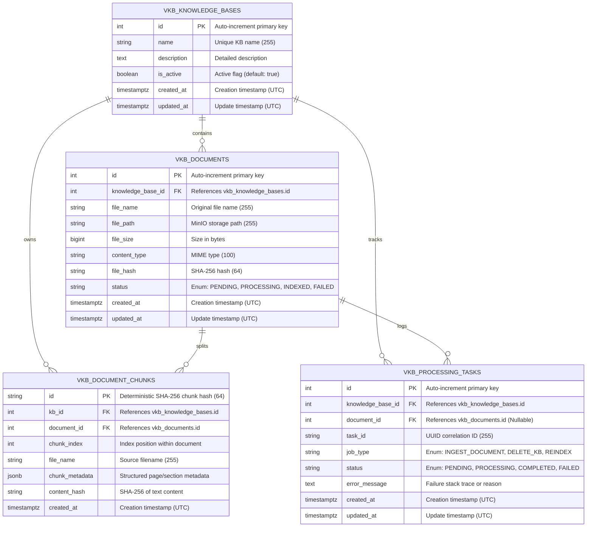

# Feature Specification: Vector-KB SQLAlchemy 2.0 Models

> **Feature ID:** `005_vector_kb_sqlalchemy_models_spec`  
> **Task Ref:** `TASK-DB-201`  
> **Target Branch:** `epic/rag-monorepo-mcp`  
> **Status:** `PROPOSED (Under Review)`  
> **Estimated Effort:** `1.5 hrs (Vibe-Coding) / 1.0 day (Traditional)`  
> **Author:** Antigravity Architect / Database & Backend Specialist  
> **Source Repository:** `vector-knowledge-base-mcp-server` (`/Users/galihpratama/Sites/vector-knowledge-base-mcp-server`)  
> **Upstream Reference:** [docs/lld/container_based_rag_platform_lld.md](file:///Users/galihpratama/Sites/akvo-rag/docs/lld/container_based_rag_platform_lld.md) (Sections 6, 8, 9)

---

## 1. Overview & 5W1H Requirements Discovery

### 1.1 Problem Statement
In the legacy `vector-knowledge-base-mcp-server` repository, SQLAlchemy models were written in legacy SQLAlchemy 1.4 syntax (`Column(...)`), contained MySQL-specific legacy types, and included Celery-specific fields (`celery_task_id`). 

For Option C monorepo consolidation, we are porting and modernizing these models into `vector-kb-mcp/models/` using **SQLAlchemy 2.0 typed syntax (`Mapped`, `mapped_column`)**, native **PostgreSQL 17 datatypes (`JSONB`, `TIMESTAMP with time zone`)**, and clean async relationship cascades.

### 1.2 5W1H Discovery Lens

| Dimension | Specification |
|---|---|
| **Who** | `vector-kb-mcp` service, Alembic migration engine (`alembic_version_vkb`), and async database sessions. |
| **What** | Port and modernize `KnowledgeBase`, `Document`, `DocumentChunk`, and `ProcessingTask` models using SQLAlchemy 2.0 declarative syntax and PostgreSQL 17 JSONB types. |
| **Where** | `vector-kb-mcp/models/` (`base.py`, `knowledge_base.py`, `document.py`, `document_chunk.py`, `processing_task.py`, `__init__.py`). |
| **When** | **Phase 2, Step 1** — foundational first step of Phase 2 before applying metadata enrichment (`TASK-DB-202`) and generating Alembic migrations (`TASK-DB-203`). |
| **Why** | Provides type safety, auto-completion, asyncpg compatibility, and efficient JSONB querying in PostgreSQL 17 while stripping out legacy Celery artifacts. |
| **How** | Python 3.11 with SQLAlchemy 2.0 `DeclarativeBase`, `Mapped[...]`, `mapped_column(...)`, `relationship(...)` with `cascade="all, delete-orphan"`, and `idx_` composite indices. |

---

## 2. Architecture & Entity-Relationship Model

### 2.1 Entity-Relationship (ER) Diagram



---

## 3. Detailed Model Specifications (SQLAlchemy 2.0)

### 3.1 Base Declarative Setup (`vector-kb-mcp/models/base.py`)

```python
from datetime import datetime, timezone
from sqlalchemy import DateTime, func
from sqlalchemy.orm import DeclarativeBase, Mapped, mapped_column

class Base(DeclarativeBase):
    """Base declarative class for all vector-kb-mcp models."""
    pass

class TimestampMixin:
    """Standardized UTC timestamp mixin using PostgreSQL TIMESTAMPTZ."""
    created_at: Mapped[datetime] = mapped_column(
        DateTime(timezone=True),
        server_default=func.now(),
        nullable=False
    )
    updated_at: Mapped[datetime] = mapped_column(
        DateTime(timezone=True),
        server_default=func.now(),
        onupdate=lambda: datetime.now(timezone.utc),
        nullable=False
    )
```

---

### 3.2 `KnowledgeBase` Model (`vector-kb-mcp/models/knowledge_base.py`)

```python
from typing import List, Optional
from sqlalchemy import String, Text, Boolean
from sqlalchemy.orm import Mapped, mapped_column, relationship
from .base import Base, TimestampMixin

class KnowledgeBase(Base, TimestampMixin):
    __tablename__ = "vkb_knowledge_bases"

    id: Mapped[int] = mapped_column(primary_key=True, autoincrement=True, index=True)
    name: Mapped[str] = mapped_column(String(255), nullable=False, index=True)
    description: Mapped[Optional[str]] = mapped_column(Text, nullable=True)
    is_active: Mapped[bool] = mapped_column(Boolean, default=True, server_default="true", nullable=False)

    # Relationships with strict cascade deletion
    documents: Mapped[List["Document"]] = relationship(
        "Document",
        back_populates="knowledge_base",
        cascade="all, delete-orphan",
        passive_deletes=True
    )
    chunks: Mapped[List["DocumentChunk"]] = relationship(
        "DocumentChunk",
        back_populates="knowledge_base",
        cascade="all, delete-orphan",
        passive_deletes=True
    )
    processing_tasks: Mapped[List["ProcessingTask"]] = relationship(
        "ProcessingTask",
        back_populates="knowledge_base",
        cascade="all, delete-orphan",
        passive_deletes=True
    )
```

---

### 3.3 `Document` Model (`vector-kb-mcp/models/document.py`)

```python
from typing import List, Optional
from sqlalchemy import String, BigInteger, ForeignKey, UniqueConstraint, Index
from sqlalchemy.orm import Mapped, mapped_column, relationship
from .base import Base, TimestampMixin

class Document(Base, TimestampMixin):
    __tablename__ = "vkb_documents"

    id: Mapped[int] = mapped_column(primary_key=True, autoincrement=True, index=True)
    knowledge_base_id: Mapped[int] = mapped_column(
        ForeignKey("vkb_knowledge_bases.id", ondelete="CASCADE"),
        nullable=False,
        index=True
    )
    file_name: Mapped[str] = mapped_column(String(255), nullable=False)
    file_path: Mapped[str] = mapped_column(String(255), nullable=False)  # S3/MinIO key
    file_size: Mapped[int] = mapped_column(BigInteger, nullable=False)
    content_type: Mapped[str] = mapped_column(String(100), nullable=False)
    file_hash: Mapped[str] = mapped_column(String(64), nullable=False, index=True)
    status: Mapped[str] = mapped_column(String(50), default="PENDING", server_default="PENDING", nullable=False)

    # Relationships
    knowledge_base: Mapped["KnowledgeBase"] = relationship("KnowledgeBase", back_populates="documents")
    chunks: Mapped[List["DocumentChunk"]] = relationship(
        "DocumentChunk",
        back_populates="document",
        cascade="all, delete-orphan",
        passive_deletes=True
    )
    processing_tasks: Mapped[List["ProcessingTask"]] = relationship(
        "ProcessingTask",
        back_populates="document",
        cascade="all, delete-orphan",
        passive_deletes=True
    )

    __table_args__ = (
        UniqueConstraint("knowledge_base_id", "file_name", name="uq_vkb_doc_kb_file_name"),
        Index("idx_vkb_doc_kb_status", "knowledge_base_id", "status"),
    )
```

---

### 3.4 `DocumentChunk` Model (`vector-kb-mcp/models/document_chunk.py`)

```python
from typing import Dict, Any, Optional
from datetime import datetime, timezone
from sqlalchemy import String, Integer, DateTime, ForeignKey, Index, func
from sqlalchemy.dialects.postgresql import JSONB
from sqlalchemy.orm import Mapped, mapped_column, relationship
from .base import Base

class DocumentChunk(Base):
    __tablename__ = "vkb_document_chunks"

    id: Mapped[str] = mapped_column(String(64), primary_key=True)  # SHA-256 deterministic chunk ID
    kb_id: Mapped[int] = mapped_column(
        ForeignKey("vkb_knowledge_bases.id", ondelete="CASCADE"),
        nullable=False,
        index=True
    )
    document_id: Mapped[int] = mapped_column(
        ForeignKey("vkb_documents.id", ondelete="CASCADE"),
        nullable=False,
        index=True
    )
    chunk_index: Mapped[int] = mapped_column(Integer, nullable=False, default=0)
    file_name: Mapped[str] = mapped_column(String(255), nullable=False)
    chunk_metadata: Mapped[Optional[Dict[str, Any]]] = mapped_column(JSONB, nullable=True)
    content_hash: Mapped[str] = mapped_column(String(64), nullable=False, index=True)
    created_at: Mapped[datetime] = mapped_column(
        DateTime(timezone=True),
        server_default=func.now(),
        nullable=False
    )

    # Relationships
    knowledge_base: Mapped["KnowledgeBase"] = relationship("KnowledgeBase", back_populates="chunks")
    document: Mapped["Document"] = relationship("Document", back_populates="chunks")

    __table_args__ = (
        Index("idx_vkb_chunk_kb_file", "kb_id", "file_name"),
        Index("idx_vkb_chunk_doc_idx", "document_id", "chunk_index"),
    )
```

---

### 3.5 `ProcessingTask` Model (`vector-kb-mcp/models/processing_task.py`)

```python
from typing import Optional
from sqlalchemy import String, Text, ForeignKey, Index
from sqlalchemy.orm import Mapped, mapped_column, relationship
from .base import Base, TimestampMixin

class ProcessingTask(Base, TimestampMixin):
    __tablename__ = "vkb_processing_tasks"

    id: Mapped[int] = mapped_column(primary_key=True, autoincrement=True, index=True)
    knowledge_base_id: Mapped[int] = mapped_column(
        ForeignKey("vkb_knowledge_bases.id", ondelete="CASCADE"),
        nullable=False,
        index=True
    )
    document_id: Mapped[Optional[int]] = mapped_column(
        ForeignKey("vkb_documents.id", ondelete="SET NULL"),
        nullable=True,
        index=True
    )
    task_id: Mapped[str] = mapped_column(String(255), nullable=False, index=True)  # UUID correlation ID
    job_type: Mapped[str] = mapped_column(String(100), nullable=False)  # e.g. "INGEST_DOCUMENT", "DELETE_KB"
    status: Mapped[str] = mapped_column(String(50), default="PENDING", server_default="PENDING", nullable=False)
    error_message: Mapped[Optional[str]] = mapped_column(Text, nullable=True)

    # Relationships
    knowledge_base: Mapped["KnowledgeBase"] = relationship("KnowledgeBase", back_populates="processing_tasks")
    document: Mapped[Optional["Document"]] = relationship("Document", back_populates="processing_tasks")

    __table_args__ = (
        Index("idx_vkb_task_kb_status", "knowledge_base_id", "status"),
    )
```

---

### 3.6 Models Export Registry (`vector-kb-mcp/models/__init__.py`)

```python
from .base import Base, TimestampMixin
from .knowledge_base import KnowledgeBase
from .document import Document
from .document_chunk import DocumentChunk
from .processing_task import ProcessingTask

__all__ = [
    "Base",
    "TimestampMixin",
    "KnowledgeBase",
    "Document",
    "DocumentChunk",
    "ProcessingTask",
]
```

---

## 4. Verification & Quality Gates

### 4.1 Automated Model Unit Tests (`vector-kb-mcp/tests/test_models.py`)
1. **Schema Validation Test:**
   - Initialize SQLAlchemy in-memory SQLite / PostgreSQL test engine.
   - Run `Base.metadata.create_all(engine)`.
   - Assert all 4 tables (`vkb_knowledge_bases`, `vkb_documents`, `vkb_document_chunks`, `vkb_processing_tasks`) create with all foreign key constraints.
2. **Cascade Deletion Test:**
   - Insert `KnowledgeBase` $\rightarrow$ insert 2 `Document` records $\rightarrow$ insert 4 `DocumentChunk` records.
   - Delete `KnowledgeBase` $\rightarrow$ assert all child documents and chunks are automatically deleted via `ondelete="CASCADE"`.
3. **Unique Constraint Test:**
   - Attempt to insert two documents with the same `file_name` in the same `knowledge_base_id`.
   - Assert `IntegrityError` is raised on duplicate insert.

---

## 5. Subtask Estimation & Breakdown

| Subtask ID | Description | Target Files | Vibe Est. | Trad. Est. | Confidence |
|---|---|---|:---:|:---:|:---:|
| `SUB-201.1` | Setup `Base` DeclarativeBase and `TimestampMixin` with TIMESTAMPTZ | `vector-kb-mcp/models/base.py` `[NEW]` | 0.2 hr | 0.2 day | High (99%) |
| `SUB-201.2` | Implement `KnowledgeBase` and `Document` models with SQLAlchemy 2.0 `Mapped` syntax | `vector-kb-mcp/models/knowledge_base.py`, `document.py` `[NEW]` | 0.5 hr | 0.3 day | High (98%) |
| `SUB-201.3` | Implement `DocumentChunk` (JSONB metadata) and `ProcessingTask` models | `vector-kb-mcp/models/document_chunk.py`, `processing_task.py` `[NEW]` | 0.5 hr | 0.3 day | High (98%) |
| `SUB-201.4` | Implement model unit tests (table creation, cascades, constraints) | `vector-kb-mcp/tests/test_models.py` `[NEW]` | 0.3 hr | 0.2 day | High (95%) |
| **TOTAL** | | | **1.5 hrs** | **1.0 day** | **High** |

---

## 6. Definition of Done (DoD)

- [ ] All models in `vector-kb-mcp/models/` use strict SQLAlchemy 2.0 `Mapped[...]` and `mapped_column(...)` syntax.
- [ ] Celery-specific column `celery_task_id` is replaced by generic `task_id` (UUID).
- [ ] PostgreSQL 17 native `JSONB` is used for chunk metadata.
- [ ] Foreign key relationships enforce `ondelete="CASCADE"` for clean cleanup.
- [ ] `test_models.py` executes and passes with 100% test coverage.
