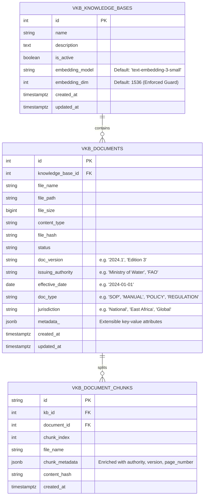
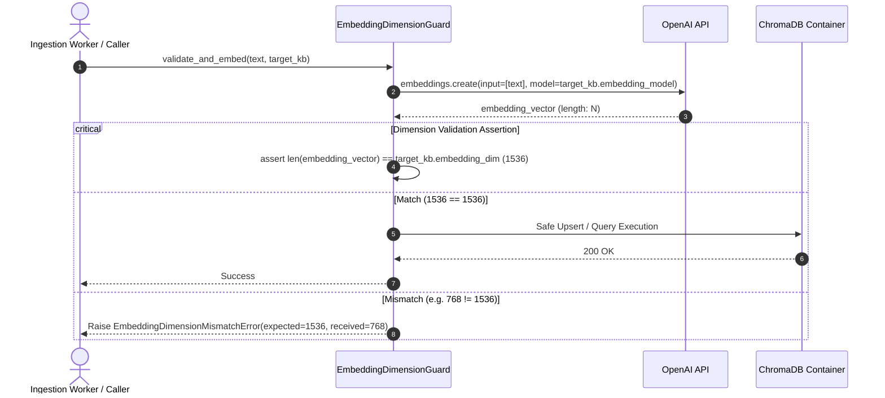

# Feature Specification: Metadata Enrichment & 1536-dim Embedding Guard

> **Feature ID:** `006_db_202_metadata_enrichment_and_embedding_guard_spec`  
> **Task Ref:** `TASK-DB-202`  
> **Target Branch:** `epic/rag-monorepo-mcp`  
> **Status:** `PROPOSED (Under Review)`  
> **Estimated Effort:** `1.5 hrs (Vibe-Coding) / 1.0 day (Traditional)`  
> **Author:** Antigravity Architect / Data Architect  
> **Upstream Reference:** [docs/lld/container_based_rag_platform_lld.md](file:///Users/galihpratama/Sites/akvo-rag/docs/lld/container_based_rag_platform_lld.md) (Sections 6, 8, 9)

---

## 1. Overview & 5W1H Requirements Discovery

### 1.1 Problem Statement
In public-sector, agriculture, and WASH deployments (such as `AgriConnect` and `CoM`), citations cannot simply refer to generic filenames (e.g. `doc_12.pdf`). Citations require **institutional authority, edition/versioning, effective dates, and jurisdictional scope** (e.g. *"National Water Quality Standard 2024, Ministry of Water, Edition 3"*). 

Furthermore, vector stores will silently fail or produce corrupted cosine distance calculations if embeddings of different dimensions (e.g. 768 vs 1536 vs 3072) are inserted into the same knowledge base collection.

`TASK-DB-202` enriches the `KnowledgeBase` and `Document` models with public-sector governance metadata, extensible `JSONB` attributes, and implements a strict **1536-dim embedding validation guard**.

### 1.2 5W1H Discovery Lens

| Dimension | Specification |
|---|---|
| **Who** | Host applications (`AgriConnect`, `CoM`), extension officers, domain managers, and the RAG answer synthesis engine. |
| **What** | Add governance metadata columns to `vkb_documents`, embedding model/dimension tracking to `vkb_knowledge_bases`, and a runtime 1536-dim validation guard. |
| **Where** | `vector-kb-mcp/models/` (`knowledge_base.py`, `document.py`, `document_chunk.py`), `vector-kb-mcp/core/exceptions.py`. |
| **When** | **Phase 2, Step 2** — immediately before generating the service-owned Alembic migrations in `TASK-DB-203`. |
| **Why** | Provides legal/institutional grounding in LLM responses and prevents vector database corruption from dimensional mismatches. |
| **How** | SQLAlchemy 2.0 `mapped_column`, PostgreSQL `JSONB` GIN indexing, and pre-ingest/pre-query dimension assertions. |

---

## 2. Architecture & Data Model Design

### 2.1 Enriched Entity-Relationship (ER) Schema



### 2.2 Embedding Dimension Guard Flow



---

## 3. Detailed Technical Specifications

### 3.1 Custom Exceptions (`vector-kb-mcp/core/exceptions.py`)

```python
class VectorMCPException(Exception):
    """Base exception for all vector-kb-mcp operations."""
    pass

class EmbeddingDimensionMismatchError(VectorMCPException):
    def __init__(self, kb_id: int, expected_dim: int, actual_dim: int, model: str):
        self.kb_id = kb_id
        self.expected_dim = expected_dim
        self.actual_dim = actual_dim
        self.model = model
        super().__init__(
            f"Embedding dimension mismatch for KB #{kb_id} using model '{model}'. "
            f"Expected {expected_dim}-dim, received {actual_dim}-dim."
        )
```

---

### 3.2 Enriched `KnowledgeBase` Model (`vector-kb-mcp/models/knowledge_base.py`)

```python
from typing import List, Optional
from sqlalchemy import String, Text, Boolean, Integer
from sqlalchemy.orm import Mapped, mapped_column, relationship
from .base import Base, TimestampMixin

class KnowledgeBase(Base, TimestampMixin):
    __tablename__ = "vkb_knowledge_bases"

    id: Mapped[int] = mapped_column(primary_key=True, autoincrement=True, index=True)
    name: Mapped[str] = mapped_column(String(255), nullable=False, index=True)
    description: Mapped[Optional[str]] = mapped_column(Text, nullable=True)
    is_active: Mapped[bool] = mapped_column(Boolean, default=True, server_default="true", nullable=False)

    # Embedding model configuration & dimension guard
    embedding_model: Mapped[str] = mapped_column(
        String(100),
        default="text-embedding-3-small",
        server_default="text-embedding-3-small",
        nullable=False
    )
    embedding_dim: Mapped[int] = mapped_column(
        Integer,
        default=1536,
        server_default="1536",
        nullable=False
    )

    # Relationships
    documents: Mapped[List["Document"]] = relationship(
        "Document",
        back_populates="knowledge_base",
        cascade="all, delete-orphan",
        passive_deletes=True
    )
    chunks: Mapped[List["DocumentChunk"]] = relationship(
        "DocumentChunk",
        back_populates="knowledge_base",
        cascade="all, delete-orphan",
        passive_deletes=True
    )
    processing_tasks: Mapped[List["ProcessingTask"]] = relationship(
        "ProcessingTask",
        back_populates="knowledge_base",
        cascade="all, delete-orphan",
        passive_deletes=True
    )
```

---

### 3.3 Enriched `Document` Model (`vector-kb-mcp/models/document.py`)

```python
from typing import List, Optional, Dict, Any
from datetime import date
from sqlalchemy import String, BigInteger, ForeignKey, UniqueConstraint, Index, Date
from sqlalchemy.dialects.postgresql import JSONB
from sqlalchemy.orm import Mapped, mapped_column, relationship
from .base import Base, TimestampMixin

class Document(Base, TimestampMixin):
    __tablename__ = "vkb_documents"

    id: Mapped[int] = mapped_column(primary_key=True, autoincrement=True, index=True)
    knowledge_base_id: Mapped[int] = mapped_column(
        ForeignKey("vkb_knowledge_bases.id", ondelete="CASCADE"),
        nullable=False,
        index=True
    )
    file_name: Mapped[str] = mapped_column(String(255), nullable=False)
    file_path: Mapped[str] = mapped_column(String(255), nullable=False)  # S3/MinIO key
    file_size: Mapped[int] = mapped_column(BigInteger, nullable=False)
    content_type: Mapped[str] = mapped_column(String(100), nullable=False)
    file_hash: Mapped[str] = mapped_column(String(64), nullable=False, index=True)
    status: Mapped[str] = mapped_column(String(50), default="PENDING", server_default="PENDING", nullable=False)

    # --- Public-Sector Governance & Citation Metadata ---
    doc_version: Mapped[Optional[str]] = mapped_column(String(50), nullable=True)
    issuing_authority: Mapped[Optional[str]] = mapped_column(String(255), nullable=True)
    effective_date: Mapped[Optional[date]] = mapped_column(Date, nullable=True)
    doc_type: Mapped[Optional[str]] = mapped_column(String(100), nullable=True)  # SOP, MANUAL, POLICY
    jurisdiction: Mapped[Optional[str]] = mapped_column(String(100), nullable=True)
    metadata_: Mapped[Optional[Dict[str, Any]]] = mapped_column(JSONB, nullable=True)

    # Relationships
    knowledge_base: Mapped["KnowledgeBase"] = relationship("KnowledgeBase", back_populates="documents")
    chunks: Mapped[List["DocumentChunk"]] = relationship(
        "DocumentChunk",
        back_populates="document",
        cascade="all, delete-orphan",
        passive_deletes=True
    )
    processing_tasks: Mapped[List["ProcessingTask"]] = relationship(
        "ProcessingTask",
        back_populates="document",
        cascade="all, delete-orphan",
        passive_deletes=True
    )

    __table_args__ = (
        UniqueConstraint("knowledge_base_id", "file_name", name="uq_vkb_doc_kb_file_name"),
        Index("idx_vkb_doc_kb_status", "knowledge_base_id", "status"),
        Index("idx_vkb_doc_authority", "issuing_authority"),
        Index("idx_vkb_doc_type", "knowledge_base_id", "doc_type"),
        Index("idx_vkb_doc_metadata_gin", "metadata_", postgresql_using="gin"),
    )
```

---

### 3.4 Citation Enrichment in `ChromaRetriever`

When `ChromaRetriever` returns a chunk, its `metadata` dictionary is enriched with the parent document's governance fields:

```python
# Format returned in RetrievedChunk.metadata:
{
    "kb_id": 1,
    "document_id": "doc-50",
    "file_name": "national_water_standard_2024.pdf",
    "page_number": 14,
    "doc_version": "2024.1",
    "issuing_authority": "Ministry of Water & Sanitation",
    "doc_type": "STANDARD",
    "effective_date": "2024-01-01",
    "jurisdiction": "National"
}
```

This enables the LLM synthesis node in `akvo-rag-backend` to format authoritative citations:
> *"According to the National Water Standard 2024 (Ministry of Water & Sanitation, Page 14), borehole pump yields must be measured across a 24-hour drawdown cycle."*

---

## 4. Verification & Quality Gates

### 4.1 Automated Model & Guard Tests (`vector-kb-mcp/tests/test_metadata_guard.py`)
1. **Metadata Persistence Test:**
   - Create `Document` with `issuing_authority="UNEP"`, `doc_version="2024"`, `doc_type="POLICY"`, `effective_date=date(2024, 1, 1)`.
   - Persist to test database $\rightarrow$ query back $\rightarrow$ assert all governance attributes match.
2. **Dimension Guard Positive Test:**
   - Vector with length 1536 is generated $\rightarrow$ validated against `kb.embedding_dim == 1536` $\rightarrow$ passes without error.
3. **Dimension Guard Negative Test:**
   - Vector with length 768 (e.g. from an incorrect embedding model) is passed $\rightarrow$ asserts `EmbeddingDimensionMismatchError` is raised with descriptive message.
4. **JSONB GIN Query Test:**
   - Query documents with `metadata_["program"] == "WASH-2024"` $\rightarrow$ assert PostgreSQL GIN index efficiently returns matching records.

---

## 5. Subtask Estimation & Breakdown

| Subtask ID | Description | Target Files | Vibe Est. | Trad. Est. | Confidence |
|---|---|---|:---:|:---:|:---:|
| `SUB-202.1` | Add `embedding_model` and `embedding_dim` columns to `KnowledgeBase` model | `vector-kb-mcp/models/knowledge_base.py` `[MODIFY]` | 0.3 hr | 0.2 day | High (99%) |
| `SUB-202.2` | Add governance metadata columns (`authority`, `version`, `date`, `type`) and GIN index to `Document` | `vector-kb-mcp/models/document.py` `[MODIFY]` | 0.5 hr | 0.3 day | High (98%) |
| `SUB-202.3` | Implement `EmbeddingDimensionMismatchError` and dimension validation guard | `vector-kb-mcp/core/exceptions.py`, `retriever/chroma_retriever.py` `[MODIFY]` | 0.4 hr | 0.3 day | High (95%) |
| `SUB-202.4` | Implement unit tests for metadata persistence and dimension guard assertions | `vector-kb-mcp/tests/test_metadata_guard.py` `[NEW]` | 0.3 hr | 0.2 day | High (98%) |
| **TOTAL** | | | **1.5 hrs** | **1.0 day** | **High** |

---

## 6. Definition of Done (DoD)

- [ ] `KnowledgeBase` model includes `embedding_model` (default: `text-embedding-3-small`) and `embedding_dim` (default: 1536).
- [ ] `Document` model includes governance columns (`doc_version`, `issuing_authority`, `effective_date`, `doc_type`, `jurisdiction`) and JSONB GIN index.
- [ ] Runtime dimension guard prevents indexing or querying vectors with lengths $\neq 1536$.
- [ ] `test_metadata_guard.py` executes and passes with 100% test coverage.
