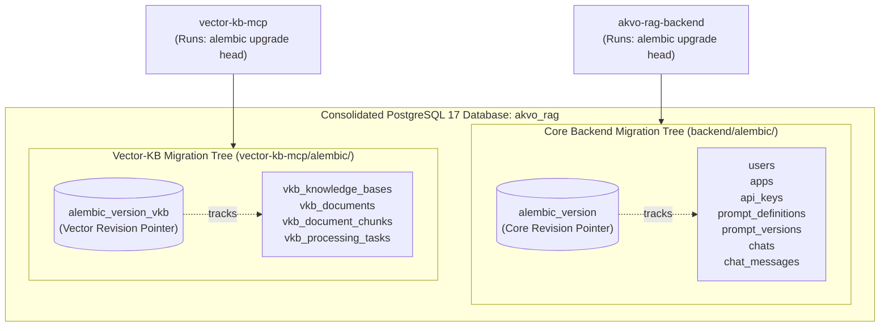

# Feature Specification: Service-Owned Alembic Migrations (`alembic_version_vkb`)

> **Feature ID:** `007_db_203_service_owned_alembic_migrations_spec`  
> **Task Ref:** `TASK-DB-203`  
> **Target Branch:** `epic/rag-monorepo-mcp`  
> **Status:** `PROPOSED (Under Review)`  
> **Estimated Effort:** `1.5 hrs (Vibe-Coding) / 1.0 day (Traditional)`  
> **Author:** Antigravity Architect / Database & DevOps Engineer  
> **Source Repository:** `vector-knowledge-base-mcp-server` (`/Users/galihpratama/Sites/vector-knowledge-base-mcp-server`)  
> **Upstream Reference:** [docs/lld/container_based_rag_platform_lld.md](file:///Users/galihpratama/Sites/akvo-rag/docs/lld/container_based_rag_platform_lld.md) (Sections 6, 8, 9)

---

## 1. Overview & 5W1H Requirements Discovery

### 1.1 Problem Statement
In Option C, both `akvo-rag-backend` and `vector-kb-mcp` connect to the same consolidated PostgreSQL 17 database instance (`akvo_rag`). If both services used the default Alembic tracking table (`alembic_version`), their independent migration revision trees would collide, causing `alembic upgrade head` to overwrite or fail on startup.

`TASK-DB-203` establishes a dedicated, service-owned Alembic migration environment inside `vector-kb-mcp/` using an isolated version table:
$$\text{version\_table} = \mathbf{"alembic\_version\_vkb"}$$

This guarantees 100% schema isolation and allows `vector-kb-mcp` to manage and evolve its database tables independently of `backend/`.

### 1.2 5W1H Discovery Lens

| Dimension | Specification |
|---|---|
| **Who** | `vector-kb-mcp` container startup script, automated CI pipelines, and database administrators. |
| **What** | Configure an isolated Alembic environment in `vector-kb-mcp/` (`alembic.ini`, `env.py`) with `version_table = "alembic_version_vkb"` and author the initial baseline migration (`001_initial_vkb_schema.py`). |
| **Where** | `vector-kb-mcp/alembic.ini`, `vector-kb-mcp/alembic/env.py`, `vector-kb-mcp/alembic/script.py.mako`, `vector-kb-mcp/alembic/versions/`. |
| **When** | **Phase 2, Step 3** — immediately following model definition & metadata enrichment (`TASK-DB-201`, `TASK-DB-202`). |
| **Why** | Prevents migration collisions in PostgreSQL 17, provides true microservice autonomy, and automates DDL lifecycle management. |
| **How** | Alembic async engine configuration with `asyncpg`, `include_object` filter, `version_table="alembic_version_vkb"`, and PostgreSQL 17 DDL operations (JSONB, TIMESTAMPTZ, GIN indices). |

---

## 2. Architecture & Schema Isolation Topology

### 2.1 Database Schema Isolation Architecture



---

## 3. Detailed Technical Specifications

### 3.1 Alembic Configuration (`vector-kb-mcp/alembic.ini`)

```ini
[alembic]
script_location = alembic
prepend_sys_path = .
version_path_separator = os
version_table = alembic_version_vkb
file_template = %%(year)d_%%(month).2d_%%(day).2d_%%(hour).2d%%(minute).2d-%%(rev)s_%%(slug)s

# Logging configuration
[loggers]
keys = root,sqlalchemy,alembic

[handlers]
keys = console

[formatters]
keys = generic

[logger_root]
level = WARN
handlers = console
qualname =

[logger_sqlalchemy]
level = WARN
handlers =
qualname = sqlalchemy.engine

[logger_alembic]
level = INFO
handlers =
qualname = alembic

[handler_console]
class = StreamHandler
args = (sys.stderr,)
level = NOTSET
formatter = generic

[formatter_generic]
format = %(levelname)-5.5s [%(name)s] %(message)s
datefmt = %H:%M:%S
```

---

### 3.2 Async Migration Environment (`vector-kb-mcp/alembic/env.py`)

```python
import asyncio
from logging.config import fileConfig
from sqlalchemy import pool
from sqlalchemy.engine import Connection
from sqlalchemy.ext.asyncio import async_engine_from_config
from alembic import context

from core.config import settings
from models.base import Base
# Import all models to ensure metadata registration
from models import KnowledgeBase, Document, DocumentChunk, ProcessingTask

config = context.config

if config.config_file_name is not None:
    fileConfig(config.config_file_name)

target_metadata = Base.metadata

# Override URL with application settings
config.set_main_option("sqlalchemy.url", settings.DATABASE_URL)

def include_object(object, name, type_, reflected, compare_to):
    """Ensure vector-kb alembic only touches vkb_ tables."""
    if type_ == "table":
        return name.startswith("vkb_")
    return True

def run_migrations_offline() -> None:
    """Run migrations in 'offline' mode."""
    url = config.get_main_option("sqlalchemy.url")
    context.configure(
        url=url,
        target_metadata=target_metadata,
        literal_binds=True,
        dialect_opts={"paramstyle": "named"},
        version_table="alembic_version_vkb",
        include_object=include_object,
    )

    with context.begin_transaction():
        context.run_migrations()

def do_run_migrations(connection: Connection) -> None:
    context.configure(
        connection=connection,
        target_metadata=target_metadata,
        version_table="alembic_version_vkb",
        include_object=include_object,
    )

    with context.begin_transaction():
        context.run_migrations()

async def run_async_migrations() -> None:
    """Run migrations in 'online' async mode."""
    configuration = config.get_section(config.config_ini_section)
    configuration["sqlalchemy.url"] = settings.DATABASE_URL

    connectable = async_engine_from_config(
        configuration,
        prefix="sqlalchemy.",
        poolclass=pool.NullPool,
    )

    async with connectable.connect() as connection:
        await connection.run_sync(do_run_migrations)

    await connectable.dispose()

def run_migrations_online() -> None:
    """Run migrations in 'online' mode."""
    asyncio.run(run_async_migrations())

if context.is_offline_mode():
    run_migrations_offline()
else:
    run_migrations_online()
```

---

### 3.3 Initial Baseline Migration (`alembic/versions/001_initial_vkb_schema.py`)

```python
"""initial vkb schema

Revision ID: 001_initial_vkb_schema
Revises: 
Create Date: 2026-09-02 00:00:00.000000

"""
from typing import Sequence, Union
from alembic import op
import sqlalchemy as sa
from sqlalchemy.dialects import postgresql

revision: str = '001_initial_vkb_schema'
down_revision: Union[str, None] = None
branch_labels: Union[str, Sequence[str], None] = None
depends_on: Union[str, Sequence[str], None] = None

def upgrade() -> None:
    # 1. Create vkb_knowledge_bases table
    op.create_table(
        'vkb_knowledge_bases',
        sa.Column('id', sa.Integer(), autoincrement=True, nullable=False),
        sa.Column('name', sa.String(length=255), nullable=False),
        sa.Column('description', sa.Text(), nullable=True),
        sa.Column('is_active', sa.Boolean(), server_default='true', nullable=False),
        sa.Column('embedding_model', sa.String(length=100), server_default='text-embedding-3-small', nullable=False),
        sa.Column('embedding_dim', sa.Integer(), server_default='1536', nullable=False),
        sa.Column('created_at', sa.DateTime(timezone=True), server_default=sa.text('now()'), nullable=False),
        sa.Column('updated_at', sa.DateTime(timezone=True), server_default=sa.text('now()'), nullable=False),
        sa.PrimaryKeyConstraint('id')
    )
    op.create_index(op.f('ix_vkb_knowledge_bases_id'), 'vkb_knowledge_bases', ['id'], unique=False)
    op.create_index(op.f('ix_vkb_knowledge_bases_name'), 'vkb_knowledge_bases', ['name'], unique=False)

    # 2. Create vkb_documents table
    op.create_table(
        'vkb_documents',
        sa.Column('id', sa.Integer(), autoincrement=True, nullable=False),
        sa.Column('knowledge_base_id', sa.Integer(), nullable=False),
        sa.Column('file_name', sa.String(length=255), nullable=False),
        sa.Column('file_path', sa.String(length=255), nullable=False),
        sa.Column('file_size', sa.BigInteger(), nullable=False),
        sa.Column('content_type', sa.String(length=100), nullable=False),
        sa.Column('file_hash', sa.String(length=64), nullable=False),
        sa.Column('status', sa.String(length=50), server_default='PENDING', nullable=False),
        sa.Column('doc_version', sa.String(length=50), nullable=True),
        sa.Column('issuing_authority', sa.String(length=255), nullable=True),
        sa.Column('effective_date', sa.Date(), nullable=True),
        sa.Column('doc_type', sa.String(length=100), nullable=True),
        sa.Column('jurisdiction', sa.String(length=100), nullable=True),
        sa.Column('metadata_', postgresql.JSONB(astext_type=sa.Text()), nullable=True),
        sa.Column('created_at', sa.DateTime(timezone=True), server_default=sa.text('now()'), nullable=False),
        sa.Column('updated_at', sa.DateTime(timezone=True), server_default=sa.text('now()'), nullable=False),
        sa.ForeignKeyConstraint(['knowledge_base_id'], ['vkb_knowledge_bases.id'], ondelete='CASCADE'),
        sa.PrimaryKeyConstraint('id'),
        sa.UniqueConstraint('knowledge_base_id', 'file_name', name='uq_vkb_doc_kb_file_name')
    )
    op.create_index(op.f('ix_vkb_documents_id'), 'vkb_documents', ['id'], unique=False)
    op.create_index(op.f('ix_vkb_documents_knowledge_base_id'), 'vkb_documents', ['knowledge_base_id'], unique=False)
    op.create_index(op.f('ix_vkb_documents_file_hash'), 'vkb_documents', ['file_hash'], unique=False)
    op.create_index('idx_vkb_doc_kb_status', 'vkb_documents', ['knowledge_base_id', 'status'], unique=False)
    op.create_index('idx_vkb_doc_authority', 'vkb_documents', ['issuing_authority'], unique=False)
    op.create_index('idx_vkb_doc_type', 'vkb_documents', ['knowledge_base_id', 'doc_type'], unique=False)
    op.create_index('idx_vkb_doc_metadata_gin', 'vkb_documents', ['metadata_'], unique=False, postgresql_using='gin')

    # 3. Create vkb_document_chunks table
    op.create_table(
        'vkb_document_chunks',
        sa.Column('id', sa.String(length=64), nullable=False),
        sa.Column('kb_id', sa.Integer(), nullable=False),
        sa.Column('document_id', sa.Integer(), nullable=False),
        sa.Column('chunk_index', sa.Integer(), nullable=False),
        sa.Column('file_name', sa.String(length=255), nullable=False),
        sa.Column('chunk_metadata', postgresql.JSONB(astext_type=sa.Text()), nullable=True),
        sa.Column('content_hash', sa.String(length=64), nullable=False),
        sa.Column('created_at', sa.DateTime(timezone=True), server_default=sa.text('now()'), nullable=False),
        sa.ForeignKeyConstraint(['document_id'], ['vkb_documents.id'], ondelete='CASCADE'),
        sa.ForeignKeyConstraint(['kb_id'], ['vkb_knowledge_bases.id'], ondelete='CASCADE'),
        sa.PrimaryKeyConstraint('id')
    )
    op.create_index(op.f('ix_vkb_document_chunks_kb_id'), 'vkb_document_chunks', ['kb_id'], unique=False)
    op.create_index(op.f('ix_vkb_document_chunks_document_id'), 'vkb_document_chunks', ['document_id'], unique=False)
    op.create_index(op.f('ix_vkb_document_chunks_content_hash'), 'vkb_document_chunks', ['content_hash'], unique=False)
    op.create_index('idx_vkb_chunk_kb_file', 'vkb_document_chunks', ['kb_id', 'file_name'], unique=False)
    op.create_index('idx_vkb_chunk_doc_idx', 'vkb_document_chunks', ['document_id', 'chunk_index'], unique=False)

    # 4. Create vkb_processing_tasks table
    op.create_table(
        'vkb_processing_tasks',
        sa.Column('id', sa.Integer(), autoincrement=True, nullable=False),
        sa.Column('knowledge_base_id', sa.Integer(), nullable=False),
        sa.Column('document_id', sa.Integer(), nullable=True),
        sa.Column('task_id', sa.String(length=255), nullable=False),
        sa.Column('job_type', sa.String(length=100), nullable=False),
        sa.Column('status', sa.String(length=50), server_default='PENDING', nullable=False),
        sa.Column('error_message', sa.Text(), nullable=True),
        sa.Column('created_at', sa.DateTime(timezone=True), server_default=sa.text('now()'), nullable=False),
        sa.Column('updated_at', sa.DateTime(timezone=True), server_default=sa.text('now()'), nullable=False),
        sa.ForeignKeyConstraint(['document_id'], ['vkb_documents.id'], ondelete='SET NULL'),
        sa.ForeignKeyConstraint(['knowledge_base_id'], ['vkb_knowledge_bases.id'], ondelete='CASCADE'),
        sa.PrimaryKeyConstraint('id')
    )
    op.create_index(op.f('ix_vkb_processing_tasks_id'), 'vkb_processing_tasks', ['id'], unique=False)
    op.create_index(op.f('ix_vkb_processing_tasks_task_id'), 'vkb_processing_tasks', ['task_id'], unique=False)
    op.create_index('idx_vkb_task_kb_status', 'vkb_processing_tasks', ['knowledge_base_id', 'status'], unique=False)

def downgrade() -> None:
    op.drop_table('vkb_processing_tasks')
    op.drop_table('vkb_document_chunks')
    op.drop_table('vkb_documents')
    op.drop_table('vkb_knowledge_bases')
```

---

## 4. Verification & Quality Gates

### 4.1 Automated Migration Lifecycle Tests
1. **Migration Upgrade Test:**
   ```bash
   cd vector-kb-mcp && alembic upgrade head
   # Assert: Exit code 0, tables vkb_* created in PostgreSQL 17
   ```
2. **Version Table Isolation Assertion:**
   ```bash
   docker exec -it akvo-rag-postgres-1 psql -U postgres -d akvo_rag -c \
     "SELECT version_num FROM alembic_version_vkb;"
   # Assert: Returns '001_initial_vkb_schema'
   ```
3. **Migration Downgrade & Re-Upgrade Test (Roundtrip):**
   ```bash
   cd vector-kb-mcp && alembic downgrade base && alembic upgrade head
   # Assert: Clean drop and rebuild with 0 schema errors
   ```

---

## 5. Subtask Estimation & Breakdown

| Subtask ID | Description | Target Files | Vibe Est. | Trad. Est. | Confidence |
|---|---|---|:---:|:---:|:---:|
| `SUB-203.1` | Setup `vector-kb-mcp/alembic.ini` and `env.py` with `version_table="alembic_version_vkb"` | `vector-kb-mcp/alembic.ini`, `alembic/env.py` `[NEW]` | 0.4 hr | 0.3 day | High (99%) |
| `SUB-203.2` | Author initial baseline migration script `001_initial_vkb_schema.py` | `vector-kb-mcp/alembic/versions/001_initial_vkb_schema.py` `[NEW]` | 0.6 hr | 0.4 day | High (98%) |
| `SUB-203.3` | Test upgrade/downgrade roundtrip against live PostgreSQL 17 container | CLI / PostgreSQL 17 | 0.5 hr | 0.3 day | High (95%) |
| **TOTAL** | | | **1.5 hrs** | **1.0 day** | **High** |

---

## 6. Definition of Done (DoD)

- [ ] `alembic -c alembic.ini upgrade head` executes cleanly against PostgreSQL 17 without errors.
- [ ] Version state is tracked in `alembic_version_vkb` without touching `alembic_version`.
- [ ] Downgrade to base and re-upgrade to head executes without syntax or constraint failures.
- [ ] GIN index `idx_vkb_doc_metadata_gin` and foreign key cascade rules are active in PostgreSQL 17.
