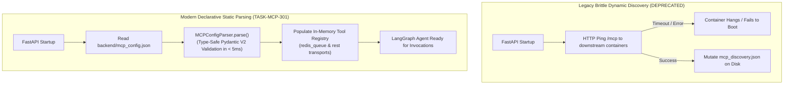

# Feature Specification: Declarative `mcp_config.json` Schema & Static Parser

> **Feature ID:** `009_mcp_301_mcp_config_schema_and_static_parser_spec`  
> **Task Ref:** `TASK-MCP-301`  
> **Target Branch:** `epic/rag-monorepo-mcp`  
> **Status:** `PROPOSED (Under Review)`  
> **Estimated Effort:** `1.0 hr (Vibe-Coding) / 0.5 day (Traditional)`  
> **Author:** Antigravity Architect / Backend & Systems Specialist  
> **Upstream Reference:** [docs/lld/container_based_rag_platform_lld.md](file:///Users/galihpratama/Sites/akvo-rag/docs/lld/container_based_rag_platform_lld.md) (Sections 7, 8, 9)

---

## 1. Overview & 5W1H Requirements Discovery

### 1.1 Problem Statement
In the legacy `akvo-rag` backend, MCP tool discovery was brittle and fragmented:
1. It depended on dynamic HTTP discovery (`mcp_discovery_manager.py`) querying `/mcp` endpoints at server boot and mutating `mcp_discovery.json` on disk.
2. It relied on FastMCP SSE transport which introduced connection timeouts, Base64 serialization overhead, and runtime hangs if a downstream container was slow to boot.
3. Server configuration was duplicated across `mcp_servers_config.py`, `mcp_discovery.json`, and environment variables without strict schema validation.

`TASK-MCP-301` replaces dynamic runtime discovery with a **single, declarative, version-controlled configuration file (`backend/mcp_config.json`)** and a **zero-latency static Pydantic V2 parser (`MCPConfigParser`)** supporting two clean transports:
- `"transport": "redis_queue"`: Sub-5ms native Redis queue RPC for internal microservices (`vector_kb`).
- `"transport": "rest"`: Standard HTTP POST for external web tools (`weather_mcp`, `agri_mcp`).

### 1.2 5W1H Discovery Lens

| Dimension | Specification |
|---|---|
| **Who** | `akvo-rag-backend` application lifecycle, LangGraph agent nodes, and tool execution dispatcher. |
| **What** | Author declarative `backend/mcp_config.json` and implement type-safe Pydantic models & static loader in `app/core/mcp_config.py`. |
| **Where** | `backend/mcp_config.json`, `backend/app/core/mcp_config.py`, `backend/tests/unit/test_mcp_config_parser.py`. |
| **When** | **Phase 3, Step 1** — first task of Phase 3, establishing the declarative contract before implementing the Redis RPC client (`TASK-MCP-302`). |
| **Why** | Guarantees deterministic $< 5\text{ms}$ backend startup with 0 network calls, enables compile-time type validation of tool schemas, and unifies internal/external transports. |
| **How** | Pydantic V2 `BaseModel`, discriminated transport unions (`RedisQueueTransportConfig` vs `RestTransportConfig`), and JSON schema validation. |

---

## 2. Architecture & Data Flow Design

### 2.1 Static Bootstrapping vs Legacy Discovery



---

## 3. Detailed Technical Specifications

### 3.1 Declarative Configuration File (`backend/mcp_config.json`)

```json
{
  "version": "1.0",
  "servers": {
    "knowledge_bases_mcp": {
      "name": "Vector Knowledge Base Microservice",
      "transport": "redis_queue",
      "request_queue": "mcp:vector:requests",
      "response_queue_prefix": "mcp:vector:responses",
      "timeout_seconds": 30,
      "tools": [
        {
          "name": "query_knowledge_base",
          "description": "Query specific vector knowledge bases and retrieve semantic chunks with grounded citations.",
          "inputSchema": {
            "type": "object",
            "properties": {
              "query": {
                "type": "string",
                "description": "Natural language user query to search against knowledge base embeddings."
              },
              "knowledge_base_ids": {
                "type": "array",
                "items": { "type": "integer" },
                "description": "List of target knowledge base IDs."
              },
              "top_k": {
                "type": "integer",
                "default": 5,
                "description": "Maximum number of relevant chunks to return."
              },
              "score_threshold": {
                "type": "number",
                "default": 0.0,
                "description": "Minimum similarity score threshold (0.0 to 1.0)."
              }
            },
            "required": ["query", "knowledge_base_ids"]
          }
        }
      ]
    },
    "weather_mcp": {
      "name": "Open-Meteo Weather MCP Service",
      "transport": "rest",
      "endpoint_url": "${WEATHER_MCP_URL:-http://localhost:8080/weather}",
      "timeout_seconds": 10,
      "tools": [
        {
          "name": "get_weather_forecast",
          "description": "Get multi-day weather forecasts for a given latitude and longitude.",
          "endpoint": "/forecast",
          "method": "POST",
          "inputSchema": {
            "type": "object",
            "properties": {
              "latitude": { "type": "number", "description": "Latitude coordinate" },
              "longitude": { "type": "number", "description": "Longitude coordinate" },
              "days": { "type": "integer", "default": 7, "description": "Forecast horizon in days" }
            },
            "required": ["latitude", "longitude"]
          }
        }
      ]
    }
  }
}
```

---

### 3.2 Pydantic V2 Schema Models (`backend/app/core/mcp_config.py`)

```python
import json
import os
import re
from typing import Dict, List, Any, Optional, Literal, Union
from pydantic import BaseModel, Field, model_validator

class InputSchemaProperty(BaseModel):
    type: str
    description: Optional[str] = None
    default: Optional[Any] = None
    items: Optional[Dict[str, Any]] = None

class InputSchema(BaseModel):
    type: Literal["object"] = "object"
    properties: Dict[str, InputSchemaProperty] = Field(default_factory=dict)
    required: List[str] = Field(default_factory=list)

class MCPToolDefinition(BaseModel):
    name: str
    description: str
    endpoint: Optional[str] = None  # Used for REST transport
    method: Optional[Literal["GET", "POST", "PUT", "DELETE"]] = "POST"
    inputSchema: InputSchema

class BaseServerConfig(BaseModel):
    name: str
    timeout_seconds: int = 30
    tools: List[MCPToolDefinition] = Field(default_factory=list)

class RedisQueueServerConfig(BaseServerConfig):
    transport: Literal["redis_queue"]
    request_queue: str = "mcp:vector:requests"
    response_queue_prefix: str = "mcp:vector:responses"

class RestServerConfig(BaseServerConfig):
    transport: Literal["rest"]
    endpoint_url: str

ServerConfigUnion = Union[RedisQueueServerConfig, RestServerConfig]

class MCPConfig(BaseModel):
    version: str = "1.0"
    servers: Dict[str, ServerConfigUnion] = Field(default_factory=dict)

    @classmethod
    def load_from_file(cls, config_path: str = "mcp_config.json") -> "MCPConfig":
        """Loads and parses mcp_config.json with environment variable substitution (${VAR:-default})."""
        if not os.path.exists(config_path):
            raise FileNotFoundError(f"MCP configuration file not found at: {config_path}")

        with open(config_path, "r", encoding="utf-8") as f:
            raw_text = f.read()

        # Substitute environment variables: ${VAR_NAME:-default_value} or ${VAR_NAME}
        def env_replacer(match):
            var_expr = match.group(1)
            if ":-" in var_expr:
                var_name, default_val = var_expr.split(":-", 1)
                return os.getenv(var_name, default_val)
            return os.getenv(var_expr, "")

        substituted_text = re.sub(r"\$\{([^}]+)\}", env_replacer, raw_text)
        data = json.loads(substituted_text)
        return cls.model_validate(data)

    def get_tool(self, server_name: str, tool_name: str) -> Optional[MCPToolDefinition]:
        server = self.servers.get(server_name)
        if not server:
            return None
        for tool in server.tools:
            if tool.name == tool_name:
                return tool
        return None

    def get_server_for_tool(self, tool_name: str) -> Optional[tuple[str, ServerConfigUnion, MCPToolDefinition]]:
        for server_name, server in self.servers.items():
            for tool in server.tools:
                if tool.name == tool_name:
                    return server_name, server, tool
        return None
```

---

## 4. Verification & Quality Gates

### 4.1 Automated Unit Tests (`backend/tests/unit/test_mcp_config_parser.py`)

1. **Valid Configuration Parsing Test:**
   - Load `mcp_config.json` via `MCPConfig.load_from_file()`.
   - Assert `len(config.servers) >= 2`.
   - Assert `knowledge_bases_mcp` parses as `RedisQueueServerConfig` with `request_queue == "mcp:vector:requests"`.
   - Assert `weather_mcp` parses as `RestServerConfig`.

2. **Environment Variable Expansion Test:**
   - Set `WEATHER_MCP_URL=http://prod-weather:9000`.
   - Load configuration and assert `endpoint_url == "http://prod-weather:9000"`.

3. **Schema Validation & Error Boundary Test:**
   - Pass invalid JSON (missing required field `type` in input schema or invalid `transport`).
   - Assert `ValidationError` is raised on invalid configuration.

4. **Execution Speed Assertion:**
   - Measure parsing execution time: assert `parsing_time < 5ms`.

---

## 5. Subtask Estimation & Breakdown

| Subtask ID | Description | Target Files | Vibe Est. | Trad. Est. | Confidence |
|---|---|---|:---:|:---:|:---:|
| `SUB-301.1` | Create standardized `backend/mcp_config.json` declarative schema | `backend/mcp_config.json` `[NEW]` | 0.3 hr | 0.2 day | High (99%) |
| `SUB-301.2` | Implement Pydantic V2 schema models and static loader with env substitution | `backend/app/core/mcp_config.py` `[NEW]` | 0.4 hr | 0.2 day | High (98%) |
| `SUB-301.3` | Implement unit test suite verifying schema validation and lookup helpers | `backend/tests/unit/test_mcp_config_parser.py` `[NEW]` | 0.3 hr | 0.1 day | High (99%) |
| **TOTAL** | | | **1.0 hr** | **0.5 day** | **High** |

---

## 6. Definition of Done (DoD)

- [ ] `backend/mcp_config.json` authored with all internal (`redis_queue`) and external (`rest`) tool definitions.
- [ ] `app/core/mcp_config.py` provides type-safe Pydantic V2 parsing with zero network calls.
- [ ] Environment variable substitution (`${VAR:-default}`) works cleanly.
- [ ] `pytest tests/unit/test_mcp_config_parser.py` passes with 100% test coverage in $< 1\text{s}$.
