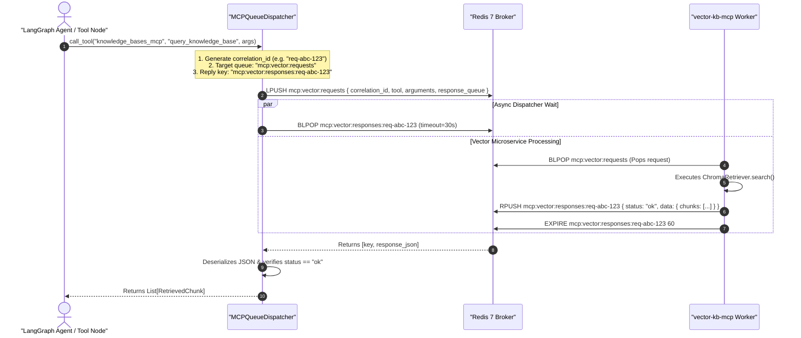

# Feature Specification: `MCPQueueDispatcher` (Redis Request-Reply with Correlation ID)

> **Feature ID:** `010_mcp_302_mcp_queue_dispatcher_spec`  
> **Task Ref:** `TASK-MCP-302`  
> **Target Branch:** `epic/rag-monorepo-mcp`  
> **Status:** `PROPOSED (Under Review)`  
> **Estimated Effort:** `2.0 hrs (Vibe-Coding) / 1.5 days (Traditional)`  
> **Author:** Antigravity Architect / Backend & Systems Specialist  
> **Upstream Reference:** [docs/lld/container_based_rag_platform_lld.md](file:///Users/galihpratama/Sites/akvo-rag/docs/lld/container_based_rag_platform_lld.md) (Sections 7, 8, 9)

---

## 1. Overview & 5W1H Requirements Discovery

### 1.1 Problem Statement
In the legacy architecture, the backend communicated with `vector-kb` over HTTP using FastMCP and SSE (Server-Sent Events). This introduced:
1. High latency ($> 80\text{ms}$ connection setup overhead per request).
2. Fragile connection drops during long-running vector similarity scans.
3. Unnecessary Base64 string encoding and decoding.

`TASK-MCP-302` implements the `MCPQueueDispatcher` in `akvo-rag-backend`. It provides a unified async tool execution interface that routes tool invocations according to `mcp_config.json`:
- **For Internal Microservices (`redis_queue`):** Dispatches JSON payloads to Redis (`mcp:vector:requests`) with a unique `correlation_id` (UUID4) and awaits response on `mcp:vector:responses:{correlation_id}` using `BLPOP` ($< 5\text{ms}$ IPC overhead).
- **For External Tools (`rest`):** Dispatches asynchronous HTTP POST requests via `httpx.AsyncClient`.

### 1.2 5W1H Discovery Lens

| Dimension | Specification |
|---|---|
| **Who** | `akvo-rag-backend` LangGraph tool execution nodes, chat streaming services, and background workers. |
| **What** | Implement `MCPQueueDispatcher`, `RedisQueueMCPClient`, and `RestMCPClient` with correlation IDs, timeout controls, and structured error boundaries. |
| **Where** | `backend/mcp_clients/queue_dispatcher.py` (or `app/services/mcp/queue_dispatcher.py`), `backend/tests/unit/test_mcp_queue_dispatcher.py`. |
| **When** | **Phase 3, Step 2** — following declarative schema parser (`TASK-MCP-301`) and before removing the scoping node (`TASK-MCP-303`). |
| **Why** | Drastically cuts container IPC latency to $< 5\text{ms}$, eliminates SSE connection flakiness, and provides clean decoupling between Gateway and Vector workers. |
| **How** | `redis.asyncio` connection pooling, `LPUSH` / `BLPOP` with configurable timeouts, `httpx.AsyncClient`, and structured exception handling. |

---

## 2. Architecture & Sequence Flow

### 2.1 Redis Request-Reply Sequence Diagram



---

## 3. Detailed Technical Specifications

### 3.1 Custom Exceptions (`backend/app/core/exceptions.py` or `backend/mcp_clients/exceptions.py`)

```python
class MCPException(Exception):
    """Base exception for all MCP client operations."""
    pass

class MCPTimeoutError(MCPException):
    """Raised when an MCP tool invocation times out."""
    pass

class MCPToolExecutionError(MCPException):
    """Raised when a remote MCP tool returns an error status."""
    pass

class MCPConfigurationError(MCPException):
    """Raised when an unknown server or tool is requested."""
    pass
```

---

### 3.2 Unified `MCPQueueDispatcher` (`backend/mcp_clients/queue_dispatcher.py`)

```python
import json
import uuid
import asyncio
import logging
from typing import Dict, Any, Optional, List
import redis.asyncio as aioredis
import httpx

from app.core.mcp_config import MCPConfig, RedisQueueServerConfig, RestServerConfig, MCPToolDefinition
from app.core.config import settings
from .exceptions import MCPTimeoutError, MCPToolExecutionError, MCPConfigurationError

logger = logging.getLogger("mcp_dispatcher")

class MCPQueueDispatcher:
    """
    Unified high-performance MCP tool dispatcher supporting:
    1. Native async Redis Request-Reply queues (for internal microservices)
    2. Standard Async HTTP REST requests (for external tool providers)
    """

    def __init__(self, config: Optional[MCPConfig] = None, redis_client: Optional[aioredis.Redis] = None):
        self.config = config or MCPConfig.load_from_file()
        self._redis = redis_client
        self._http_client: Optional[httpx.AsyncClient] = None

    async def get_redis(self) -> aioredis.Redis:
        if self._redis is None:
            self._redis = aioredis.from_url(
                settings.REDIS_URL,
                decode_responses=True,
                max_connections=20
            )
        return self._redis

    async def get_http_client(self) -> httpx.AsyncClient:
        if self._http_client is None or self._http_client.is_closed:
            self._http_client = httpx.AsyncClient(timeout=30.0)
        return self._http_client

    async def close(self):
        if self._redis is not None:
            await self._redis.aclose()
        if self._http_client is not None:
            await self._http_client.aclose()

    async def call_tool(
        self,
        server_name: str,
        tool_name: str,
        arguments: Dict[str, Any],
        timeout: Optional[float] = None
    ) -> Dict[str, Any]:
        """
        Dispatches a tool call to the appropriate transport (redis_queue or rest).
        """
        server = self.config.servers.get(server_name)
        if not server:
            raise MCPConfigurationError(f"Server '{server_name}' not configured in mcp_config.json")

        tool_def = self.config.get_tool(server_name, tool_name)
        if not tool_def:
            raise MCPConfigurationError(f"Tool '{tool_name}' not defined for server '{server_name}'")

        effective_timeout = timeout or server.timeout_seconds

        if isinstance(server, RedisQueueServerConfig):
            return await self._call_redis_queue(server, tool_name, arguments, effective_timeout)
        elif isinstance(server, RestServerConfig):
            return await self._call_rest(server, tool_def, arguments, effective_timeout)
        else:
            raise MCPConfigurationError(f"Unsupported transport: {getattr(server, 'transport', 'unknown')}")

    async def _call_redis_queue(
        self,
        server: RedisQueueServerConfig,
        tool_name: str,
        arguments: Dict[str, Any],
        timeout: float
    ) -> Dict[str, Any]:
        redis = await self.get_redis()
        correlation_id = str(uuid.uuid4())
        response_queue = f"{server.response_queue_prefix}:{correlation_id}"

        payload = {
            "correlation_id": correlation_id,
            "tool": tool_name,
            "arguments": arguments,
            "response_queue": response_queue
        }

        logger.debug(f"Dispatching RPC request {correlation_id} to queue {server.request_queue}")
        await redis.lpush(server.request_queue, json.dumps(payload))

        try:
            # Await response with timeout via BLPOP
            result = await redis.blpop(response_queue, timeout=int(timeout))
            if not result:
                raise MCPTimeoutError(
                    f"RPC call to '{tool_name}' on '{server.name}' timed out after {timeout}s (corr_id: {correlation_id})"
                )

            _, raw_response = result
            data = json.loads(raw_response)

            if data.get("status") == "error":
                raise MCPToolExecutionError(data.get("error", "Unknown remote tool execution error"))

            return data.get("data", {})

        finally:
            # Ensure temporary response key is cleaned up
            await redis.delete(response_queue)

    async def _call_rest(
        self,
        server: RestServerConfig,
        tool_def: MCPToolDefinition,
        arguments: Dict[str, Any],
        timeout: float
    ) -> Dict[str, Any]:
        http_client = await self.get_http_client()
        url = f"{server.endpoint_url.rstrip('/')}{tool_def.endpoint or ''}"

        try:
            response = await http_client.request(
                method=tool_def.method or "POST",
                url=url,
                json=arguments,
                timeout=timeout
            )
            response.raise_for_status()
            return response.json()
        except httpx.TimeoutException:
            raise MCPTimeoutError(f"HTTP request to '{url}' timed out after {timeout}s")
        except httpx.HTTPStatusError as e:
            raise MCPToolExecutionError(f"HTTP error {e.response.status_code} from '{url}': {e.response.text}")
        except Exception as e:
            raise MCPToolExecutionError(f"Failed to execute REST tool '{tool_def.name}': {str(e)}")
```

---

## 4. Verification & Quality Gates

### 4.1 Automated Unit & Mock Tests (`backend/tests/unit/test_mcp_queue_dispatcher.py`)

1. **Redis RPC Happy Path Test:**
   - Use `fakeredis.aioredis.FakeRedis`.
   - Start background task that pops `mcp:vector:requests` and pushes `{"status": "ok", "data": {"chunks": [{"text": "sample"}]}}` to the correlation response queue.
   - Dispatch tool call via `dispatcher.call_tool("knowledge_bases_mcp", "query_knowledge_base", {"query": "test"})`.
   - Assert response returns `{"chunks": [{"text": "sample"}]}`.
   - Assert temporary response queue is deleted.

2. **Redis RPC Timeout Test:**
   - Simulate no worker response.
   - Call tool with `timeout=1.0`.
   - Assert `MCPTimeoutError` is raised after 1.0s.

3. **Redis RPC Remote Error Test:**
   - Worker pushes `{"status": "error", "error": "Index not found"}`.
   - Assert `MCPToolExecutionError` is raised with message `"Index not found"`.

4. **REST Transport Fallthrough Test:**
   - Mock `httpx.AsyncClient` response.
   - Call `dispatcher.call_tool("weather_mcp", "get_weather_forecast", {"latitude": -1.2, "longitude": 36.8})`.
   - Assert HTTP POST dispatched and returned JSON payload parsed.

---

## 5. Subtask Estimation & Breakdown

| Subtask ID | Description | Target Files | Vibe Est. | Trad. Est. | Confidence |
|---|---|---|:---:|:---:|:---:|
| `SUB-302.1` | Define `MCPException` hierarchy (`MCPTimeoutError`, `MCPToolExecutionError`) | `backend/mcp_clients/exceptions.py` `[NEW]` | 0.3 hr | 0.2 day | High (99%) |
| `SUB-302.2` | Implement `MCPQueueDispatcher` with Redis request-reply and REST dispatching | `backend/mcp_clients/queue_dispatcher.py` `[NEW]` | 0.9 hr | 0.7 day | High (98%) |
| `SUB-302.3` | Implement unit test suite with `fakeredis` and `httpx_mock` | `backend/tests/unit/test_mcp_queue_dispatcher.py` `[NEW]` | 0.8 hr | 0.6 day | High (95%) |
| **TOTAL** | | | **2.0 hrs** | **1.5 days** | **High** |

---

## 6. Definition of Done (DoD)

- [ ] `MCPQueueDispatcher` handles both `redis_queue` (RPC with correlation ID) and `rest` transports.
- [ ] Correlation ID response queues use atomic `BLPOP` and cleanup keys on completion.
- [ ] Timeout and error handling produce explicit, typed exceptions (`MCPTimeoutError`, `MCPToolExecutionError`).
- [ ] `pytest tests/unit/test_mcp_queue_dispatcher.py` passes with 100% test coverage in $< 2\text{s}$.
