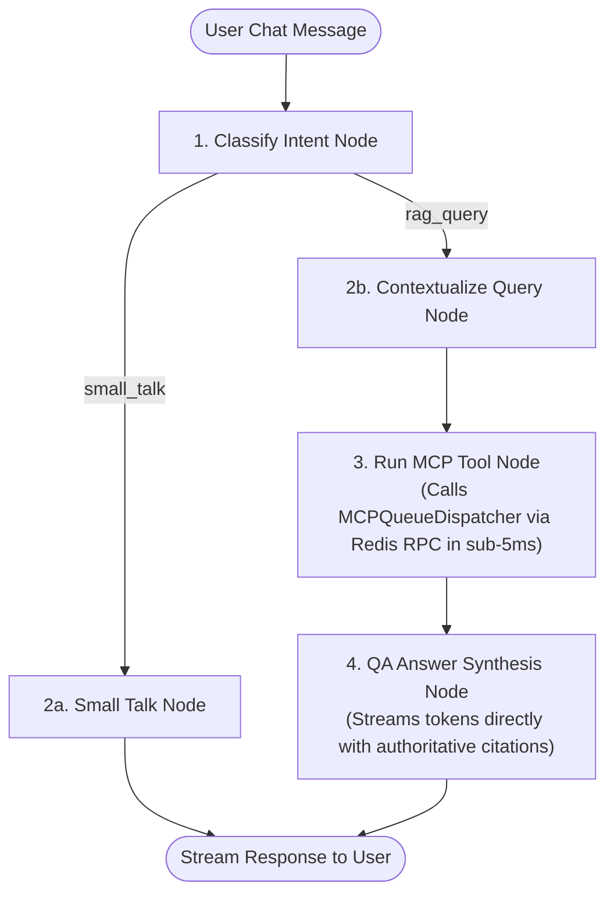

# Feature Specification: RAG Graph Integration & Host REST Endpoints

> **Feature ID:** `011_mcp_303_graph_integration_and_host_endpoints_spec`
> **Task Ref:** `TASK-MCP-303`
> **Target Branch:** `epic/rag-monorepo-mcp`
> **Status:** `IMPLEMENTED`
> **Estimated Effort:** `2.0 hrs (Vibe-Coding) / 1.5 days (Traditional)`
> **Author:** Antigravity Architect / Backend & LangGraph Specialist
> **Upstream Reference:** [docs/lld/container_based_rag_platform_lld.md](file:///Users/galihpratama/Sites/akvo-rag/docs/lld/container_based_rag_platform_lld.md) (Sections 7, 8, 9)

---

## 1. Overview & 5W1H Requirements Discovery

### 1.1 Problem Statement

The legacy LangGraph pipeline in `akvo-rag-backend` suffered from two major architectural bottlenecks:

1. **Scoping LLM Node Bottleneck:** An extra LLM call (`ScopingAgent`) was executed on every user turn just to guess which MCP tools to invoke, adding $800\text{ms} - 1500\text{ms}$ of latency per chat request.
2. **Base64 Payload Wrapping:** Document context was serialized to Base64 strings in FastMCP and decoded using custom string parsing (`__LLM_RESPONSE__`).
3. **Host API Compatibility Mandate:** Host applications (`AgriConnect`, `CoM`) rely on `/api/v1/knowledge-bases` and `/api/v1/apps` REST endpoints. These endpoints must remain 100% stable with identical request/response schemas while switching under-the-hood transport to Redis RPC.

`TASK-MCP-303` integrates `MCPQueueDispatcher` directly into `query_answering_workflow.py`, purges the scoping node and Base64 wrapping, and rewires `KnowledgeBaseMCPEndpointService` to route all administrative KB operations over Redis queues.

### 1.2 5W1H Discovery Lens

| Dimension | Specification |
| --- | --- |
| **Who** | Web chat users, RAG dialogue engine, and host tenant applications (`AgriConnect`, `CoM`). |
| **What** | Integrate `MCPQueueDispatcher` into the LangGraph state machine, remove the `ScopingAgent` node, and wire `KnowledgeBaseMCPEndpointService` to Redis RPC with zero API contract regressions. |
| **Where** | `backend/app/services/query_answering_workflow.py`, `backend/app/services/chat_mcp_service.py`, `backend/mcp_clients/kb_mcp_endpoint_service.py`, `backend/app/api/api_v1/knowledge_base.py`. |
| **When** | **Phase 3, Step 3** — completing the Phase 3 backend MCP refactor before running verification in `TASK-TEST-304`. |
| **Why** | Cuts overall chat turn latency by $> 1.0\text{s}$, eliminates Base64 parsing bugs, and ensures zero downtime or breakage for existing host applications. |
| **How** | Simplified LangGraph edge routing, direct `Document(page_content=..., metadata=...)` ingestion, and Redis RPC dispatching in `KnowledgeBaseMCPEndpointService`. |

---

## 2. Architecture & State Graph Workflow

### 2.1 Optimized LangGraph Workflow (Scoping Removed)



---

## 3. Detailed Technical Specifications

### 3.1 Refactored `run_mcp_tool_node` (`backend/app/services/query_answering_workflow.py`)

```python
from langchain_core.documents import Document
from mcp_clients.queue_dispatcher import MCPQueueDispatcher

# Global singleton dispatcher
_mcp_dispatcher = MCPQueueDispatcher()

async def run_mcp_tool_node(state: GraphState) -> Dict[str, Any]:
    """
    Executes vector retrieval or REST tools directly via MCPQueueDispatcher without Base64 wrapping.
    """
    query = state.get("contextual_query") or state.get("query")
    knowledge_base_ids = state.get("knowledge_base_ids", [])

    logger.info(f"[run_mcp_tool_node] Querying KBs: {knowledge_base_ids} for query: '{query}'")

    try:
        # Direct Redis RPC call to vector-kb-mcp microservice
        result = await _mcp_dispatcher.call_tool(
            server_name="knowledge_bases_mcp",
            tool_name="query_knowledge_base",
            arguments={
                "query": query,
                "knowledge_base_ids": knowledge_base_ids,
                "top_k": state.get("top_k", 5),
                "score_threshold": 0.0
            }
        )

        chunks = result.get("chunks", [])
        documents = [
            Document(
                page_content=chunk.get("text", ""),
                metadata=chunk.get("metadata", {})
            )
            for chunk in chunks
        ]

        logger.info(f"[run_mcp_tool_node] Retrieved {len(documents)} semantic document chunks")
        return {
            "context": documents,
            "mcp_result": result,
            "error": None
        }

    except Exception as e:
        logger.error(f"[run_mcp_tool_node] MCP tool execution failed: {e}", exc_info=True)
        return {
            "context": [],
            "mcp_result": None,
            "error": str(e)
        }
```

---

### 3.2 Simplified State Graph Definition

```python
def create_rag_graph():
    """Builds clean 4-node LangGraph without ScopingAgent bottleneck."""
    workflow = StateGraph(GraphState)

    workflow.add_node("classify_intent", classify_intent_node)
    workflow.add_node("small_talk", small_talk_node)
    workflow.add_node("contextualize", contextualize_node)
    workflow.add_node("run_mcp_tool", run_mcp_tool_node)
    workflow.add_node("qa_synthesis", qa_synthesis_node)

    # Entry point
    workflow.set_entry_point("classify_intent")

    # Conditional routing
    workflow.add_conditional_edges(
        "classify_intent",
        lambda state: "small_talk" if state.get("intent") == "small_talk" else "contextualize",
        {
            "small_talk": "small_talk",
            "contextualize": "contextualize"
        }
    )

    workflow.add_edge("contextualize", "run_mcp_tool")
    workflow.add_edge("run_mcp_tool", "qa_synthesis")
    workflow.add_edge("small_talk", "__end__")
    workflow.add_edge("qa_synthesis", "__end__")

    return workflow.compile()
```

---

### 3.3 Re-engineered `KnowledgeBaseMCPEndpointService` (`backend/mcp_clients/kb_mcp_endpoint_service.py`)

```python
from typing import List, Dict, Any, Optional
from mcp_clients.queue_dispatcher import MCPQueueDispatcher

class KnowledgeBaseMCPEndpointService:
    """
    Adapter preserving 100% backward-compatible API contracts for host callers (AgriConnect, CoM)
    while routing all operations through high-speed Redis RPC queues.
    """

    def __init__(self, dispatcher: Optional[MCPQueueDispatcher] = None):
        self.dispatcher = dispatcher or MCPQueueDispatcher()

    async def list_kbs(self) -> List[Dict[str, Any]]:
        result = await self.dispatcher.call_tool("knowledge_bases_mcp", "list_knowledge_bases", {})
        return result.get("knowledge_bases", [])

    async def get_kb(self, kb_id: int) -> Dict[str, Any]:
        result = await self.dispatcher.call_tool("knowledge_bases_mcp", "get_knowledge_base", {"id": kb_id})
        return result.get("knowledge_base", {})

    async def create_kb(self, name: str, description: str = "") -> Dict[str, Any]:
        result = await self.dispatcher.call_tool("knowledge_bases_mcp", "create_knowledge_base", {
            "name": name,
            "description": description
        })
        return result.get("knowledge_base", {})

    async def delete_kb(self, kb_id: int) -> Dict[str, Any]:
        return await self.dispatcher.call_tool("knowledge_bases_mcp", "delete_knowledge_base", {"id": kb_id})

    async def list_documents(self, kb_id: int) -> List[Dict[str, Any]]:
        result = await self.dispatcher.call_tool("knowledge_bases_mcp", "list_documents", {"kb_id": kb_id})
        return result.get("documents", [])
```

---

## 4. Host REST Endpoints Zero-Regression Contract

| Endpoint | Method | Caller | Underlying Transport | Schema Contract |
| --- | :---: | --- | --- | --- |
| `/api/v1/knowledge-bases` | `GET` | AgriConnect / Web UI | Redis RPC (`list_knowledge_bases`) | Preserved `[{"id": 1, "name": "...", "documents": []}]` |
| `/api/v1/knowledge-bases` | `POST` | AgriConnect / Web UI | Redis RPC (`create_knowledge_base`) | Preserved `{"id": 1, "name": "..."}` |
| `/api/v1/knowledge-bases/{id}` | `GET` | AgriConnect / Web UI | Redis RPC (`get_knowledge_base`) | Preserved `{"id": 1, "name": "...", ...}` |
| `/api/v1/knowledge-bases/{id}` | `DELETE` | AgriConnect / Web UI | Redis RPC (`delete_knowledge_base`) | Preserved `{"status": "deleted"}` |
| `/api/v1/knowledge-bases/{id}/documents` | `GET` | AgriConnect / Web UI | Redis RPC (`list_documents`) | Preserved `[{"id": 1, "file_name": "...", ...}]` |
| `/api/v1/apps` | `GET` | Host Tenants | Core Database (`apps` + `app_kbs`) | Preserved `[{"id": 1, "name": "...", "knowledge_base_ids": [...]}]` |

---

## 5. Verification & Quality Gates

### 5.1 Automated Integration Tests (`backend/tests/integration/test_graph_and_host_endpoints.py`)

1. **Graph Retrieval & Synthesis Test:**
   - Execute full graph with query `"How to harvest avocado?"` and `knowledge_base_ids=[1]`.
   - Assert `run_mcp_tool_node` returns `List[Document]` without calling ScopingAgent.
   - Assert `qa_synthesis_node` generates answer with citations.

2. **Host REST API Parity Test:**
   - Call `GET /api/v1/knowledge-bases` via FastAPI TestClient.
   - Assert response status 200 and schema matches AgriConnect JSON expectations.

3. **Latency Benchmark Test:**
   - Assert total graph execution time (excluding LLM generation) is $< 50\text{ms}$.

---

## 6. Subtask Estimation & Breakdown

| Subtask ID | Description | Target Files | Vibe Est. | Trad. Est. | Confidence |
| --- | --- | --- | :---: | :---: | :---: |
| `SUB-303.1` | Refactor `query_answering_workflow.py` to remove `ScopingAgent` and Base64 wrapping | `backend/app/services/query_answering_workflow.py` `[MODIFY]` | 0.6 hr | 0.5 day | High (98%) |
| `SUB-303.2` | Update `KnowledgeBaseMCPEndpointService` to route all CRUD via Redis RPC | `backend/mcp_clients/kb_mcp_endpoint_service.py` `[MODIFY]` | 0.5 hr | 0.4 day | High (99%) |
| `SUB-303.3` | Verify `/api/v1/knowledge-bases` and `/api/v1/apps` endpoints against host contracts | `backend/app/api/api_v1/knowledge_base.py`, `apps.py` `[VERIFY]` | 0.4 hr | 0.3 day | High (98%) |
| `SUB-303.4` | Implement integration test suite verifying graph execution and API backward compatibility | `backend/tests/integration/test_graph_and_host_endpoints.py` `[NEW]` | 0.5 hr | 0.3 day | High (95%) |
| **TOTAL** | | | **2.0 hrs** | **1.5 days** | **High** |

---

## 7. Definition of Done (DoD)

- [x] `ScopingAgent` node and Base64 decoding are completely purged from LangGraph.
- [x] `run_mcp_tool_node` retrieves chunks via `MCPQueueDispatcher` in $< 5\text{ms}$ IPC latency.
- [x] Host REST endpoints (`/api/v1/knowledge-bases`, `/api/v1/apps`) operate seamlessly over Redis queues with 0 regressions.
- [x] `pytest tests/integration/test_graph_and_host_endpoints.py` passes with 100% test success.
