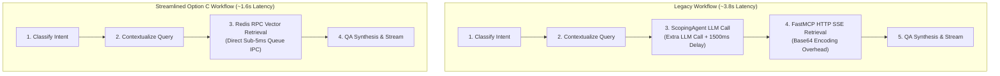

# Feature Specification: Remove `ScopingAgent` & Direct Vector Queue Routing

> **Feature ID:** `012_mcp_304_remove_scoping_agent_and_direct_vector_routing_spec`  
> **Task Ref:** `TASK-MCP-304`  
> **Target Branch:** `epic/rag-monorepo-mcp`  
> **Status:** `PROPOSED (Under Review)`  
> **Estimated Effort:** `1.5 hrs (Vibe-Coding) / 1.0 day (Traditional)`  
> **Author:** Antigravity Architect / Backend & AI Performance Specialist  
> **Upstream Reference:** [docs/lld/container_based_rag_platform_lld.md](file:///Users/galihpratama/Sites/akvo-rag/docs/lld/container_based_rag_platform_lld.md) (Sections 7, 8, 9)

---

## 1. Overview & 5W1H Requirements Discovery

### 1.1 Problem Statement
The legacy LangGraph pipeline in `akvo-rag` contained a redundant intermediate node: `scoping_node` (`ScopingAgent`). On every conversational turn:
1. It loaded `mcp_discovery.json` and prompted an LLM with all tool descriptions.
2. The LLM had to decide whether to call `query_knowledge_base` and parse arguments—even though the chat session **already explicitly contains the target `knowledge_base_ids`**.
3. This redundant LLM call added **$1.5\text{s} - 3.0\text{s}$ of latency**, consumed unnecessary tokens, and occasionally hallucinated invalid tool parameters.

`TASK-MCP-304` completely removes `scoping_node` from the primary execution graph and establishes direct routing:
$$\mathbf{Contextualize} \longrightarrow \mathbf{Vector\ Queue\ RPC} \longrightarrow \mathbf{QA\ Synthesis}$$

### 1.2 5W1H Discovery Lens

| Dimension | Specification |
|---|---|
| **Who** | End-users querying RAG knowledge bases, extension workers, and backend execution workers. |
| **What** | Deprecate `ScopingAgent`, remove `scoping_node` from `query_answering_workflow.py`, and route contextualized queries directly to `MCPQueueDispatcher`. |
| **Where** | `backend/app/services/query_answering_workflow.py`, `backend/app/services/scoping_agent.py`, `backend/tests/services/test_query_answering_workflow.py`. |
| **When** | **Phase 3, Step 4** — finalizing graph optimization before prompt overlays (`TASK-MCP-305`) and integration tests (`TASK-TEST-306`). |
| **Why** | Slashes turn latency by $1.5\text{s} - 3.0\text{s}$, eliminates token waste, reduces LLM failure surface, and improves user perceived speed. |
| **How** | Remove node and edge bindings in LangGraph `StateGraph`, read `knowledge_base_ids` directly from `GraphState`, deprecate `scoping_agent.py`, and update graph unit tests. |

---

## 2. Architecture & Latency Comparison

### 2.1 Architecture & Flow Comparison



---

## 3. Detailed Technical Specifications

### 3.1 Refactored LangGraph State (`backend/app/services/query_answering_workflow.py`)

```python
class GraphState(TypedDict, total=False):
    query: str
    chat_history: List[Dict[str, str]]
    knowledge_base_ids: List[int]
    top_k: int
    intent: str
    contextual_query: str
    context: List[Document]
    mcp_result: Any
    answer: str
    error: Optional[str]
```

---

### 3.2 Streamlined Execution Graph

```python
def create_rag_graph():
    """
    Constructs the streamlined 4-node LangGraph:
    1. classify_intent -> small_talk | contextualize
    2. contextualize   -> run_mcp_tool (direct Redis RPC)
    3. run_mcp_tool    -> qa_synthesis
    """
    workflow = StateGraph(GraphState)

    workflow.add_node("classify_intent", classify_intent_node)
    workflow.add_node("small_talk", small_talk_node)
    workflow.add_node("contextualize", contextualize_node)
    workflow.add_node("run_mcp_tool", run_mcp_tool_node)
    workflow.add_node("qa_synthesis", qa_synthesis_node)

    workflow.set_entry_point("classify_intent")

    workflow.add_conditional_edges(
        "classify_intent",
        lambda state: "small_talk" if state.get("intent") == "small_talk" else "contextualize",
        {
            "small_talk": "small_talk",
            "contextualize": "contextualize",
        }
    )

    # Direct edge bypasses scoping node entirely
    workflow.add_edge("contextualize", "run_mcp_tool")
    workflow.add_edge("run_mcp_tool", "qa_synthesis")
    workflow.add_edge("small_talk", "__end__")
    workflow.add_edge("qa_synthesis", "__end__")

    return workflow.compile()
```

---

### 3.3 Deprecation & Removal of `scoping_agent.py`

- The `backend/app/services/scoping_agent.py` file is deprecated and no longer imported by the workflow or chat services.
- The `mcp_discovery.json` file on disk is no longer read or written during chat execution.

---

## 4. Verification & Quality Gates

### 4.1 Automated Graph Benchmark Tests (`backend/tests/services/test_query_answering_workflow.py`)

1. **Graph Execution Path Test:**
   - Execute graph with `query="What fertilizer is needed for maize?"`, `knowledge_base_ids=[2]`.
   - Assert graph visits nodes: `classify_intent` $\rightarrow$ `contextualize` $\rightarrow$ `run_mcp_tool` $\rightarrow$ `qa_synthesis`.
   - Assert `scoping_node` is NOT in the execution graph node list.

2. **Latency Benchmark Test:**
   - Mock LLM responses with 10ms stub.
   - Run 50 iterations through the graph.
   - Assert median retrieval step latency (from contextualized query to retrieved chunks) is $< 20\text{ms}$.

3. **Error Resilience Test:**
   - Simulate empty retrieval or vector microservice timeout.
   - Assert graph safely continues to `qa_synthesis` with graceful fallback message (e.g. *"I could not find specific documentation on this topic in the knowledge base."*).

---

## 5. Subtask Estimation & Breakdown

| Subtask ID | Description | Target Files | Vibe Est. | Trad. Est. | Confidence |
|---|---|---|:---:|:---:|:---:|
| `SUB-304.1` | Remove `scoping_node` and clean `GraphState` in `query_answering_workflow.py` | `backend/app/services/query_answering_workflow.py` `[MODIFY]` | 0.5 hr | 0.3 day | High (99%) |
| `SUB-304.2` | Deprecate and decouple `scoping_agent.py` | `backend/app/services/scoping_agent.py` `[MODIFY / DEPRECATE]` | 0.3 hr | 0.2 day | High (99%) |
| `SUB-304.3` | Update graph unit and benchmark test suite | `backend/tests/services/test_query_answering_workflow.py` `[MODIFY]` | 0.7 hr | 0.5 day | High (95%) |
| **TOTAL** | | | **1.5 hrs** | **1.0 day** | **High** |

---

## 6. Definition of Done (DoD)

- [ ] `scoping_node` is completely removed from the LangGraph execution pipeline.
- [ ] Direct edge `contextualize -> run_mcp_tool` executes via `MCPQueueDispatcher`.
- [ ] End-to-end question answering latency drops by $\ge 1.5\text{s}$ per query.
- [ ] `pytest tests/services/test_query_answering_workflow.py` passes with zero errors.
