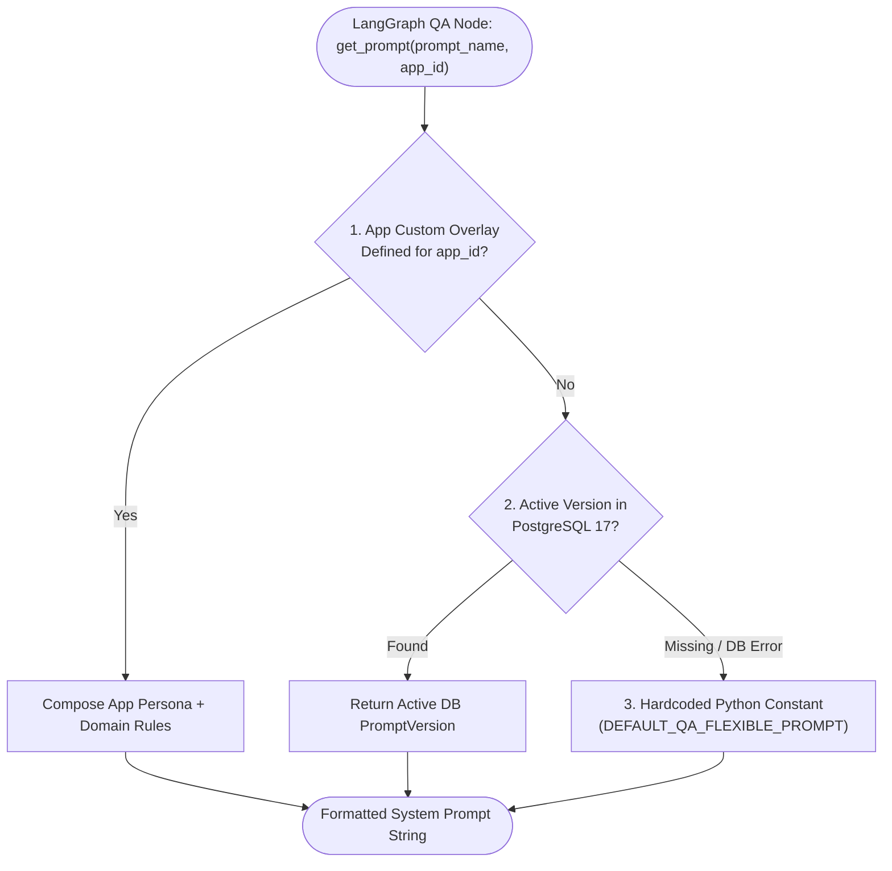

# Feature Specification: Dynamic Prompt Resolver with PostgreSQL 17 Overlays

> **Feature ID:** `013_mcp_305_dynamic_prompt_resolver_spec`  
> **Task Ref:** `TASK-MCP-305`  
> **Target Branch:** `epic/rag-monorepo-mcp`  
> **Status:** `PROPOSED (Under Review)`  
> **Estimated Effort:** `1.5 hrs (Vibe-Coding) / 1.0 day (Traditional)`  
> **Author:** Antigravity Architect / Backend & LLM Systems Specialist  
> **Upstream Reference:** [docs/lld/container_based_rag_platform_lld.md](file:///Users/galihpratama/Sites/akvo-rag/docs/lld/container_based_rag_platform_lld.md) (Sections 6, 8, 9)

---

## 1. Overview & 5W1H Requirements Discovery

### 1.1 Problem Statement
In production RAG deployments serving multiple distinct domains (e.g. `AgriConnect` agricultural advisory vs `CoM` municipal WASH governance), system prompts cannot remain static hardcoded strings in code. Domain administrators must be able to adjust LLM behavior, tone, citations, and guidelines live from the Admin Dashboard without redeploying containers.

`TASK-MCP-305` enhances the `PromptService` in `akvo-rag-backend` with:
1. **Async SQLAlchemy 2.0 Resolution:** High-speed async queries against PostgreSQL 17 (`prompt_definitions` and `prompt_versions`).
2. **Layered Resolution & App Overlays:** A 3-tier fallback hierarchy:
   $$\text{Tenant/App Custom Prompt} \longrightarrow \text{Active PostgreSQL 17 Version} \longrightarrow \text{Hardcoded Python Constant}$$
3. **Seeder Idempotency:** Automated seeder script (`seed_prompts.py`) to initialize baseline prompt definitions and active versions on first boot.

### 1.2 5W1H Discovery Lens

| Dimension | Specification |
|---|---|
| **Who** | Admin users, host tenant applications (`AgriConnect`, `CoM`), and LangGraph answer synthesis nodes. |
| **What** | Implement dynamic async prompt resolution in `PromptService`, modernize `PromptDefinition`/`PromptVersion` models to SQLAlchemy 2.0, and support app persona overlays. |
| **Where** | `backend/app/services/prompt_service.py`, `backend/app/models/prompt.py`, `backend/app/seeder/seed_prompts.py`, `backend/tests/services/test_prompt_service.py`. |
| **When** | **Phase 3, Step 5** — concluding Phase 3 core backend MCP transformation. |
| **Why** | Enables live prompt management in production, supports domain-specific persona customization, and guarantees fallback resilience if the database is unreachable. |
| **How** | Async SQLAlchemy 2.0 `select()`, Jinja/F-string prompt composition, database seeder, and comprehensive unit tests. |

---

## 2. Architecture & Prompt Resolution Hierarchy

### 2.1 3-Tier Resolution Architecture



---

## 3. Detailed Technical Specifications

### 3.1 SQLAlchemy 2.0 Models (`backend/app/models/prompt.py`)

```python
from datetime import datetime
from typing import List, Optional
from sqlalchemy import String, Integer, ForeignKey, Boolean, Text
from sqlalchemy.orm import Mapped, mapped_column, relationship
from app.models.base import Base, TimestampMixin
from enum import Enum

class PromptNameEnum(str, Enum):
    contextualize_q_system_prompt = "contextualize_q_system_prompt"
    qa_flexible_prompt = "qa_flexible_prompt"
    qa_strict_prompt = "qa_strict_prompt"

class PromptDefinition(Base, TimestampMixin):
    __tablename__ = "prompt_definitions"

    id: Mapped[int] = mapped_column(primary_key=True, autoincrement=True, index=True)
    name: Mapped[str] = mapped_column(String(255), unique=True, index=True, nullable=False)
    description: Mapped[Optional[str]] = mapped_column(Text, nullable=True)

    # Relationship to version history
    versions: Mapped[List["PromptVersion"]] = relationship(
        "PromptVersion",
        back_populates="definition",
        order_by="desc(PromptVersion.version_number)",
        cascade="all, delete-orphan",
        passive_deletes=True
    )

class PromptVersion(Base, TimestampMixin):
    __tablename__ = "prompt_versions"

    id: Mapped[int] = mapped_column(primary_key=True, autoincrement=True, index=True)
    prompt_definition_id: Mapped[int] = mapped_column(
        ForeignKey("prompt_definitions.id", ondelete="CASCADE"),
        nullable=False,
        index=True
    )
    content: Mapped[str] = mapped_column(Text, nullable=False)
    version_number: Mapped[int] = mapped_column(Integer, default=1, nullable=False)
    is_active: Mapped[bool] = mapped_column(Boolean, default=False, nullable=False, index=True)
    activated_by_user_id: Mapped[Optional[int]] = mapped_column(
        ForeignKey("users.id", ondelete="SET NULL"),
        nullable=True
    )
    activation_reason: Mapped[Optional[str]] = mapped_column(String(512), nullable=True)

    definition: Mapped["PromptDefinition"] = relationship("PromptDefinition", back_populates="versions")
```

---

### 3.2 Dynamic Async `PromptService` (`backend/app/services/prompt_service.py`)

```python
import logging
from typing import Optional, Dict, Any
from sqlalchemy.ext.asyncio import AsyncSession
from sqlalchemy import select

from app.models.prompt import PromptDefinition, PromptVersion, PromptNameEnum
from app.constants.prompt_constant import (
    DEFAULT_CONTEXTUALIZE_PROMPT,
    DEFAULT_QA_STRICT_PROMPT,
    DEFAULT_QA_FLEXIBLE_PROMPT,
)

logger = logging.getLogger("prompt_service")

FALLBACK_MAP = {
    PromptNameEnum.contextualize_q_system_prompt: DEFAULT_CONTEXTUALIZE_PROMPT,
    PromptNameEnum.qa_strict_prompt: DEFAULT_QA_STRICT_PROMPT,
    PromptNameEnum.qa_flexible_prompt: DEFAULT_QA_FLEXIBLE_PROMPT,
}

class PromptService:
    def __init__(self, db: AsyncSession):
        self.db = db

    async def get_active_prompt_content(
        self,
        prompt_name: PromptNameEnum,
        app_custom_prompt: Optional[str] = None
    ) -> str:
        """
        Resolves prompt with 3-tier fallback:
        1. App custom override (if provided)
        2. Active version in PostgreSQL 17
        3. Hardcoded fallback constant
        """
        if app_custom_prompt and app_custom_prompt.strip():
            logger.debug(f"Using app-specific custom prompt for '{prompt_name.value}'")
            return app_custom_prompt.strip()

        try:
            stmt = (
                select(PromptVersion.content)
                .join(PromptDefinition, PromptVersion.prompt_definition_id == PromptDefinition.id)
                .where(
                    PromptDefinition.name == prompt_name.value,
                    PromptVersion.is_active == True
                )
                .order_by(PromptVersion.version_number.desc())
                .limit(1)
            )
            result = await self.db.execute(stmt)
            content = result.scalar_one_or_none()

            if content and content.strip():
                return content.strip()

        except Exception as e:
            logger.warning(f"Failed to query active prompt '{prompt_name.value}' from DB: {e}. Using fallback constant.")

        # Fallback to hardcoded constant
        logger.info(f"Using default fallback constant for '{prompt_name.value}'")
        return FALLBACK_MAP.get(prompt_name, DEFAULT_QA_FLEXIBLE_PROMPT).strip()

    def build_full_prompt(self, dynamic: str, static_rules: str = "", closing: str = "") -> str:
        parts = [dynamic.strip()]
        if static_rules.strip():
            parts.append(static_rules.strip())
        if closing.strip():
            parts.append(closing.strip())
        return "\n\n".join(parts)
```

---

### 3.3 Idempotent Database Seeder (`backend/app/seeder/seed_prompts.py`)

```python
import asyncio
import logging
from sqlalchemy.ext.asyncio import AsyncSession
from sqlalchemy import select

from app.db.session import AsyncSessionLocal
from app.models.prompt import PromptDefinition, PromptVersion, PromptNameEnum
from app.constants.prompt_constant import (
    DEFAULT_CONTEXTUALIZE_PROMPT,
    DEFAULT_QA_STRICT_PROMPT,
    DEFAULT_QA_FLEXIBLE_PROMPT,
)

logger = logging.getLogger("prompt_seeder")

SEEDS = [
    {
        "name": PromptNameEnum.contextualize_q_system_prompt.value,
        "description": "System prompt for reforming follow-up questions into standalone queries.",
        "content": DEFAULT_CONTEXTUALIZE_PROMPT,
    },
    {
        "name": PromptNameEnum.qa_strict_prompt.value,
        "description": "Strict RAG answering prompt requiring direct grounded citations without outside extrapolation.",
        "content": DEFAULT_QA_STRICT_PROMPT,
    },
    {
        "name": PromptNameEnum.qa_flexible_prompt.value,
        "description": "Flexible conversational RAG prompt balancing knowledge base grounding with natural phrasing.",
        "content": DEFAULT_QA_FLEXIBLE_PROMPT,
    },
]

async def seed_prompts():
    async with AsyncSessionLocal() as session:
        for item in SEEDS:
            stmt = select(PromptDefinition).where(PromptDefinition.name == item["name"])
            result = await session.execute(stmt)
            existing_def = result.scalar_one_or_none()

            if not existing_def:
                logger.info(f"Creating PromptDefinition: {item['name']}")
                prompt_def = PromptDefinition(name=item["name"], description=item["description"])
                session.add(prompt_def)
                await session.flush()

                # Add initial active version
                version = PromptVersion(
                    prompt_definition_id=prompt_def.id,
                    content=item["content"],
                    version_number=1,
                    is_active=True,
                    activation_reason="Initial migration baseline seeder"
                )
                session.add(version)
            else:
                logger.info(f"PromptDefinition '{item['name']}' already exists. Skipping.")

        await session.commit()
        logger.info("Prompt seeding completed successfully.")

if __name__ == "__main__":
    asyncio.run(seed_prompts())
```

---

## 4. Verification & Quality Gates

### 4.1 Automated Unit & Integration Tests (`backend/tests/services/test_prompt_service.py`)

1. **App Custom Prompt Overlay Priority Test:**
   - Call `prompt_service.get_active_prompt_content(PromptNameEnum.qa_flexible_prompt, app_custom_prompt="You are an agricultural extension agent.")`.
   - Assert returned string equals `"You are an agricultural extension agent."`.

2. **Database Active Version Resolution Test:**
   - Insert `PromptDefinition` and `PromptVersion(is_active=True, content="DB Custom Prompt V2")`.
   - Call `prompt_service.get_active_prompt_content(PromptNameEnum.qa_flexible_prompt)`.
   - Assert returned string equals `"DB Custom Prompt V2"`.

3. **Fallback Constant Test (DB Empty or Unreachable):**
   - Query prompt name with no records in DB.
   - Assert returned content gracefully matches `DEFAULT_QA_FLEXIBLE_PROMPT` without raising an unhandled exception.

4. **Seeder Idempotency Test:**
   - Execute `seed_prompts()` twice in succession.
   - Assert no duplicate definitions or errors occur.

---

## 5. Subtask Estimation & Breakdown

| Subtask ID | Description | Target Files | Vibe Est. | Trad. Est. | Confidence |
|---|---|---|:---:|:---:|:---:|
| `SUB-305.1` | Modernize `PromptDefinition` & `PromptVersion` models to SQLAlchemy 2.0 | `backend/app/models/prompt.py` `[MODIFY]` | 0.3 hr | 0.2 day | High (99%) |
| `SUB-305.2` | Refactor `PromptService` for asyncpg, app overlays, and 3-tier fallback | `backend/app/services/prompt_service.py` `[MODIFY]` | 0.5 hr | 0.4 day | High (98%) |
| `SUB-305.3` | Update idempotent database seeder script (`seed_prompts.py`) | `backend/app/seeder/seed_prompts.py` `[MODIFY]` | 0.3 hr | 0.2 day | High (99%) |
| `SUB-305.4` | Implement unit test suite verifying resolution hierarchy and fallback safety | `backend/tests/services/test_prompt_service.py` `[NEW]` | 0.4 hr | 0.2 day | High (98%) |
| **TOTAL** | | | **1.5 hrs** | **1.0 day** | **High** |

---

## 6. Definition of Done (DoD)

- [ ] `PromptService` operates asynchronously with `AsyncSession` and `asyncpg`.
- [ ] 3-tier resolution correctly prioritizes app custom prompt $\rightarrow$ active DB version $\rightarrow$ Python constant.
- [ ] `docker compose exec backend python -m app.seeder.seed_prompts` runs idempotently.
- [ ] `pytest tests/services/test_prompt_service.py` passes with 100% coverage.
