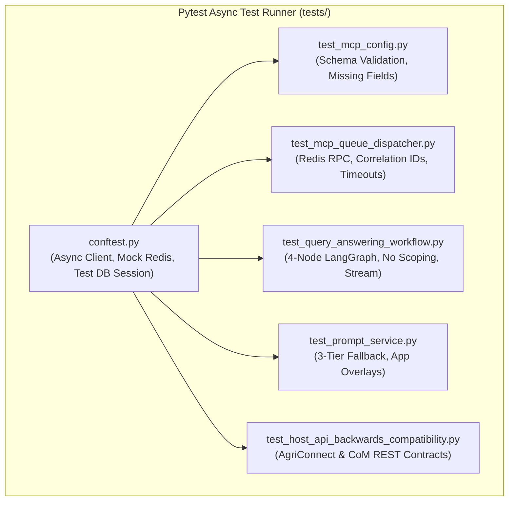

# Feature Specification: Backend Unit & Integration Test Suite

> **Feature ID:** `014_test_306_backend_test_suite_spec`  
> **Task Ref:** `TASK-TEST-306`  
> **Target Branch:** `epic/rag-monorepo-mcp`  
> **Status:** `PROPOSED (Under Review)`  
> **Estimated Effort:** `2.0 hrs (Vibe-Coding) / 1.5 days (Traditional)`  
> **Author:** Antigravity Architect / Test Architect & Quality Specialist  
> **Upstream Reference:** [docs/lld/container_based_rag_platform_lld.md](file:///Users/galihpratama/Sites/akvo-rag/docs/lld/container_based_rag_platform_lld.md) (Sections 7, 8, 9, 10)

---

## 1. Overview & 5W1H Requirements Discovery

### 1.1 Problem Statement
The transition of `akvo-rag-backend` to Option C involves significant architectural changes:
1. Declarative static `mcp_config.json` parsing replacing dynamic HTTP ping discovery.
2. Request-reply queue dispatching via `MCPQueueDispatcher` over Redis.
3. Purging the `ScopingAgent` node in the LangGraph workflow.
4. Dynamic 3-tier `PromptService` resolution.
5. Preserving **100% JSON contract backwards compatibility** for host tenants (**AgriConnect** and **CoM**).

`TASK-TEST-306` establishes a rigorous, automated backend unit and integration test suite executing offline in $< 10\text{s}$ with $\ge 85\%$ code coverage across all Phase 3 touchpoints.

### 1.2 5W1H Discovery Lens

| Dimension | Specification |
|---|---|
| **Who** | Backend engineers, CI/CD runners, and tenant integration partners (AgriConnect, CoM). |
| **What** | Implement unit and integration test suite covering `mcp_config.json`, `MCPQueueDispatcher`, LangGraph workflow, `PromptService`, and host REST endpoints. |
| **Where** | `backend/tests/core/`, `backend/tests/services/`, `backend/tests/api/`, `backend/tests/conftest.py`. |
| **When** | **Phase 3, Step 6** — the mandatory quality gate concluding Phase 3 before Phase 4 MinIO & Ingestion. |
| **Why** | Guarantees zero regressions, validates sub-5ms queue dispatch semantics, and ensures that CI/CD pipelines run deterministically offline. |
| **How** | `pytest`, `pytest-asyncio`, FastAPI `AsyncClient`, mock Redis fixtures, and synthetic LLM response stubs. |

---

## 2. Architecture & Test Coverage Map

### 2.1 Test Suite Architecture



---

## 3. Detailed Test Module Specifications

### 3.1 `backend/tests/core/test_mcp_config.py`
Validates declarative configuration schema and parser resilience:
- `test_valid_mcp_config_parsing()`: Loads complete `mcp_config.json` with `redis_queue` and `rest` transports; asserts correct server, tool, and argument mappings.
- `test_missing_required_fields()`: Feeds missing `transport` or `tool_name`; asserts `MCPConfigValidationError` is raised.
- `test_custom_timeout_defaults()`: Verifies fallback to 30s default timeout when omitted.

---

### 3.2 `backend/tests/services/test_mcp_queue_dispatcher.py`
Validates Redis Request-Reply IPC mechanics:
- `test_successful_redis_rpc_call()`: Enqueues tool call, mocks worker response on `mcp:vector:responses:{correlation_id}`, asserts status `ok` and returned chunks.
- `test_redis_rpc_timeout_handling()`: Simulates worker failure with `None` from `BLPOP`; asserts `MCPQueueTimeoutError` after configured timeout.
- `test_worker_error_propagation()`: Simulates worker returning `{ status: "error", error: "ChromaDB connection lost" }`; asserts `MCPToolExecutionError` is raised with message.
- `test_rest_transport_dispatch()`: Verifies HTTP POST execution for servers configured with `transport: "rest"`.

---

### 3.3 `backend/tests/services/test_query_answering_workflow.py`
Validates streamlined LangGraph state machine:
- `test_graph_node_sequence()`: Asserts graph strictly visits `classify_intent` $\rightarrow$ `contextualize` $\rightarrow$ `run_mcp_tool` $\rightarrow$ `qa_synthesis`, with zero references to `scoping_node`.
- `test_small_talk_intent_bypass()`: User query *"Hello, who are you?"* routes to `small_talk` and terminates without invoking vector queues.
- `test_empty_retrieval_fallback()`: When `run_mcp_tool` returns 0 chunks, synthesis node gracefully replies with standard helpful fallback.
- `test_token_stream_synthesis()`: Verifies streaming generator yields response chunks with citations attached.

---

### 3.4 `backend/tests/services/test_prompt_service.py`
Validates 3-tier dynamic resolution hierarchy:
- `test_app_custom_overlay_priority()`: App custom instructions take immediate precedence.
- `test_active_database_prompt_resolution()`: Active `PromptVersion` record returned when no app overlay is passed.
- `test_database_failure_fallback_constant()`: Database down/empty returns hardcoded `DEFAULT_QA_FLEXIBLE_PROMPT`.

---

### 3.5 `backend/tests/api/test_host_api_backwards_compatibility.py`
Validates 100% JSON contract backwards compatibility for **AgriConnect** and **CoM**:

| Method | Endpoint | Request Payload | Expected Status & Response |
|---|---|---|---|
| `POST` | `/api/v1/chat` | `{"query": "...", "knowledge_base_ids": [1]}` | `200 OK` (Stream / Answer DTO) |
| `GET` | `/api/v1/knowledge-bases` | `None` | `200 OK` `[{"id": 1, "name": "...", ...}]` |
| `GET` | `/api/v1/knowledge-bases/{id}` | `None` | `200 OK` `{"id": 1, "name": "...", ...}` |
| `POST` | `/api/v1/knowledge-bases` | `{"name": "New KB", "description": "..."}` | `201 Created` `{"id": 2, "name": "New KB"}` |
| `GET` | `/api/v1/knowledge-bases/{id}/documents` | `None` | `200 OK` `[{"id": "doc-1", "title": "..."}]` |
| `GET` | `/api/v1/apps` | `None` | `200 OK` `[{"id": 1, "name": "AgriConnect"}]` |

---

## 4. Test Fixtures & Conftest Setup (`backend/tests/conftest.py`)

```python
import pytest
import pytest_asyncio
from unittest.mock import AsyncMock, MagicMock
from httpx import AsyncClient, ASGITransport
from app.main import app
from app.services.mcp_queue_dispatcher import MCPQueueDispatcher

@pytest.fixture
def mock_redis():
    """Mock Redis client with in-memory request-reply stubbing."""
    redis_mock = AsyncMock()
    redis_mock.rpush = AsyncMock(return_value=1)
    redis_mock.blpop = AsyncMock(return_value=("mcp:vector:responses:test-123", '{"status": "ok", "data": [{"content": "Sample text", "score": 0.95}]}'))
    redis_mock.delete = AsyncMock(return_value=1)
    return redis_mock

@pytest_asyncio.fixture
async def async_client(mock_redis):
    """FastAPI AsyncClient configured with mock dependencies."""
    app.dependency_overrides = {}
    async with AsyncClient(transport=ASGITransport(app=app), base_url="http://test") as client:
        yield client
```

---

## 5. Subtask Estimation & Breakdown

| Subtask ID | Description | Target Files | Vibe Est. | Trad. Est. | Confidence |
|---|---|---|:---:|:---:|:---:|
| `SUB-306.1` | Setup shared async fixtures and Redis mocks in `conftest.py` | `backend/tests/conftest.py` `[MODIFY]` | 0.4 hr | 0.3 day | High (99%) |
| `SUB-306.2` | Implement `test_mcp_config.py` and `test_mcp_queue_dispatcher.py` | `backend/tests/core/`, `backend/tests/services/` `[NEW]` | 0.5 hr | 0.4 day | High (98%) |
| `SUB-306.3` | Implement `test_query_answering_workflow.py` and `test_prompt_service.py` | `backend/tests/services/` `[NEW / MODIFY]` | 0.5 hr | 0.4 day | High (98%) |
| `SUB-306.4` | Implement `test_host_api_backwards_compatibility.py` | `backend/tests/api/` `[NEW]` | 0.6 hr | 0.4 day | High (99%) |
| **TOTAL** | | | **2.0 hrs** | **1.5 days** | **High** |

---

## 6. Definition of Done (DoD)

- [ ] All 5 test suites execute offline with zero live network calls.
- [ ] `cd backend && pytest tests/ -v` passes with **0 failures and 0 errors**.
- [ ] Code coverage across Phase 3 modules achieves **$\ge 85\%$**.
- [ ] All Section 7.3 host endpoints pass backwards compatibility assertions.
