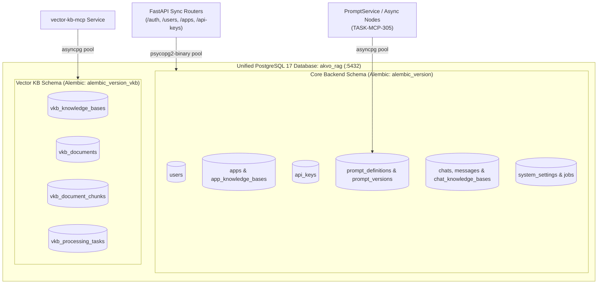

# Feature Specification: Backend PostgreSQL Adapter, Configuration & Core Alembic Alignment

> **Feature ID:** `015_db_205_backend_postgres_adapter_and_schema_migration_spec`  
> **Task Ref:** `TASK-DB-205`  
> **Target Branch:** `epic/rag-monorepo-mcp`  
> **Status:** `PROPOSED (Ready for Review)`  
> **Estimated Effort:** `1.5 hrs (Vibe-Coding) / 1.0 day (Traditional)`  
> **Author:** Antigravity Architect / Database & Backend Specialist  
> **Upstream Reference:** [docs/lld/container_based_rag_platform_lld.md](file:///Users/galihpratama/Sites/akvo-rag/docs/lld/container_based_rag_platform_lld.md) (Sections 5, 8, 9)  

---

## 1. Overview & 5W1H Requirements Discovery

### 1.1 Problem Statement
While the `vector-kb-mcp` service was migrated to PostgreSQL 17 in Phase 2 (`TASK-DB-201` through `TASK-DB-204`), the core `akvo-rag-backend` service remains bound to synchronous MySQL connection parameters (`MYSQL_SERVER`, `mysql-connector-python`, `from sqlalchemy.dialects.mysql import JSON`). 

To unblock **Phase 3 (`TASK-MCP-305`: Dynamic Prompt Resolver)** and **Phase 4 (`TASK-ING-401`: MinIO Ingestion)** without running in a fragmented "split-brain" database state, the `akvo-rag-backend` must be transitioned to natively connect to PostgreSQL 17 (`postgres:17-alpine`, database `akvo_rag`) for all core tables (`users`, `apps`, `api_keys`, `prompts`, `chats`, `system_settings`, `jobs`, `password_reset_tokens`).

### 1.2 5W1H Discovery Lens

| Dimension | Specification |
|---|---|
| **Who** | `akvo-rag-backend` FastAPI routes, background workers, Alembic migrations, and database seeders. |
| **What** | Modernize database engine configuration in `backend/` to natively connect to PostgreSQL 17 via `psycopg2-binary` (sync) and `asyncpg` (async), clean MySQL-specific model imports, and align Alembic environment. |
| **Where** | `backend/app/core/config.py`, `backend/app/db/session.py`, `backend/requirements.txt`, `backend/app/models/app.py`, `backend/alembic/env.py`. |
| **When** | **Phase 2 Completion / Phase 3 Entry** — bridging the gap between `vector-kb-mcp` database isolation and `PromptService` async resolution. |
| **Why** | Unifies relational persistence across the monorepo into a single PostgreSQL 17 instance, eliminates MySQL dependencies, and provides stable connection pooling for high-concurrency RAG workloads. |
| **How** | Add `psycopg2-binary` & `asyncpg` to requirements, update `Settings.get_database_url` to parse `DATABASE_URL` / `POSTGRES_*` environment variables, adapt `session.py` with PostgreSQL connection pooling, and verify table creation and seeder execution. |

---

## 2. Architecture & Database Topology

### 2.1 Unified Relational Database Topology (`akvo_rag`)



---

## 3. Detailed Technical Specifications

### 3.1 Backend Dependencies (`backend/requirements.txt`)
Add PostgreSQL database drivers while retaining compatibility:
```text
psycopg2-binary>=2.9.9
asyncpg>=0.29.0
```

### 3.2 Configuration Modernization (`backend/app/core/config.py`)
Update `Settings` to prioritize `DATABASE_URL` and `POSTGRES_*` environment variables:
```python
# PostgreSQL / Database settings
POSTGRES_SERVER: str = os.getenv("POSTGRES_SERVER", os.getenv("POSTGRES_HOST", "postgres"))
POSTGRES_PORT: int = int(os.getenv("POSTGRES_PORT", "5432"))
POSTGRES_USER: str = os.getenv("POSTGRES_USER", "postgres")
POSTGRES_PASSWORD: str = os.getenv("POSTGRES_PASSWORD", "postgres")
POSTGRES_DB: str = os.getenv("POSTGRES_DB", "akvo_rag")
DATABASE_URL: Optional[str] = os.getenv("DATABASE_URL")
SQLALCHEMY_DATABASE_URI: Optional[str] = None

@property
def get_database_url(self) -> str:
    if self.SQLALCHEMY_DATABASE_URI:
        return self.SQLALCHEMY_DATABASE_URI
    if self.DATABASE_URL:
        # Convert asyncpg scheme to psycopg2 for synchronous SQLAlchemy engine if needed
        url = self.DATABASE_URL
        if url.startswith("postgresql+asyncpg://"):
            return url.replace("postgresql+asyncpg://", "postgresql+psycopg2://")
        return url
    return (
        f"postgresql+psycopg2://{self.POSTGRES_USER}:{self.POSTGRES_PASSWORD}"
        f"@{self.POSTGRES_SERVER}:{self.POSTGRES_PORT}/{self.POSTGRES_DB}"
    )
```

### 3.3 Database Engine & Session Pooling (`backend/app/db/session.py`)
Replace MySQL-specific connection recycling with standard PostgreSQL engine options:
```python
from sqlalchemy import create_engine
from sqlalchemy.orm import sessionmaker
from app.core.config import settings

engine = create_engine(
    settings.get_database_url,
    pool_size=10,
    max_overflow=20,
    pool_timeout=30,
    pool_pre_ping=True,
)
SessionLocal = sessionmaker(autocommit=False, autoflush=False, bind=engine)

def get_db():
    db = SessionLocal()
    try:
        yield db
    finally:
        db.close()
```

### 3.4 Model Dialect Cleanup (`backend/app/models/app.py`)
Replace `from sqlalchemy.dialects.mysql import JSON` with standard `from sqlalchemy import JSON`:
```python
# backend/app/models/app.py
from sqlalchemy import (
    Column,
    Integer,
    String,
    Text,
    Boolean,
    ForeignKey,
    Enum as SQLEnum,
    JSON,
)
```

### 3.5 Alembic Migration & Environment (`backend/alembic/env.py`)
Ensure `get_url()` uses `settings.get_database_url` (PostgreSQL) and executes migrations without dialect conflicts.

---

## 4. Verification & Testing Plan

### 4.1 Automated Unit Tests (Offline / SQLite)
All existing 265+ unit tests in `backend/tests/` must continue to pass using in-memory SQLite isolation:
```bash
docker exec akvo-rag-backend-1 python -m pytest tests/ -v
```

### 4.2 Integration Tests (Live PostgreSQL 17)
1. Run backend migrations against live PostgreSQL 17:
   ```bash
   docker exec akvo-rag-backend-1 alembic upgrade head
   ```
2. Run database seeders against live PostgreSQL 17:
   ```bash
   docker exec akvo-rag-backend-1 python -m app.seeder.seed_admin_user
   docker exec akvo-rag-backend-1 python -m app.seeder.seed_prompts
   ```
3. Inspect PostgreSQL 17 table layout:
   ```bash
   docker exec akvo-rag-postgres-1 psql -U postgres -d akvo_rag -c "\dt"
   ```

---

## 5. Task Breakdown & Ballpark Estimates

| Subtask ID | Description | Touchpoints | Vibe-Coding Est. | Traditional Est. |
|---|---|---|---|---|
| `SUB-205.1` | Add `psycopg2-binary` & `asyncpg` to requirements and update `app.core.config` | `backend/requirements.txt`, `backend/app/core/config.py` | 0.3 hr | 0.25 day |
| `SUB-205.2` | Refactor `app.db.session` & clean `models/app.py` MySQL import | `backend/app/db/session.py`, `backend/app/models/app.py` | 0.3 hr | 0.25 day |
| `SUB-205.3` | Align backend `alembic/env.py` and run migrations against PostgreSQL 17 | `backend/alembic/env.py`, `backend/alembic/` | 0.4 hr | 0.25 day |
| `SUB-205.4` | Validate seeders, integration tests, and full test suite regression gate | `backend/tests/`, seeder scripts | 0.5 hr | 0.25 day |
| **Total** | | | **1.5 hrs** | **1.0 day** |
