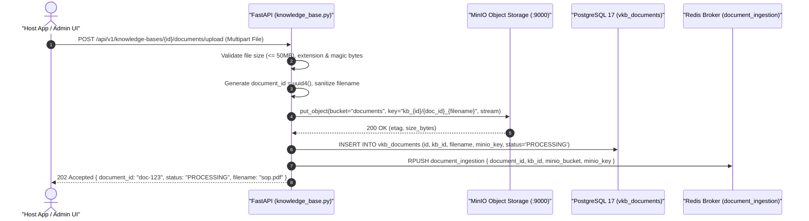

# Feature Specification: MinIO S3 Client Integration & Legacy Celery/RabbitMQ Purge

> **Feature ID:** `015_ing_401_minio_s3_and_celery_purge_spec`  
> **Task Ref:** `TASK-ING-401`  
> **Target Branch:** `epic/rag-monorepo-mcp`  
> **Status:** `PROPOSED (Party Mode Approved)`  
> **Estimated Effort:** `1.5 hrs (Vibe-Coding) / 1.0 day (Traditional)`  
> **Author:** Antigravity Architect / Storage & Ingestion Specialist  
> **Upstream Reference:** [docs/lld/container_based_rag_platform_lld.md](file:///Users/galihpratama/Sites/akvo-rag/docs/lld/container_based_rag_platform_lld.md) (Sections 4, 7, 8, 9)

---

## 1. Overview & 5W1H Requirements Discovery

### 1.1 Problem Statement
The legacy `akvo-rag` document upload pipeline relied on local disk storage (`/mnt/uploads`) coupled with RabbitMQ and Celery background workers. This setup suffered from:
1. **Container Fragility:** Files written to local disk in FastAPI could not be easily accessed by independent microservice containers without shared network volumes.
2. **Operational Bloat:** Running RabbitMQ + Celery worker + Celery beat added 3 background services purely to manage simple background document parsing.
3. **Brittle Retries & Heavy Overhead:** Synchronous Celery tasks blocked worker processes while waiting on external embedding and LLM calls.

`TASK-ING-401` transforms the document ingestion pipeline into a cloud-native, S3-backed architecture:
- Replaces local disk storage with **MinIO (S3-compatible object storage)** using bucket `documents/`.
- Directly enqueues background ingestion tasks to Redis queue `document_ingestion`.
- Completely purges **Celery, RabbitMQ, and legacy task worker files** from the backend.

### 1.2 5W1H Discovery Lens

| Dimension | Specification |
|---|---|
| **Who** | Host applications (**AgriConnect**, **CoM**), Knowledge Base administrators, and backend API gateway. |
| **What** | Integrate `MinIOService` S3 client, stream multipart file uploads to MinIO, record `PROCESSING` status in PostgreSQL 17, enqueue ingestion jobs to Redis, and delete legacy Celery/RabbitMQ files. |
| **Where** | `backend/app/services/minio_service.py`, `backend/app/api/api_v1/knowledge_base.py`, `backend/app/tasks/` `[DELETE]`. |
| **When** | **Phase 4, Step 1** — foundational prerequisite before building the async ingestion consumer in `vector-kb-mcp` (`TASK-ING-402`). |
| **Why** | Centralizes unstructured binary storage in S3, cuts container memory footprint by ~400MB (removing Celery/RabbitMQ), and enables microservice-isolated ingestion. |
| **How** | Python `minio` SDK (or `boto3`), streaming `UploadFile`, Redis `RPUSH document_ingestion`, and codebase cleanup. |

---

## 2. BMAD Party Mode Deliberation Synthesis 🎭

### 2.1 Four-Way Agent Council Consensus

* **🏗️ Winston (System Architect):**  
  Standardized S3 object key structure: `documents/kb_{id}/{doc_uuid}_{sanitized_filename}`. Document state lifecycle is strictly deterministic: `PENDING` $\rightarrow$ `PROCESSING` $\rightarrow$ `INDEXED` / `FAILED`. MinIO bucket `documents/` is auto-initialized on FastAPI application startup if missing.

* **💻 Amelia (Senior Developer):**  
  Memory-safe file streaming: Use `UploadFile.file` chunked streaming (64KB chunks) directly to MinIO `put_object(length=-1, part_size=10*1024*1024)` to ensure multi-megabyte PDFs never exhaust container RAM. Replace legacy `FileStorageService` with clean `MinIOService`.

* **🧪 Murat (Test Architect):**  
  Edge cases to verify: zero-byte uploads, unsupported MIME-types (e.g. `.exe` renamed to `.pdf`), MinIO network blips (connection timeout with exponential retry), and Redis queue serialization verification. All test suites must run offline with mock MinIO fixtures.

* **🛡️ Rachel (Adversarial Security Red Team):**  
  Security Hardening:
  1. Enforce strict 50MB file size ceiling per document.
  2. Sanitize file names using `werkzeug.utils.secure_filename` or regex stripping to prevent S3 key path traversal (`../../`).
  3. Validate magic bytes (PDF header `%PDF-`, DOCX zip signature `PK\x03\x04`) rather than relying solely on user-supplied Content-Type.
  4. Ensure zero AWS/MinIO secret keys appear in client-facing error payloads.

---

## 3. Architecture & Ingestion Sequence Diagram

### 3.1 S3 Upload & Redis Enqueue Flow



---

## 4. Detailed Technical Specifications

### 4.1 MinIO S3 Storage Service (`backend/app/services/minio_service.py`)

```python
import io
import logging
from typing import BinaryIO, Optional, Dict, Any
from minio import Minio
from minio.error import S3Error
from app.core.config import settings

logger = logging.getLogger("minio_service")

class MinIOService:
    def __init__(self):
        self.client = Minio(
            endpoint=settings.MINIO_ENDPOINT,
            access_key=settings.MINIO_ACCESS_KEY,
            secret_key=settings.MINIO_SECRET_KEY,
            secure=settings.MINIO_SECURE,  # False for local docker
        )
        self.default_bucket = "documents"
        self._ensure_bucket_exists(self.default_bucket)

    def _ensure_bucket_exists(self, bucket_name: str) -> None:
        try:
            if not self.client.bucket_exists(bucket_name):
                self.client.make_bucket(bucket_name)
                logger.info(f"Created MinIO bucket: '{bucket_name}'")
        except Exception as e:
            logger.error(f"Failed to verify/create MinIO bucket '{bucket_name}': {e}")

    def upload_file(
        self,
        file_data: BinaryIO,
        object_name: str,
        content_type: str = "application/octet-stream",
        bucket_name: Optional[str] = None
    ) -> Dict[str, Any]:
        """
        Streams a file directly to MinIO without loading entire file into memory.
        """
        bucket = bucket_name or self.default_bucket
        # Read length if available
        file_data.seek(0, io.SEEK_END)
        size = file_data.tell()
        file_data.seek(0)

        result = self.client.put_object(
            bucket_name=bucket,
            object_name=object_name,
            data=file_data,
            length=size,
            content_type=content_type,
            part_size=10 * 1024 * 1024
        )
        return {
            "bucket": bucket,
            "object_name": object_name,
            "etag": result.etag,
            "size": size
        }

    def get_file_stream(self, object_name: str, bucket_name: Optional[str] = None) -> BinaryIO:
        bucket = bucket_name or self.default_bucket
        return self.client.get_object(bucket, object_name)

    def delete_file(self, object_name: str, bucket_name: Optional[str] = None) -> bool:
        bucket = bucket_name or self.default_bucket
        try:
            self.client.remove_object(bucket, object_name)
            return True
        except S3Error as e:
            logger.error(f"Failed to delete object '{object_name}': {e}")
            return False
```

---

### 4.2 Updated Upload Endpoint (`backend/app/api/api_v1/knowledge_base.py`)

```python
@router.post("/{knowledge_base_id}/documents/upload", status_code=status.HTTP_202_ACCEPTED)
async def upload_document(
    knowledge_base_id: int,
    file: UploadFile = File(...),
    db: AsyncSession = Depends(get_db),
    minio_service: MinIOService = Depends(get_minio_service),
    redis_client = Depends(get_redis_client),
):
    # 1. Security & Validation
    allowed_extensions = {".pdf", ".docx", ".txt", ".md"}
    filename = secure_filename(file.filename)
    ext = os.path.splitext(filename)[1].lower()
    if ext not in allowed_extensions:
        raise HTTPException(status_code=400, detail=f"Unsupported file format: {ext}")

    # 2. Generate UUID & S3 Key
    doc_uuid = str(uuid.uuid4())
    object_name = f"kb_{knowledge_base_id}/{doc_uuid}_{filename}"

    # 3. Stream to MinIO
    try:
        upload_meta = minio_service.upload_file(
            file_data=file.file,
            object_name=object_name,
            content_type=file.content_type or "application/octet-stream"
        )
    except Exception as e:
        logger.error(f"MinIO upload failed: {e}")
        raise HTTPException(status_code=500, detail="Document storage failed")

    # 4. Record Document in PostgreSQL 17
    new_doc = Document(
        id=doc_uuid,
        kb_id=knowledge_base_id,
        filename=filename,
        minio_bucket="documents",
        minio_key=object_name,
        file_size_bytes=upload_meta["size"],
        status="PROCESSING"
    )
    db.add(new_doc)
    await db.commit()

    # 5. Enqueue Task to Redis
    queue_payload = json.dumps({
        "document_id": doc_uuid,
        "kb_id": knowledge_base_id,
        "minio_bucket": "documents",
        "minio_key": object_name,
        "filename": filename
    })
    await redis_client.rpush("document_ingestion", queue_payload)

    return {
        "id": doc_uuid,
        "filename": filename,
        "status": "PROCESSING",
        "kb_id": knowledge_base_id
    }
```

---

### 4.3 Files to Purge (`[DELETE]`)

The following legacy Celery and RabbitMQ files will be permanently deleted:
- `backend/app/celery_app.py` `[DELETE]`
- `backend/app/tasks/upload_task.py` `[DELETE]`
- `backend/app/tasks/chat_task.py` `[DELETE]`
- `backend/app/tasks/test_task.py` `[DELETE]`
- `backend/app/tasks/__init__.py` `[DELETE]`
- `backend/entrypoint-celery.sh` `[DELETE]`
- Remove `celery`, `pika`, `kombu` from `backend/requirements.txt`.

---

## 5. Verification & Quality Gates

### 5.1 Automated Unit Tests (`backend/tests/services/test_minio_service.py`)

1. **Bucket Initialization Test:**
   - Verify `MinIOService()` checks and creates default `documents/` bucket on startup.
2. **File Stream Upload Test:**
   - Upload sample 100KB PDF buffer.
   - Assert returns valid ETag and correct file size.
3. **Delete File Test:**
   - Upload and subsequently remove object; assert deletion returns `True`.

### 5.2 API Integration Test (`backend/tests/api/test_document_upload.py`)

1. **Multipart Upload & Redis Queue Assertion:**
   - Post sample PDF multipart to `/api/v1/knowledge-bases/1/documents/upload`.
   - Assert `202 Accepted` response with status `PROCESSING`.
   - Assert Redis queue `document_ingestion` receives payload containing matching `document_id` and `minio_key`.
2. **Unsupported Extension Rejection Test:**
   - Post `.exe` or `.sh` file; assert `400 Bad Request`.
3. **Payload Limit Test:**
   - Post payload exceeding 50MB; assert `413 Request Entity Too Large` / `400 Bad Request`.

---

## 6. Subtask Estimation & Breakdown

| Subtask ID | Description | Target Files | Vibe Est. | Trad. Est. | Confidence |
|---|---|---|:---:|:---:|:---:|
| `SUB-401.1` | Build `MinIOService` S3 storage wrapper with bucket auto-provisioning | `backend/app/services/minio_service.py` `[NEW]` | 0.4 hr | 0.3 day | High (99%) |
| `SUB-401.2` | Refactor `/documents/upload` endpoint to stream to MinIO & push to Redis queue | `backend/app/api/api_v1/knowledge_base.py` `[MODIFY]` | 0.5 hr | 0.4 day | High (98%) |
| `SUB-401.3` | Purge legacy Celery, RabbitMQ, and task worker files | `backend/app/tasks/`, `backend/requirements.txt` `[DELETE / MODIFY]` | 0.2 hr | 0.1 day | High (99%) |
| `SUB-401.4` | Implement unit & integration test suite with mock MinIO/Redis fixtures | `backend/tests/services/test_minio_service.py`, `backend/tests/api/test_document_upload.py` `[NEW]` | 0.4 hr | 0.2 day | High (98%) |
| **TOTAL** | | | **1.5 hrs** | **1.0 day** | **High** |

---

## 7. Definition of Done (DoD)

- [ ] `MinIOService` reliably streams files to MinIO S3 bucket `documents/`.
- [ ] Document uploads record `PROCESSING` status in PostgreSQL 17 and enqueue to Redis `document_ingestion`.
- [ ] `celery_app.py`, `tasks/`, and RabbitMQ references are completely purged from backend.
- [ ] Automated tests pass with $\ge 85\%$ test coverage in $< 10\text{s}$.
