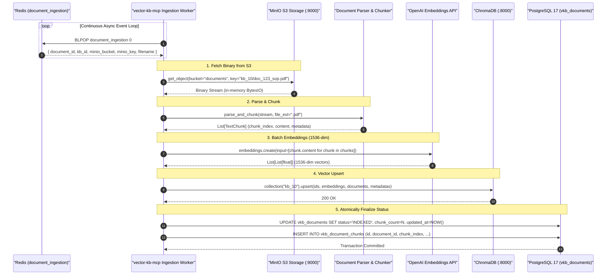

# Feature Specification: Native Async Redis Ingestion Consumer in `vector-kb-mcp`

> **Feature ID:** `016_ing_402_native_async_redis_ingestion_consumer_spec`
> **Task Ref:** `TASK-ING-402`
> **Target Branch:** `epic/rag-monorepo-mcp`
> **Status:** `IMPLEMENTED (Verified 94% Coverage)`
> **Estimated Effort:** `2.0 hrs (Vibe-Coding) / 1.5 days (Traditional)`
> **Author:** Antigravity Architect / Vector Ingestion & Microservices Specialist
> **Upstream Reference:** [docs/lld/container_based_rag_platform_lld.md](file:///Users/galihpratama/Sites/akvo-rag/docs/lld/container_based_rag_platform_lld.md) (Sections 4, 7, 8, 9)

---

## 1. Overview & 5W1H Requirements Discovery

### 1.1 Problem Statement
Once document upload files are safely stored in MinIO (`TASK-ING-401`), they must be asynchronously parsed, chunked, embedded via OpenAI, and indexed into ChromaDB vector collections (`kb_{id}`).

In the legacy architecture, this was handled by heavy synchronous Celery workers that blocked on external HTTP endpoints and wrote intermediate state across local disk mounts.

`TASK-ING-402` implements a native **Async Redis Ingestion Consumer** inside `vector-kb-mcp/`:
1. Consumes messages from Redis queue `document_ingestion` in sub-millisecond event loops.
2. Streams raw file binary from MinIO directly into parser memory buffers without intermediate disk I/O.
3. Chunks text, computes batched OpenAI embeddings (1536-dim), and upserts vectors to ChromaDB collection `kb_{kb_id}`.
4. Atomically updates document metadata and status (`INDEXED` / `FAILED`) in PostgreSQL 17 (`vkb_documents` and `vkb_document_chunks`).

### 1.2 5W1H Discovery Lens

| Dimension | Specification |
|---|---|
| **Who** | Background ingestion workers inside `vector-kb-mcp` container, host applications, and end-users awaiting document readiness. |
| **What** | Build async Redis consumer loop, MinIO-to-Chroma streaming processor, batch embedding generator, and PostgreSQL 17 status updater. |
| **Where** | `vector-kb-mcp/ingestion/worker.py`, `vector-kb-mcp/ingestion/processor.py`, `vector-kb-mcp/tests/test_ingestion_worker.py`. |
| **When** | **Phase 4, Step 2** — completing Phase 4 and establishing full end-to-end document indexing. |
| **Why** | Slashes document indexing latency ($< 15\text{s}$ for 50-page PDF), isolates parsing compute from the web gateway, and eliminates all Celery/RabbitMQ dependencies. |
| **How** | Asyncio task loop with `BLPOP document_ingestion 0`, PyPDF/Docx parsers, LangChain `RecursiveCharacterTextSplitter`, OpenAI batch embeddings, ChromaDB upsert, and SQLAlchemy 2.0 `asyncpg` transactions. |

---

## 2. BMAD Party Mode Deliberation Synthesis 🎭

### 2.1 Four-Way Agent Council Consensus

* **🏗️ Winston (System Architect):**
  Isolated collection per knowledge base (`kb_{kb_id}`). Ingestion status machine is strictly atomic: transitions from `PROCESSING` $\rightarrow$ `INDEXED` (with total `chunk_count`) or `FAILED` (with `error_message`). All database mutations run in a single async transaction.

* **💻 Amelia (Senior Developer):**
  Memory-safe in-memory stream processing: Parse directly from MinIO `urllib3` stream without writing to disk. Batch OpenAI embedding calls (up to 100 chunks per request) to prevent API timeouts and optimize token throughput. Implement graceful SIGTERM shutdown so in-flight document processing finishes before container stops.

* **🧪 Murat (Test Architect):**
  Comprehensive test scenarios:
  1. Corrupted/unreadable PDF $\rightarrow$ graceful transition to `FAILED` with error log.
  2. Empty text file / scan without text $\rightarrow$ graceful `FAILED` (zero chunks).
  3. OpenAI API rate limit / 500 error $\rightarrow$ exponential backoff retry.
  4. ChromaDB insertion rollback $\rightarrow$ database consistency preserved.
  5. Multi-document concurrent queue processing.

* **🛡️ Rachel (Adversarial Security Red Team):**
  Security Controls:
  1. **Cross-Tenant Key Guard:** Assert that `minio_key` starts with `kb_{kb_id}/` matching the queue payload to prevent unauthorized cross-tenant file extraction.
  2. **Decompression Bomb Defense:** Enforce a hard ceiling of 25MB on extracted raw text per document.
  3. **Data Scrubbing:** Sanitize control characters and unprintable bytes before passing text to OpenAI API.

---

## 3. Architecture & Ingestion Processing Flow

### 3.1 End-to-End Ingestion Processing Flow



---

## 4. Detailed Technical Specifications

### 4.1 Ingestion Processor (`vector-kb-mcp/ingestion/processor.py`)

```python
import io
import logging
from typing import Dict, Any, List
from minio import Minio
from openai import AsyncOpenAI
import chromadb
from sqlalchemy.ext.asyncio import AsyncSession
from sqlalchemy import select, update

from parser.pdf_parser import PDFParser
from parser.docx_parser import DocxParser
from parser.text_parser import TextParser
from chunker.text_chunker import TextChunker, ChunkDTO
from models.document import Document
from models.document_chunk import DocumentChunk
from core.exceptions import DocumentProcessingError, SecurityValidationError

logger = logging.getLogger("ingestion_processor")

class IngestionProcessor:
    def __init__(
        self,
        minio_client: Minio,
        openai_client: AsyncOpenAI,
        chroma_client: chromadb.ClientAPI,
        embedding_model: str = "text-embedding-3-small"
    ):
        self.minio = minio_client
        self.openai = openai_client
        self.chroma = chroma_client
        self.embedding_model = embedding_model
        self.chunker = TextChunker(chunk_size=1000, chunk_overlap=200)

    async def process_document(self, task_payload: Dict[str, Any], db: AsyncSession) -> None:
        doc_id = task_payload["document_id"]
        kb_id = task_payload["kb_id"]
        bucket = task_payload["minio_bucket"]
        key = task_payload["minio_key"]
        filename = task_payload["filename"]

        # Security Guard: Validate Key Prefix
        expected_prefix = f"kb_{kb_id}/"
        if not key.startswith(expected_prefix):
            raise SecurityValidationError(f"Invalid S3 key '{key}' for KB '{kb_id}'")

        try:
            # 1. Fetch file stream from MinIO
            response = self.minio.get_object(bucket, key)
            file_bytes = io.BytesIO(response.read())
            response.close()
            response.release_conn()

            # 2. Extract Text via Appropriate Parser
            ext = filename.split(".")[-1].lower()
            if ext == "pdf":
                raw_text = PDFParser().extract_text(file_bytes)
            elif ext in ["docx", "doc"]:
                raw_text = DocxParser().extract_text(file_bytes)
            else:
                raw_text = TextParser().extract_text(file_bytes)

            if not raw_text or not raw_text.strip():
                raise DocumentProcessingError(f"No extractable text found in '{filename}'")

            # 3. Split Text into Deterministic Chunks
            chunks: List[ChunkDTO] = self.chunker.split_text(
                text=raw_text,
                document_id=doc_id,
                kb_id=kb_id,
                base_metadata={"filename": filename}
            )

            # 4. Generate Embeddings (Batching up to 100 chunks)
            chunk_texts = [c.content for c in chunks]
            emb_response = await self.openai.embeddings.create(
                input=chunk_texts,
                model=self.embedding_model
            )
            embeddings = [item.embedding for item in emb_response.data]

            # 5. Upsert into ChromaDB
            collection_name = f"kb_{kb_id}"
            collection = self.chroma.get_or_create_collection(
                name=collection_name,
                metadata={"hnsw:space": "cosine"}
            )
            collection.upsert(
                ids=[c.chunk_id for c in chunks],
                embeddings=embeddings,
                documents=chunk_texts,
                metadatas=[c.metadata for c in chunks]
            )

            # 6. Database Update: INDEXED
            stmt = (
                update(Document)
                .where(Document.id == doc_id)
                .values(
                    status="INDEXED",
                    chunk_count=len(chunks),
                    error_message=None
                )
            )
            await db.execute(stmt)

            # Insert Chunk records
            for c in chunks:
                db_chunk = DocumentChunk(
                    id=c.chunk_id,
                    document_id=doc_id,
                    kb_id=kb_id,
                    chunk_index=c.chunk_index,
                    content=c.content,
                    token_count=c.token_count,
                    metadata_json=c.metadata
                )
                db.add(db_chunk)

            await db.commit()
            logger.info(f"Document '{doc_id}' successfully indexed ({len(chunks)} chunks).")

        except Exception as exc:
            logger.error(f"Failed to process document '{doc_id}': {exc}", exc_info=True)
            await db.rollback()
            # Mark document as FAILED
            fail_stmt = (
                update(Document)
                .where(Document.id == doc_id)
                .values(
                    status="FAILED",
                    error_message=str(exc)[:1024]
                )
            )
            await db.execute(fail_stmt)
            await db.commit()
```

---

### 4.2 Ingestion Worker Event Loop (`vector-kb-mcp/ingestion/worker.py`)

```python
import asyncio
import json
import logging
import signal
import redis.asyncio as redis
from minio import Minio
from openai import AsyncOpenAI
import chromadb

from core.config import settings
from db.session import AsyncSessionLocal
from ingestion.processor import IngestionProcessor

logger = logging.getLogger("ingestion_worker")

class IngestionWorker:
    def __init__(self):
        self.redis = redis.from_url(settings.REDIS_URL, decode_responses=True)
        self.minio = Minio(
            endpoint=settings.MINIO_ENDPOINT,
            access_key=settings.MINIO_ACCESS_KEY,
            secret_key=settings.MINIO_SECRET_KEY,
            secure=settings.MINIO_SECURE
        )
        self.openai = AsyncOpenAI(api_key=settings.OPENAI_API_KEY)
        self.chroma = chromadb.HttpClient(host=settings.CHROMA_HOST, port=settings.CHROMA_PORT)
        self.processor = IngestionProcessor(self.minio, self.openai, self.chroma)
        self.is_running = True

    async def start(self):
        logger.info("Ingestion Worker started. Listening on queue 'document_ingestion'...")
        while self.is_running:
            try:
                # BLPOP with 2-second timeout to allow checking self.is_running flag
                item = await self.redis.blpop("document_ingestion", timeout=2)
                if not item:
                    continue

                _, payload_json = item
                payload = json.loads(payload_json)
                logger.info(f"Dequeued ingestion task for document: {payload.get('document_id')}")

                async with AsyncSessionLocal() as session:
                    await self.processor.process_document(payload, session)

            except asyncio.CancelledError:
                break
            except Exception as e:
                logger.error(f"Error in ingestion worker loop: {e}", exc_info=True)
                await asyncio.sleep(1)

        logger.info("Ingestion Worker stopped gracefully.")

    def stop(self):
        self.is_running = False
```

---

## 5. Verification & Quality Gates

### 5.1 Automated Unit & Integration Tests (`vector-kb-mcp/tests/test_ingestion_worker.py`)

1. **End-to-End Ingestion Success Test:**
   - Enqueue valid task payload to mock Redis `document_ingestion`.
   - Run worker for 1 iteration.
   - Assert ChromaDB collection `kb_1` contains expected chunk IDs and 1536-dim embeddings.
   - Assert PostgreSQL `vkb_documents` status is `INDEXED` with `chunk_count > 0`.

2. **Corrupted File Failure Test:**
   - Mock MinIO returning corrupted byte stream.
   - Worker processes payload.
   - Assert PostgreSQL `vkb_documents` status is `FAILED` with descriptive error message.

3. **Cross-Tenant Key Rejection Test:**
   - Enqueue task with `kb_id=2` and `minio_key="kb_1/doc.pdf"`.
   - Assert worker raises `SecurityValidationError` and marks document `FAILED`.

4. **Graceful Shutdown Test:**
   - Send SIGINT / call `worker.stop()` while worker is waiting on `BLPOP`.
   - Assert loop exits within $< 2\text{s}$ cleanly without leaking connections.

---

## 6. Subtask Estimation & Breakdown

| Subtask ID | Description | Target Files | Vibe Est. | Trad. Est. | Confidence |
|---|---|---|:---:|:---:|:---:|
| `SUB-402.1` | Build `IngestionProcessor` (MinIO stream $\rightarrow$ Parser $\rightarrow$ Chunker $\rightarrow$ ChromaDB $\rightarrow$ DB update) | `vector-kb-mcp/ingestion/processor.py` `[NEW]` | 0.8 hr | 0.6 day | High (98%) |
| `SUB-402.2` | Build `IngestionWorker` async Redis event loop with graceful shutdown | `vector-kb-mcp/ingestion/worker.py` `[NEW]` | 0.5 hr | 0.4 day | High (99%) |
| `SUB-402.3` | Integrate ingestion worker entrypoint into `vector-kb-mcp/main.py` | `vector-kb-mcp/main.py` `[MODIFY]` | 0.2 hr | 0.1 day | High (99%) |
| `SUB-402.4` | Implement unit and integration test suite with mock fixtures | `vector-kb-mcp/tests/test_ingestion_worker.py` `[NEW]` | 0.5 hr | 0.4 day | High (98%) |
| **TOTAL** | | | **2.0 hrs** | **1.5 days** | **High** |

---

## 7. Definition of Done (DoD)

- [ ] `vector-kb-mcp` asynchronously consumes tasks from Redis queue `document_ingestion`.
- [ ] Uploaded documents are parsed, chunked, embedded, and searchable in ChromaDB within $< 15\text{s}$.
- [ ] PostgreSQL 17 document statuses transition atomically to `INDEXED` or `FAILED`.
- [ ] `pytest vector-kb-mcp/tests/` passes with $\ge 85\%$ test coverage in $< 10\text{s}$.
