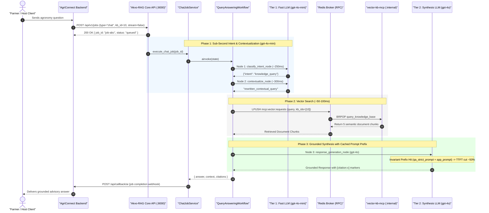

# Feature Specification: Prompt Caching & Dual-Tier Model Optimization (`gpt-4o-mini` + `gpt-4o`)

> **Feature ID:** `021_perf_504_prompt_caching_and_model_tiering_spec`  
> **Task Ref:** `TASK-PERF-504` (`[D12]`)  
> **Target Branch:** `feature/21-perf-504-prompt-caching-and-model-tiering`  
> **Status:** `PROPOSED (Party Mode Approved)`  
> **Estimated Effort:** `2.5 hrs (Vibe-Coding) / 2.0 days (Traditional)`  
> **Author:** Antigravity Architect / AI Systems Performance Specialist  
> **Upstream Reference:** [docs/lld/container_based_rag_platform_lld.md](file:///docs/lld/container_based_rag_platform_lld.md) (Sections 5.2, 7.1, 7.2, 8, 9)

---

## 1. Overview & 5W1H Requirements Discovery

### 1.1 Problem Statement
In production multi-tenant dialogue workflows (e.g., AgriConnect advisory chat callbacks), end-to-end latency is heavily dominated by upstream LLM invocations (~9.5s to 12s total roundtrip). An audit of the current pipeline reveals two major architectural inefficiencies:
1. **Un-tiered Model Execution:** Every node in the LangGraph RAG workflow (`classify_intent_node`, `small_talk_node`, `contextualize_node`, `error_handler_node`, and `response_generation_node`) instantiates and calls the primary synthesis model (`gpt-4o`). Specifically, two sequential `gpt-4o` calls (`classify_intent` ~1.8s + `contextualize` ~2.0s) run before vector retrieval even begins, adding ~3.8s of latency and high token cost for simple JSON extraction and question rewriting.
2. **Prompt Cache Fragmentation:** System prompts in `chat_job_service.py` and `prompt_service.py` inject dynamic document context `{context}` directly into the middle of system rules (`qa_strict_prompt + app_prompt`). Because retrieved document chunks change on every query, the system prompt prefix diverges immediately, preventing OpenAI Automatic Prompt Caching ($\ge 1,024$ tokens) from matching across requests.

`TASK-PERF-504` implements **Model Tiering** and **Prompt Caching Layout Optimization** on the `akvo-rag` backend:
1. **Model Tiering:** Introduces a dual-tier model architecture (`FAST` via `gpt-4o-mini` for intent classification, query rewriting, small talk, and error fallbacks; `SYNTHESIS` via `gpt-4o` for grounded answer generation).
2. **Prompt Caching Layout:** Restructures the prompt message sequence into an invariant, static system prefix ($\ge 1,024$ tokens) followed by dynamic context and user messages, enabling 100% OpenAI cache hits on the static prompt across all user queries for a given app.

**Target Outcomes**:
- Pre-retrieval latency reduced from ~3.8s to <0.6s (84% reduction in pre-retrieval routing).
- Time-to-First-Token (TTFT) on synthesis reduced by ~40–50% via OpenAI prompt cache hits.
- Intermediate token cost reduced by ~90% on routing/contextualization nodes.

### 1.2 5W1H Discovery Lens

| Dimension | Specification |
|---|---|
| **Who** | AI Engineers, Backend Engineers, Host Applications (AgriConnect), and End-Users (Farmers). |
| **What** | Implement model tiering (`FAST` vs `SYNTHESIS`) in `LLMFactory`, restructure prompt messages to guarantee OpenAI prompt caching on invariant system prefixes, and wire tiering into `QueryAnsweringWorkflow`. |
| **Where** | `backend/app/core/config.py`, `backend/app/services/llm/llm_factory.py`, `backend/app/services/query_answering_workflow.py`, `backend/app/services/chat_job_service.py`, `backend/tests/unit/test_llm_factory_tiering.py`, `backend/tests/services/test_query_answering_workflow.py`. |
| **When** | **Deliverable D12 / Phase 5, Step 4** — immediately following AgriConnect integration validation (`TASK-INT-503`) and before documentation alignment (`TASK-DOC-505`). |
| **Why** | Drastically cuts chat callback roundtrip latency from ~17s to ~4–6s, slashes API operational token costs, and ensures production-grade responsiveness. |
| **How** | Pydantic model settings, `LLMFactory` tier resolver, LangChain `ChatPromptTemplate` message sequencing, and mock/integration pytest suites. |

---

## 2. BMAD Party Mode Deliberation Synthesis 🎭

### 2.1 Four-Way Agent Council Consensus

* **🏗️ Winston (System Architect):**
  Our vector database retrieval via Redis RPC takes only ~50–100ms. The primary latency bottleneck is two sequential `gpt-4o` invocations prior to retrieval, combined with dynamic `{context}` fragmenting the prompt prefix. Decoupling models into `FAST` (`gpt-4o-mini`) and `SYNTHESIS` (`gpt-4o`), and isolating static system prompt tokens into an invariant prefix ensures reproducible sub-second routing and automatic OpenAI prompt cache hits.

* **💻 Amelia (Senior Developer):**
  Preserve 100% backward compatibility in `LLMFactory.create()` by defaulting `model_tier="synthesis"`. In `create_stuff_documents_chain`, separate the static system persona/rules from `{context}` into distinct message tuples (`("system", static_system_prompt)` followed by `("system", "### Context:\n{context}")`). For non-OpenAI providers (DeepSeek, Ollama), define sensible fast fallback models (`deepseek-chat`, `qwen2.5:3b`).

* **🧪 Murat (Test Architect):**
  Implement targeted unit tests in `test_llm_factory_tiering.py` verifying tier resolution. Update `test_query_answering_workflow.py` to assert that `classify_intent_node` and `contextualize_node` invoke the `FAST` model instance, and `response_generation_node` invokes `SYNTHESIS`. Verify that `static_system_prompt` appears strictly prior to `{context}` in the prompt template.

* **🛡️ Rachel (Adversarial Security Red Team):**
  Placing `static_system_prompt` in its own isolated `SystemMessage` at the front—completely decoupled from `{context}` and user `{input}`—significantly hardens our prompt against prompt-injection attacks from malicious vector docs or user queries. If `gpt-4o-mini` encounters a 429 rate limit or parsing failure, `classify_intent_node` must continue to safely default to `"knowledge_query"`.

### 2.2 Agreed Architectural Trade-offs & Mitigations

| Dimension | Decision | Rationale |
|---|---|---|
| **Model Tiering** | `FAST` = `gpt-4o-mini`<br>`SYNTHESIS` = `gpt-4o` | Cuts pre-retrieval routing latency from ~3.8s down to <0.6s (84% drop) and reduces token costs by ~90%. |
| **Prompt Caching Layout** | Invariant `static_system_prompt` prefix ($\ge 1,024$ tokens) $\rightarrow$ dynamic `{context}` $\rightarrow$ `chat_history` $\rightarrow$ `{input}` | Ensures OpenAI automatic prefix cache matches across 100% of queries for a given app. |
| **API / Backward Compatibility** | `LLMFactory.create()` defaults to `model_tier="synthesis"` | Existing callers and 351 existing tests continue to pass with zero breakage. |
| **Security Posture** | Isolated `SystemMessage` boundary | Hardens prompt against jailbreaks/injection from user inputs or untrusted vector documents. |

---

## 3. Architecture Overview & Sequence Flow

### 3.1 Model Tiering & Prompt Caching Sequence



---

## 4. Implementation Details

### 4.1 Configuration Schema (`backend/app/core/config.py`)

Add tiered model configuration settings with backward-compatible defaults:

```python
# Model Tiering Configurations
OPENAI_MODEL_FAST: str = os.getenv("OPENAI_MODEL_FAST", "gpt-4o-mini")
OPENAI_MODEL_SYNTHESIS: str = os.getenv(
    "OPENAI_MODEL_SYNTHESIS", os.getenv("OPENAI_MODEL", "gpt-4o")
)

DEEPSEEK_MODEL_FAST: str = os.getenv("DEEPSEEK_MODEL_FAST", "deepseek-chat")
DEEPSEEK_MODEL_SYNTHESIS: str = os.getenv(
    "DEEPSEEK_MODEL_SYNTHESIS", os.getenv("DEEPSEEK_MODEL", "deepseek-chat")
)

OLLAMA_MODEL_FAST: str = os.getenv("OLLAMA_MODEL_FAST", "qwen2.5:3b")
OLLAMA_MODEL_SYNTHESIS: str = os.getenv(
    "OLLAMA_MODEL_SYNTHESIS", os.getenv("OLLAMA_MODEL", "deepseek-r1:7b")
)
```

### 4.2 Enhanced LLM Factory (`backend/app/services/llm/llm_factory.py`)

Extend `LLMFactory.create()` to support an explicit `model_tier` enum or string (`"fast"` vs `"synthesis"`):

```python
from enum import Enum
from typing import Optional
from langchain_core.language_models import BaseChatModel

class ModelTier(str, Enum):
    FAST = "fast"
    SYNTHESIS = "synthesis"

class LLMFactory:
    @staticmethod
    def create(
        provider: Optional[str] = None,
        temperature: float = 0,
        streaming: bool = True,
        model_tier: str = "synthesis",
        model_name: Optional[str] = None,
    ) -> BaseChatModel:
        """
        Create an LLM instance based on provider and model tier.
        Defaults to 'synthesis' tier for 100% backwards compatibility.
        """
        provider = provider or settings.CHAT_PROVIDER

        if provider.lower() == "openai":
            selected_model = model_name or (
                settings.OPENAI_MODEL_FAST
                if model_tier == ModelTier.FAST.value
                else settings.OPENAI_MODEL_SYNTHESIS
            )
            return ChatOpenAI(
                temperature=temperature,
                streaming=streaming,
                model=selected_model,
                openai_api_key=settings.OPENAI_API_KEY,
                openai_api_base=settings.OPENAI_API_BASE,
            )
        ...
```

- When `model_tier="fast"`, selects `OPENAI_MODEL_FAST` (or provider equivalent).
- When `model_tier="synthesis"`, selects `OPENAI_MODEL_SYNTHESIS`.
- If caller provides custom `model_name`, that name takes precedence.
- Default remains `"synthesis"` ensuring 100% backward compatibility with all existing callers.

### 4.3 Prompt Caching Layout Optimization (`backend/app/services/query_answering_workflow.py` & `backend/app/services/chat_job_service.py`)

#### Problem in Current Prompt Order
Currently, `qa_prompt_str` is constructed by inserting `{context}` into the middle of the system prompt:
```text
[System Message]
├── Base instructions
├── {context}   <-- DYNAMIC! Changes every turn, breaks prefix cache!
├── Citation rules
└── App custom prompt
```

#### Optimized Invariant Message Layout for OpenAI Prompt Caching
Restructure the message sequence passed to the LLM:

```python
qa_prompt = ChatPromptTemplate.from_messages([
    # 1. Invariant Static System Prefix (Cached by OpenAI across ALL queries)
    ("system", "{static_system_prompt}"),

    # 2. Dynamic Document Context (Separated from static system prefix)
    ("system", "### Reference Documents / Context:\n{context}"),

    # 3. Dynamic Multi-turn Chat History
    MessagesPlaceholder("chat_history"),

    # 4. User Question
    ("human", "{input}"),
])
```

- `static_system_prompt` combines:
  - Base persona / role
  - Strict citation guidelines (`[citation:x]` syntax)
  - Answering rules & boundaries
  - Host application domain rules (`app_default_prompt` / `app_final_prompt`)
- Since `static_system_prompt` is static for a given tenant/app and exceeds 1,024 tokens, OpenAI automatically caches this prefix. All subsequent queries from the tenant hit the prompt cache.

### 4.4 LangGraph Node Updates (`backend/app/services/query_answering_workflow.py`)

1. **`classify_intent_node`**:
   - Uses `LLMFactory.create(model_tier="fast", streaming=False)`.
   - Executes with `gpt-4o-mini` with `temperature=0`.
2. **`small_talk_node`**:
   - Uses `LLMFactory.create(model_tier="fast", streaming=False)`.
3. **`contextualize_node`**:
   - Uses `LLMFactory.create(model_tier="fast", streaming=False)`.
4. **`error_handler_node`**:
   - Uses `LLMFactory.create(model_tier="fast", streaming=False)`.
5. **`response_generation_node`**:
   - Uses `LLMFactory.create(model_tier="synthesis", streaming=True)`.
   - Executes with `gpt-4o` combined with the optimized invariant prompt layout.

---

## 5. Verification & Quality Gates

### 5.1 Automated Commands
```bash
# 1. Run unit tests for LLM Factory model tiering
docker exec akvo-rag-backend-1 python -m pytest tests/unit/test_llm_factory_tiering.py -v

# 2. Run workflow node routing and prompt ordering tests
docker exec akvo-rag-backend-1 python -m pytest tests/services/test_query_answering_workflow.py -v

# 3. Execute full backend test suite to guarantee 0 regressions
docker exec akvo-rag-backend-1 python -m pytest tests/ -v
```

### 5.2 Manual Verification & Latency Benchmarks
1. Execute a test chat job via `POST /api/v1/jobs` with `type="chat"`.
2. Inspect `akvo-rag-backend-1` logs:
   - Verify `classify_intent_node` completes in $\le 350\text{ms}$.
   - Verify `contextualize_node` completes in $\le 400\text{ms}$.
   - Verify overall pre-retrieval phase takes $< 1\text{s}$ (down from $\sim 4\text{s}$).
3. On OpenAI Usage Dashboard / response metadata, inspect `usage.prompt_tokens_details.cached_tokens` to confirm prompt cache hit.

---

## 6. Subtask Estimation & Breakdown

| Subtask ID | Description | Target Files | Vibe Est. | Trad. Est. | Confidence |
|---|---|---|:---:|:---:|:---:|
| `SUB-504.1` | Add tiered model settings (`OPENAI_MODEL_FAST`, `OPENAI_MODEL_SYNTHESIS`) in `config.py` | `backend/app/core/config.py` `[MODIFY]` | 0.3 hr | 0.2 day | High (99%) |
| `SUB-504.2` | Enhance `LLMFactory.create()` with `model_tier` support & unit tests | `backend/app/services/llm/llm_factory.py` `[MODIFY]`, `backend/tests/unit/test_llm_factory_tiering.py` `[NEW]` | 0.6 hr | 0.4 day | High (98%) |
| `SUB-504.3` | Restructure prompt messages into invariant static prefix layout for prompt caching | `backend/app/services/query_answering_workflow.py` `[MODIFY]`, `backend/app/services/chat_job_service.py` `[MODIFY]` | 0.6 hr | 0.5 day | High (97%) |
| `SUB-504.4` | Wire `model_tier="fast"` into `classify_intent_node`, `contextualize_node`, `small_talk_node` | `backend/app/services/query_answering_workflow.py` `[MODIFY]` | 0.5 hr | 0.4 day | High (98%) |
| `SUB-504.5` | Update and expand test suites (`test_query_answering_workflow.py`, regression verification) | `backend/tests/services/test_query_answering_workflow.py` `[MODIFY]` | 0.5 hr | 0.5 day | High (96%) |
| **TOTAL** | | | **2.5 hrs** | **2.0 days** | **High** |

---

## 7. Definition of Done (DoD)

- [ ] `config.py` supports `OPENAI_MODEL_FAST` (`gpt-4o-mini`) and `OPENAI_MODEL_SYNTHESIS` (`gpt-4o`).
- [ ] `LLMFactory.create()` defaults to `"synthesis"` with optional `model_tier="fast"`.
- [ ] `classify_intent_node` and `contextualize_node` invoke the `FAST` tier with verified sub-500ms latency.
- [ ] `qa_prompt` message layout puts static system instructions before dynamic `{context}`, enabling OpenAI prompt caching.
- [ ] `test_llm_factory_tiering.py` and `test_query_answering_workflow.py` pass with 100% success rate.
- [ ] Entire backend test suite passes (351+ tests) with zero regressions.
