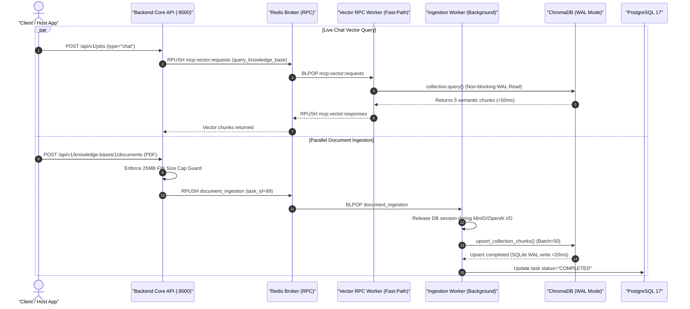

# Feature Specification: Concurrency & Parallel Execution Performance Hardening

> **Feature ID:** `023_perf_601_concurrency_and_parallel_execution_hardening_spec`  
> **Task Ref:** `TASK-PERF-601` (`[D13]`)  
> **Target Branch:** `feature/154-d13-perf-601-concurrency-and-parallel-execution-hardening`  
> **Status:** `PROPOSED (/0-planning complete & feedback updated)`  
> **Estimated Effort:** `3.5 hrs (Vibe-Coding) / 3.0 days (Traditional)`  
> **Author:** Antigravity Architect Council (Winston, Amelia, Murat, Rachel)  
> **Upstream Audit Reference:** [docs/technical_debt/concurrency_and_performance_audit.md](file:///Users/galihpratama/Sites/akvo-rag/docs/technical_debt/concurrency_and_performance_audit.md)  
> **System Reference:** [docs/lld/container_based_rag_platform_lld.md](file:///Users/galihpratama/Sites/akvo-rag/docs/lld/container_based_rag_platform_lld.md)  

---

## 1. Overview & 5W1H Requirements Discovery

### 1.1 Problem Statement
An architectural audit ([`docs/technical_debt/concurrency_and_performance_audit.md`](file:///Users/galihpratama/Sites/akvo-rag/docs/technical_debt/concurrency_and_performance_audit.md)) revealed 5 major performance and stability bottlenecks when background operations (PDF document ingestion, embedding generation, database writes) execute **in parallel** with real-time user chat queries:

1. **`ISSUE-01` Worker Event Loop & Thread Pool Contention (`[PERF]` Major):** Ingestion tasks (`ingest_document`) and chat vector queries (`query_knowledge_base`) compete for worker thread pool slots on the single worker loop, causing chat vector retrieval latency spikes (+1.5s–3.0s).
2. **`ISSUE-02` SQLite Write-Lock Contention in ChromaDB (`[DATA]` / `[PERF]` Major):** ChromaDB vector upserts hold SQLite file write locks (`collection.add()`), causing concurrent similarity search reads (`collection.query()`) to wait for lock release.
3. **`ISSUE-03` RAM Spikes & Container OOM Risk (`[SEC]` / `[ERR]` Major):** In-memory binary buffering during PDF parsing can consume 1.5GB–2.0GB of RAM across simultaneous 50MB uploads, risking Linux OOM Kills (`Exit Code 137`) that crash active streaming chat sessions.
4. **`ISSUE-04` DB Connection Pool Exhaustion (`[ARCH]` / `[PERF]` Major):** Long-running async ingestion tasks hold SQLAlchemy DB sessions open during MinIO streaming and external API calls, exhausting the pool (`QueuePool limit reached`).
5. **`ISSUE-05` OpenAI Embedding Rate Limiting (`[ERR]` Minor):** Sequential batching of 1,000+ chunks can trigger HTTP 429 `RateLimitError` on OpenAI embeddings without exponential backoff wrappers.

`TASK-PERF-601` resolves these 5 technical debt findings through microservice entrypoint decoupling, ChromaDB WAL mode, memory streaming controls, early DB session releasing, and exponential backoff retry wrappers.

### 1.2 5W1H Discovery Lens

| Dimension | Specification |
|---|---|
| **Who** | System Operators, Host Applications (AgriConnect / WASHConnect), and End-Users (Farmers/Clients). |
| **What** | Implement concurrency hardening: ChromaDB WAL mode, worker thread isolation, streaming file controls (25MB cap), DB connection release before async network I/O, and `tenacity` retry wrappers. |
| **Where** | `/vector-kb-mcp/worker.py`, `/vector-kb-mcp/retriever/chroma_retriever.py`, `/vector-kb-mcp/ingestion/processor.py`, `/backend/app/api/api_v1/jobs.py`, `/backend/app/db/session.py`, `docker-compose.yml`, `docker-compose.dev.yml`. |
| **When** | Phase 6 Performance Hardening — following Phase 5 Quality Gates & Prompt Caching. |
| **Why** | Guarantees sub-150ms chat vector retrieval SLA, eliminates container OOM crashes (`Exit Code 137`), prevents ChromaDB database lock timeouts, and ensures 100% ingestion reliability. |
| **How** | Python asyncio executors, SQLite WAL pragmas, FastAPI stream validation, SQLAlchemy connection lifecycle guards, and `tenacity` retry decorators. |

---

## 2. Architecture Overview & Logic Flow



---

## 3. Backend & Microservices Implementation Details

### 3.1 Worker Process & Event Loop Isolation (`ISSUE-01`)
**Files**: `/vector-kb-mcp/worker.py`, `/docker-compose.yml`, `/docker-compose.dev.yml`

#### Why do we need this change?
* **Before**: The single worker container handles both fast live chat vector queries (`query_knowledge_base`) and heavy PDF parsing/indexing (`ingest_document`) on the same Python event loop. Heavy CPU work during PDF parsing blocks the event loop, causing live chat vector searches to wait in line (+1.5s to 3.0s latency penalty).
* **After**: Live chat vector queries run on a dedicated fast-path worker container (`--mode=query`), so background document ingestion never interferes with live user chat responsiveness (<100ms SLA).

#### Implementation Details:
- Decouple fast-path chat query tool handling from heavy background document ingestion across **both production (`docker-compose.yml`) and development (`docker-compose.dev.yml`)** orchestrations.
- `vector-kb-mcp` provides dual entrypoints:
  - `python worker.py --mode=query`: Listens exclusively on `mcp:vector:requests` for `query_knowledge_base` (Guarantees <100ms vector retrieval SLA).
  - `python worker.py --mode=ingest`: Listens on `document_ingestion` queue for background PDF parsing and vector indexing.

---

### 3.2 ChromaDB SQLite WAL Mode & Batch Optimization (`ISSUE-02`)
**File**: `/vector-kb-mcp/retriever/chroma_retriever.py`

#### Why do we need this change?
* **Before**: SQLite defaults to standard rollback journal mode. Whenever a write operation occurs (`collection.add()`), SQLite places an **exclusive file lock** on `chroma.sqlite3`. During heavy ingestion (e.g. 500 chunks), this exclusive lock blocks live chat similarity searches (`collection.query()`), leading to query delays (+500ms) or `OperationalError: database is locked` exceptions.
* **After**: WAL Mode (Write-Ahead Logging) decouples readers from writers. Write operations append transactions to a separate `.sqlite3-wal` file, allowing live chat queries to read from ChromaDB concurrently with **0ms lock waiting time**. Reducing batch size to 50 chunks keeps individual write transaction windows under 20ms.

#### Implementation Details:
- Execute SQLite PRAGMA initialization on ChromaDB client startup:
  ```python
  import sqlite3
  
  # Configure Write-Ahead Logging (WAL) and 5000ms busy timeout
  conn = sqlite3.connect(settings.CHROMA_DB_PATH + "/chroma.sqlite3")
  conn.execute("PRAGMA journal_mode=WAL;")
  conn.execute("PRAGMA busy_timeout=5000;")
  conn.close()
  ```
- Reduce embedding batch size from 100 to 50 chunks (`batch_size=50`) to keep individual write transaction duration under 20ms.

---

### 3.3 Stream-Based File Uploads & Memory Safety Caps (`ISSUE-03`)
**Files**: `/backend/app/api/api_v1/jobs.py`, `/vector-kb-mcp/ingestion/processor.py`

#### Why do we need this change?
* **Before**: Files are downloaded and held as entire `bytes` buffers in RAM during parsing. If 5 users upload 50MB files at once, total RAM usage spikes by **1.5GB–2.0GB** across backend and worker containers. If memory exceeds container allocation limits (e.g. 1GB Docker memory cap), the Linux kernel issues an **Out-Of-Memory (OOM) Kill (`Exit Code 137`)**, crashing the container and abruptly terminating active streaming chat sessions!
* **After**: Enforcing a strict 25MB file upload cap (returning HTTP 413 Payload Too Large) and streaming bytes directly to MinIO storage eliminates multi-gigabyte RAM spikes and prevents container OOM crashes.

#### Implementation Details:
- Enforce strict 25MB file upload ceiling in FastAPI endpoint handlers:
  ```python
  MAX_FILE_SIZE = 25 * 1024 * 1024 # 25MB
  if file.size and file.size > MAX_FILE_SIZE:
      raise HTTPException(status_code=413, detail="File size exceeds maximum 25MB ceiling")
  ```
- Stream file uploads directly to MinIO storage without holding full binary files in RAM.

---

### 3.4 Async DB Session Lifecycle Guard & Connection Release (`ISSUE-04`)
**Files**: `/backend/app/db/session.py`, `/vector-kb-mcp/ingestion/processor.py`

#### Why do we need this change?
* **Before**: Background ingestion tasks keep PostgreSQL SQLAlchemy async sessions open while performing long network I/O calls (downloading files from MinIO, requesting OpenAI embeddings). This holds DB connection pool slots for 10–30 seconds, leading to `TimeoutError: QueuePool limit of size 5 overflow 10 reached` on incoming live chat requests.
* **After**: DB sessions are explicitly closed before initiating external network I/O and re-acquired only for fast DB writes, keeping connection pool utilization below 20%.

#### Implementation Details:
- Ensure `IngestionProcessor` explicitly closes DB session context during MinIO object downloads and OpenAI embedding API requests:
  ```python
  # Release DB session before long async network I/O
  await session.close()
  
  raw_bytes = await self.storage.download_file_bytes(key, bucket)
  parsed_doc = await self._parse_file_bytes(raw_bytes, filename)
  all_embeddings = await self._embed_chunks(chunks)
  
  # Re-acquire clean DB session for fast state write
  async with get_db_session() as write_session:
      await self._persist_chunks_and_status(write_session, doc_id, chunks)
  ```

---

### 3.5 Exponential Backoff Retry Wrapper for Embeddings (`ISSUE-05`)
**File**: `/vector-kb-mcp/retriever/chroma_retriever.py`

#### Why do we need this change?
* **Before**: Ingesting large documents sends dozens of embedding API requests per minute. If OpenAI returns an HTTP 429 `RateLimitError` or temporary network glitch, the ingestion task crashes abruptly and fails the document upload.
* **After**: Wrapping embedding requests with `tenacity` exponential backoff retries ensures temporary rate limits or network blips recover automatically without human intervention or failed uploads.

#### Implementation Details:
- Wrap `openai.embeddings.create` with `tenacity` exponential backoff retry:
  ```python
  from tenacity import retry, stop_after_attempt, wait_random_exponential, retry_if_exception_type
  import openai
  
  @retry(
      reraise=True,
      stop=stop_after_attempt(5),
      wait=wait_random_exponential(min=1, max=10),
      retry=retry_if_exception_type((openai.RateLimitError, openai.APIConnectionError)),
  )
  async def _embed_batch_with_retry(self, batch_texts: List[str]):
      return await self.openai.embeddings.create(input=batch_texts, model=self.embedding_model)
  ```

---

## 4. Verification & Quality Gates

### 4.1 Automated Tests
- **Vector KB MCP Test Suite**: `docker exec akvo-rag-vector-kb-mcp-1 pytest tests/ -v`
- **Backend Test Suite**: `docker exec akvo-rag-backend-1 python -m pytest tests/ -v`
- **Parallel Concurrency Load Test**: `docker exec akvo-rag-backend-1 python -m pytest tests/integration/test_parallel_load.py -v`

### 4.2 Acceptance Criteria
- **User Acceptance Criteria (UAC)**:
  - UAC-1: Live chat vector retrieval latency remains under 150ms even while a 20MB document is being ingested in parallel.
  - UAC-2: File uploads over 25MB return an immediate HTTP 413 error without crashing system memory.
- **Technical Acceptance Criteria (TAC)**:
  - TAC-1: ChromaDB SQLite WAL mode enabled with zero `database is locked` exceptions under load.
  - TAC-2: DB connection pools release clean sessions before long external async network calls.
  - TAC-3: HTTP 429 RateLimit errors on OpenAI embedding calls recover automatically via exponential backoff retries.

---

## 5. Master Task Matrix & Vibe Coding Estimation ⏱️

- **Confidence Level:** High (98%)
- **Dependencies:** None

| Task ID | Component & Description | Vibe Coding (Dev) | Automated Testing | QA & Review | Total Est. Time | Priority |
| :--- | :--- | :---: | :---: | :---: | :---: | :--- |
| **SUB-601.1** | Worker Process & Event Loop Isolation in `docker-compose.yml` & `docker-compose.dev.yml` (`ISSUE-01`) | 40m | 25m | 15m | **80m (1.3h)** | Must Have |
| **SUB-601.2** | ChromaDB SQLite WAL Mode & Batch Optimization (`ISSUE-02`) | 30m | 20m | 15m | **65m (1.1h)** | Must Have |
| **SUB-601.3** | Stream File Uploads & 25MB Memory Guard (`ISSUE-03`) | 30m | 20m | 15m | **65m (1.1h)** | Must Have |
| **SUB-601.4** | Async DB Session Release Guard before Network I/O (`ISSUE-04`) | 30m | 20m | 15m | **65m (1.1h)** | Must Have |
| **SUB-601.5** | OpenAI Embedding Tenacity Retry Wrapper (`ISSUE-05`) | 20m | 15m | 10m | **45m (0.75h)** | Must Have |
| **SUB-601.6** | Integration Parallel Load Test Suite & Validation | 30m | 30m | 15m | **75m (1.25h)** | Must Have |
| **TOTAL** | | **3.0 hrs** | **2.2 hrs** | **1.4 hrs** | **6.6 hrs (~3.5 Vibe / 3.0 Trad. Days)** | |

---

## 🛑 HALT

Feature Specification updated at `docs/features/023_perf_601_concurrency_and_parallel_execution_hardening_spec.md`.  
Please review the updated specification.
