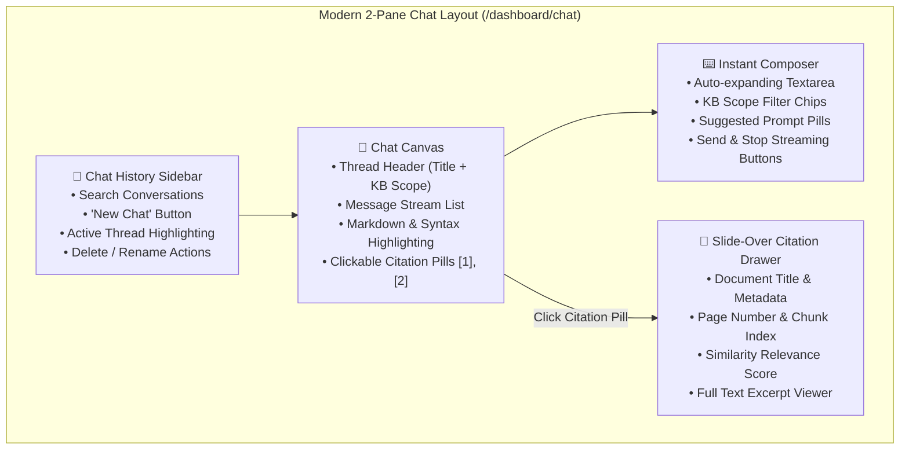

# Feature Specification: Modern Chat Canvas, 2-Pane Layout & Slide-Over Citation Drawer

> **Feature ID:** `025_ui_601_modern_chat_canvas_and_citation_drawer_spec`  
> **Task Ref:** `TASK-UI-601` (`[D13]`)  
> **Target Branch:** `feature/155-d13-ui-601-modern-chat-canvas-and-citation-drawer`  
> **Status:** `APPROVED (/0-planning complete & grilled)`  
> **Estimated Effort:** `3.5 hrs (Vibe-Coding) / 2.5 days (Traditional)`  
> **Author:** Antigravity UX & Fullstack Council (Sally, Winston, Amelia, Murat)  
> **System Reference:** [docs/lld/container_based_rag_platform_lld.md](file:///Users/galihpratama/Sites/akvo-rag/docs/lld/container_based_rag_platform_lld.md)  

---

## 1. Overview & 5W1H Requirements Discovery

### 1.1 Problem Statement
The current web chat experience in Akvo RAG has several UX and structural friction points:
1. **Chat Creation Barrier**: Users must navigate to `/dashboard/chat/new`, pick knowledge bases, fill out title fields, and click submit before they can ask a question.
2. **Citation Clutter & Viewport Clipping**: Citations currently render in floating popovers/tooltips (`components/chat/answer.tsx`), which can be clipped on smaller viewports and make inspecting multi-paragraph excerpts difficult.
3. **Missing Conversational Flow**: Switching conversations requires returning to the card-grid page `/dashboard/chat` instead of browsing a unified left sidebar.
4. **Knowledge Base Scope Invisibility**: Users cannot easily see or toggle between searching across **All Knowledge Bases** vs **Specific Knowledge Bases** directly from the composer.

`TASK-UI-601` modernizes the chat interface into a **unified 2-pane AI workspace** with an instant composer, persistent thread sidebar, and a sleek **Slide-Over Citation Drawer**.

### 1.2 5W1H Discovery Lens

| Dimension | Specification |
|---|---|
| **Who** | End-Users, Agronomy Advisors, Researchers, and System Administrators interacting with Akvo RAG. |
| **What** | Implement a 2-Pane Chat Canvas (Thread Sidebar + Real-time Streaming Chat Window), a Slide-Over Citation Drawer with score breakdown & excerpt viewer, and an In-Composer KB Filter (All KBs default + pill chips). |
| **Where** | `frontend/src/app/dashboard/chat/`, `frontend/src/components/chat/`, `frontend/src/components/layout/`. |
| **When** | **Phase 6: Frontend Experience Modernization (`[D13]`)**. |
| **Why** | Delivers a frictionless ChatGPT/Claude/Perplexity-tier DX, eliminates viewport tooltip clipping, and allows instant query execution across all knowledge bases with 1 click. |
| **How** | Next.js 14 App Router, Radix UI Dialog/Sheet primitives, Tailwind CSS, Vercel AI SDK (`useChat`), Lucide React icons. |

---

## 2. Architecture Overview & Component Hierarchy



---

## 3. UI Component Specifications

### 3.1 2-Pane Unified Chat View (`frontend/src/app/dashboard/chat/`)
- **Left Sidebar (`ChatSidebar`)**:
  - Width: `w-72` (collapsible on mobile `< 768px` via slide-over menu).
  - List of past chat sessions sorted by `updated_at` (Today, Yesterday, Previous 7 Days).
  - Instant Search input at the top.
  - "New Chat" primary action button at the top header.
- **Center Canvas (`ChatCanvas`)**:
  - Full-height flex column with auto-scrolling message bubbles.
  - User messages: Clean subtle card aligned right.
  - Assistant messages: Clean markdown container aligned left with avatar, copy-to-clipboard button, and highlighted citation badges (`[1]`, `[2]`).

### 3.2 Slide-Over Citation Drawer (`frontend/src/components/chat/citation-drawer.tsx`)
- Radix UI Sheet / Dialog sliding from the right edge (`w-full sm:w-[480px] lg:w-[540px]`).
- Header: Document Name with File Icon, KB Name badge, and Close `(Esc)` button.
- Metadata Card: Page number, Chunk ID, and Similarity Relevance Score bar (e.g. `94% Match`).
- Content Body: Scrollable, formatted markdown excerpt of the cited knowledge chunk with keyword highlighting.

### 3.3 Upfront Knowledge Base Scope Selection & Locked Session Scope
- **Pre-Chat Selection (`/dashboard/chat`)**:
  - Step 1: Users select their knowledge base scope upfront (Default: **`🌐 All Knowledge Bases`**, or select specific Knowledge Bases with search filter).
  - Step 2: Ask a question or click a suggested starter prompt chip to instantiate the chat session.
- **In-Chat Experience (`/dashboard/chat/[id]`)**:
  - Header displays the locked knowledge base scope for the active session (e.g. `📌 Scoped to: [KB Name]` or `🌐 All Knowledge Bases`).
  - Streamlined, focused chat composer without misleading mid-chat KB switching to guarantee retrieval precision and prevent context pollution.

---

## 4. Verification & Quality Gates

### 4.1 Automated Verification
```bash
# Frontend linting
docker exec akvo-rag-frontend-1 pnpm lint

# Frontend production build verification
docker exec akvo-rag-frontend-1 pnpm build
```

### 4.2 Manual Verification Checklist
1. **Instant Conversation**: Open `/dashboard/chat` -> type a question without manually creating a chat first -> verify response streams in real time and new chat appears in the left sidebar.
2. **Citation Drawer**: Click citation pill `[1]` -> verify right-side drawer opens smoothly with document title, page number, and text excerpt.
3. **KB Filter Toggle**: Click `Filter KBs` -> pick 1 KB -> verify question is scoped strictly to that KB.
4. **Mobile Responsive Check**: Resize viewport to `< 768px` -> verify sidebar collapses into a drawer and chat canvas remains fully functional.

---

## 5. Vibe Coding Estimation Standard

| Subtask ID | Description | 💻 Vibe Coding (Dev) | 🧪 Automated Testing | 🔍 QA & Review | ⏱️ Total Est. |
|---|---|:---:|:---:|:---:|:---:|
| `TASK-UI-601.1` | Build Unified 2-Pane Chat Layout & Persistent History Sidebar | 45m | 20m | 15m | **80m (1.3h)** |
| `TASK-UI-601.2` | Implement Slide-Over Citation Drawer & Chunk Excerpt Viewer | 40m | 15m | 15m | **70m (1.2h)** |
| `TASK-UI-601.3` | Build In-Composer Knowledge Base Filter Chips & Suggested Prompts | 35m | 15m | 10m | **60m (1.0h)** |
| **TOTAL** | **TASK-UI-601: Modern Chat Canvas & Citation Drawer** | **120m (2.0h)** | **50m (0.8h)** | **40m (0.7h)** | **210m (3.5h)** |
