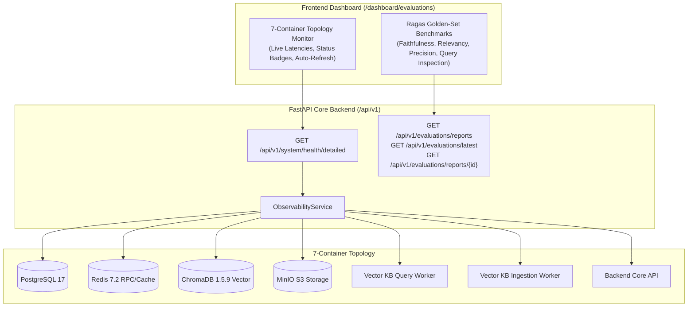

# Feature Specification: Integrated RAG Golden-Set Evaluation & 7-Container Observability

> **Issue:** [#176](https://github.com/akvo/akvo-rag/issues/176)  
> **Task ID:** `TASK-OPS-606`  
> **Target Base Branch:** `feature/175-tenant-app-registration-and-api-key-portal`  
> **Status:** In Progress  

---

## 1. Overview & Business Value

Akvo RAG relies on a distributed topology composed of 7 core docker containers (PostgreSQL 17, Redis 7.2, ChromaDB 1.5.9, MinIO S3, Vector KB Query Worker, Vector KB Ingestion Worker, and FastAPI Core Backend). In addition, quality governance requires continuous benchmarking against Ragas golden validation sets (Faithfulness, Answer Relevancy, Context Precision, and Context Recall).

Previously, system status checks were fragmented and evaluation metrics were isolated in a standalone Streamlit runner (`./rag-evaluate`). This feature embeds comprehensive real-time container observability and an interactive RAG evaluation dashboard directly into the unified dashboard portal.

---

## 2. Architecture & Touchpoints



### Key Touchpoints:
- `backend/app/schemas/observability.py`: Schemas for container diagnostics and evaluation report payloads.
- `backend/app/services/observability_service.py`: Async health check probes and evaluation report parser.
- `backend/app/api/api_v1/observability.py`: Endpoints for detailed container diagnostics and evaluation history.
- `backend/app/api/api_v1/api.py`: Route registration.
- `backend/tests/unit/test_observability_and_evaluations.py`: Comprehensive unit tests.
- `frontend/src/app/dashboard/evaluations/page.tsx`: Unified Next.js 14 dashboard page.
- `frontend/src/components/layout/dashboard-layout.tsx`: Navigation bar integration.

---

## 3. Detailed Endpoint Contracts

### 3.1 `GET /api/v1/system/health/detailed`
- **Access**: Authenticated users / Super-admins.
- **Response Model**: `DetailedSystemHealth`
- **Output Sample**:
```json
{
  "overall_status": "healthy",
  "timestamp": "2026-09-18T11:58:00Z",
  "version": "0.1.0",
  "environment": "development",
  "uptime_seconds": 12845.2,
  "services": [
    {
      "service_name": "PostgreSQL Database",
      "container_name": "akvo-rag-postgres-1",
      "status": "healthy",
      "latency_ms": 1.84,
      "port_mapping": "5432:5432",
      "details": { "database": "akvo_rag", "engine": "PostgreSQL 17" }
    },
    {
      "service_name": "Redis RPC & Cache",
      "container_name": "akvo-rag-redis-1",
      "status": "healthy",
      "latency_ms": 0.92,
      "port_mapping": "6379:6379",
      "details": { "connected_clients": 4, "used_memory": "3.8MB" }
    },
    {
      "service_name": "ChromaDB Vector Store",
      "container_name": "akvo-rag-mcp-chromadb-1",
      "status": "healthy",
      "latency_ms": 3.12,
      "port_mapping": "8001:8000",
      "details": { "storage": "persistent" }
    },
    {
      "service_name": "MinIO S3 Storage",
      "container_name": "akvo-rag-minio-1",
      "status": "healthy",
      "latency_ms": 2.45,
      "port_mapping": "9000:9000, 9001:9001",
      "details": { "default_bucket": "documents", "bucket_exists": true }
    },
    {
      "service_name": "Vector KB Query Worker",
      "container_name": "akvo-rag-mcp-vector-kb-query-1",
      "status": "healthy",
      "latency_ms": 1.15,
      "port_mapping": "internal",
      "details": { "queue": "rag_vector_kb_query", "queue_depth": 0 }
    },
    {
      "service_name": "Vector KB Ingestion Worker",
      "container_name": "akvo-rag-mcp-vector-kb-ingestion-1",
      "status": "healthy",
      "latency_ms": 1.08,
      "port_mapping": "internal",
      "details": { "queue": "rag_vector_kb_ingest", "queue_depth": 0 }
    },
    {
      "service_name": "Backend Core API",
      "container_name": "akvo-rag-backend-1",
      "status": "healthy",
      "latency_ms": 0.1,
      "port_mapping": "8000:8000",
      "details": { "framework": "FastAPI", "python": "3.11" }
    }
  ]
}
```

### 3.2 `GET /api/v1/evaluations/reports` & `GET /api/v1/evaluations/latest`
- **Output Sample**:
```json
{
  "reports": [
    {
      "report_id": "golden_evaluation_report_20260915_050547",
      "timestamp": "2026-09-15T05:05:47.061700",
      "kb_name": "Kenya Drylands",
      "dataset": "kenya_drylands_short_evaluation.csv",
      "total_queries": 2,
      "avg_latency_seconds": 5.79,
      "overall_passed": true,
      "metric_averages": {
        "faithfulness": 0.976,
        "answer_relevancy": 0.915,
        "context_precision": 1.0,
        "context_recall": 0.978,
        "answer_similarity": 0.943,
        "answer_correctness": 0.334
      },
      "gate_checks": [
        { "metric": "Faithfulness", "score": 0.976, "target": ">= 0.85", "passed": true },
        { "metric": "Answer Relevancy", "score": 0.915, "target": ">= 0.85", "passed": true },
        { "metric": "Context Precision (Groundedness)", "score": 1.0, "target": ">= 0.90", "passed": true }
      ]
    }
  ]
}
```

---

## 4. Verification Plan
1. **Unit Tests**: Test health checks (healthy and degraded scenarios), report parsing, latency calculations, and fallback responses.
2. **Frontend Validation**: Ensure responsive 2-tab rendering, color-coded latency chips, live auto-refresh timer, and query inspection modal.
3. **Linter Gate**: Run `pnpm lint` and `pytest tests/unit -v`.
