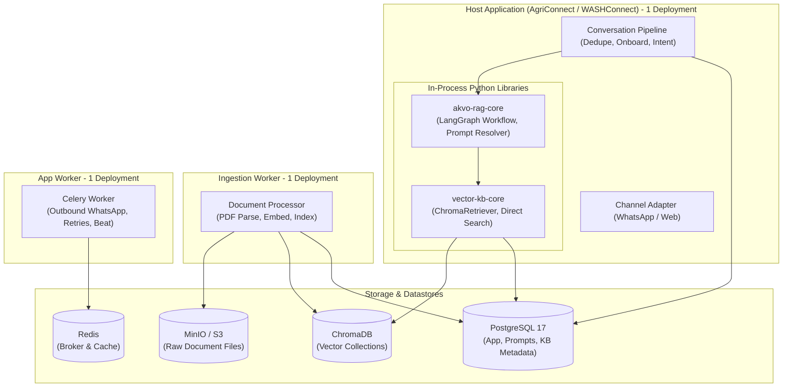
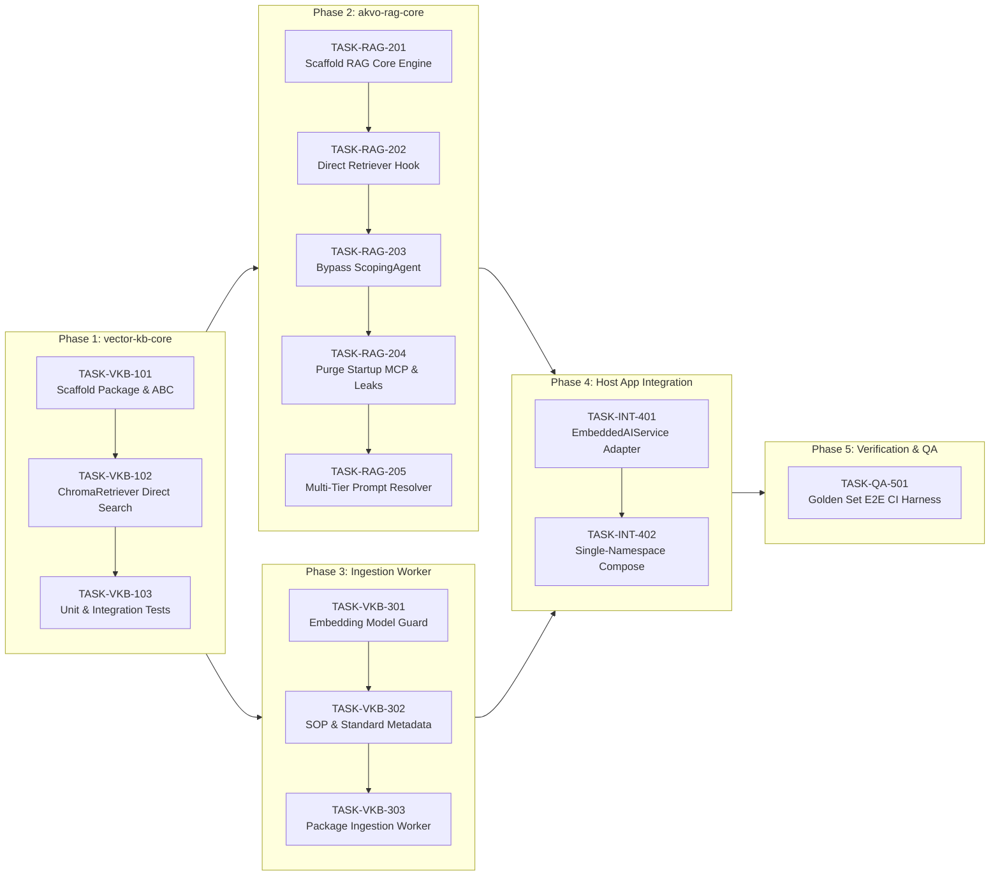

# Option C RAG Platform Architecture Refactoring Plan

**Document Title:** Option C (Self-Contained In-Process Application) Task Breakdown & Engineering Plan  
**Target Systems:** `akvo-rag` + `vector-knowledge-base-mcp-server` + Host Application Integration  
**Author / Roles:** Architect (Winston), Scrum Master (Bob), Developer (Amelia)  
**Audience:** Product Managers (Joy), Technical Project Managers (Deden), Developers (Iwan & Galih), DevOps (Anjar)  
**Date:** 2026-08-31  

---

## 1. Executive Summary

Based on the RAG Platform Architecture Review, the platform is transitioning from a distributed multi-namespace microservice topology (~20 workloads across 3 namespaces, 3 databases on 2 engines, multiple Celery queues, and HTTP streaming MCP hops) to **Option C (Self-Contained In-Process Application)**.

### Core Objectives
1. **In-Process RAG & Retrieval:** Package `akvo-rag` and `vector-knowledge-base-mcp-server` into modular Python libraries (`akvo-rag-core` and `vector-kb-core`) imported directly by the host application (AgriConnect / WASHConnect).
2. **Eliminate Redundant LLM Latency:** Bypass `ScopingAgent` in the default RAG graph path to save 1.5s–3.0s and 1 model call per question.
3. **Eliminate Network Fragility:** Delete FastMCP streaming HTTP client, startup blocking discovery, and unauthenticated/unretried HTTP callbacks.
4. **Single-Namespace Topology:** Reduce per-partner workloads from ~20 to **3 application workloads** (Web App, App Worker, Ingestion Worker) backed by 1 PostgreSQL database, 1 Redis broker, ChromaDB, and MinIO.

---

## 2. Target Architecture Blueprint (Option C)



---

## 3. High-Level Phase Workflow



---

## 4. Master Task Matrix & Vibe-Coding Estimates

| Task Code | Title | Target Repo | Vibe-Coding Est. | Traditional Est. |
|---|---|---|---|---|
| **Phase 1** | **`vector-kb-core` Package Extraction** | | | |
| `TASK-VKB-101` | Scaffold `vector-kb-core` Package & Typed Interfaces | `vector-kb-mcp-server` | **2.0 hrs** | 1.5 days |
| `TASK-VKB-102` | Implement `ChromaRetriever` with Direct Similarity Search | `vector-kb-mcp-server` | **3.0 hrs** | 2.5 days |
| `TASK-VKB-103` | Unit & Integration Test Suite for `vector-kb-core` | `vector-kb-mcp-server` | **1.5 hrs** | 1.0 day |
| **Phase 2** | **`akvo-rag-core` Package Extraction** | | | |
| `TASK-RAG-201` | Scaffold `akvo-rag-core` Package & LangGraph Engine | `akvo-rag` | **3.5 hrs** | 3.0 days |
| `TASK-RAG-202` | Direct `Retriever` Integration (Delete FastMCP Client) | `akvo-rag` | **2.5 hrs** | 2.0 days |
| `TASK-RAG-203` | Short-Circuit `ScopingAgent` on Default RAG Path | `akvo-rag` | **1.5 hrs** | 1.0 day |
| `TASK-RAG-204` | Remove Startup MCP Discovery & Purge Domain Leaks | `akvo-rag` | **1.5 hrs** | 1.0 day |
| `TASK-RAG-205` | Multi-Tier Prompt Resolver (Base + Sector + Partner) | `akvo-rag` | **2.5 hrs** | 2.0 days |
| **Phase 3** | **Ingestion Worker & Metadata Hardening** | | | |
| `TASK-VKB-301` | Add KB Embedding Model & Dimension Guard | `vector-kb-mcp-server` | **2.5 hrs** | 1.5 days |
| `TASK-VKB-302` | Enrich Documents & Chunks with Public-Sector Metadata | `vector-kb-mcp-server` | **2.0 hrs** | 1.5 days |
| `TASK-VKB-303` | Package Dedicated Background Ingestion Worker | `vector-kb-mcp-server` | **2.0 hrs** | 1.0 day |
| **Phase 4** | **Host App In-Process Integration (Option C)** | | | |
| `TASK-INT-401` | Build `EmbeddedAIService` Adapter in Host Application | Host App (`agriconnect`) | **3.5 hrs** | 2.5 days |
| `TASK-INT-402` | Unified Single-Namespace Docker Compose & Manifests | Host / Compose | **2.0 hrs** | 1.5 days |
| **Phase 5** | **Verification, QA & Golden Set Harness** | | | |
| `TASK-QA-501` | Automated Golden Dataset Evaluation & CI Pipeline | `akvo-rag` | **3.0 hrs** | 2.0 days |
| **TOTAL** | | | **33.0 hrs (~4 days)** | **23.0 days** |

---

## 5. Detailed Task Specifications

### Phase 1: `vector-kb-core` Package Extraction & Direct Retrieval

#### `TASK-VKB-101`: Scaffold `vector-kb-core` Package & Typed Interfaces
* **Repository:** `vector-knowledge-base-mcp-server`
* **Vibe-Coding Estimate:** `2.0 hours`
* **Detailed Description:**  
  Extract the retrieval interfaces into an installable Python package `vector-kb-core`. This package will be directly imported by `akvo-rag-core` and host applications. Define strongly typed immutable data structures (`RetrievedChunk`, `QueryFilter`, `KBMetadata`) and the abstract base class `Retriever`.
* **Key Touchpoints:**
  - `packages/vector-kb-core/pyproject.toml` `[NEW]`
  - `packages/vector-kb-core/src/vector_kb_core/__init__.py` `[NEW]`
  - `packages/vector-kb-core/src/vector_kb_core/models.py` `[NEW]`
  - `packages/vector-kb-core/src/vector_kb_core/retriever.py` `[NEW]`
* **Code Specification:**
  ```python
  # packages/vector-kb-core/src/vector_kb_core/models.py
  from dataclasses import dataclass, field
  from typing import Any, Dict, Optional

  @dataclass(frozen=True)
  class RetrievedChunk:
      content: str
      kb_id: int
      document_id: str
      chunk_id: str
      score: float
      metadata: Dict[str, Any] = field(default_factory=dict)

  # packages/vector-kb-core/src/vector_kb_core/retriever.py
  from abc import ABC, abstractmethod
  from typing import List, Optional
  from .models import RetrievedChunk

  class Retriever(ABC):
      @abstractmethod
      async def search(
          self,
          query: str,
          kb_ids: List[int],
          top_k: int = 4,
          score_threshold: Optional[float] = None,
          trace_id: Optional[str] = None
      ) -> List[RetrievedChunk]:
          """Search across multiple knowledge base collections directly in-memory."""
          pass
  ```
* **User Acceptance Criteria (UAC):**
  - Developers can install `vector-kb-core` as an independent Python library via `pip install -e ./packages/vector-kb-core`.
* **Technical Acceptance Criteria (TAC):**
  - `pyproject.toml` configures package build using `hatchling` or `setuptools`.
  - Zero dependencies on FastAPI, Celery, or FastMCP in `vector-kb-core`.
  - Type annotations pass `mypy --strict`.

---

#### `TASK-VKB-102`: Implement `ChromaRetriever` with Direct Similarity Search
* **Repository:** `vector-knowledge-base-mcp-server`
* **Vibe-Coding Estimate:** `3.0 hours`
* **Detailed Description:**  
  Implement the concrete `ChromaRetriever` class inside `vector-kb-core`. It connects directly to ChromaDB, computes query embeddings using OpenAI or local embedding providers, queries multiple `kb_{id}` collections concurrently via `asyncio.gather`, merges and sorts the chunks by similarity score, and returns structured `List[RetrievedChunk]`. Base64 encoding/decoding is completely eliminated.
* **Key Touchpoints:**
  - `packages/vector-kb-core/src/vector_kb_core/chroma_retriever.py` `[NEW]`
  - `packages/vector-kb-core/src/vector_kb_core/embeddings.py` `[NEW]`
  - `main/app/services/kb_query_service.py` `[MODIFY]` (delegate to `ChromaRetriever`)
* **Code Specification:**
  ```python
  # packages/vector-kb-core/src/vector_kb_core/chroma_retriever.py
  import asyncio
  from typing import List, Optional
  import chromadb
  from openai import AsyncOpenAI
  from .models import RetrievedChunk
  from .retriever import Retriever

  class ChromaRetriever(Retriever):
      def __init__(self, chroma_client: chromadb.ClientAPI, openai_client: AsyncOpenAI, embedding_model: str = "text-embedding-3-small"):
          self.chroma = chroma_client
          self.openai = openai_client
          self.embedding_model = embedding_model

      async def search(self, query: str, kb_ids: List[int], top_k: int = 4, score_threshold: Optional[float] = None, trace_id: Optional[str] = None) -> List[RetrievedChunk]:
          emb_resp = await self.openai.embeddings.create(input=[query], model=self.embedding_model)
          query_vector = emb_resp.data[0].embedding

          tasks = [self._search_kb(kb_id, query_vector, top_k) for kb_id in kb_ids]
          results_nested = await asyncio.gather(*tasks, return_exceptions=True)
          
          all_chunks: List[RetrievedChunk] = []
          for r in results_nested:
              if isinstance(r, list):
                  all_chunks.extend(r)
          
          all_chunks.sort(key=lambda x: x.score, reverse=True)
          if score_threshold is not None:
              all_chunks = [c for c in all_chunks if c.score >= score_threshold]
          return all_chunks[:top_k]
  ```
* **User Acceptance Criteria (UAC):**
  - Vector similarity search latency drops to sub-100ms since no HTTP hops or serialization cycles occur.
* **Technical Acceptance Criteria (TAC):**
  - Directly queries Chroma collections named `kb_{id}`.
  - Returns raw Python dataclasses with chunk content, metadata, score, and document IDs.
  - Gracefully handles missing collections without raising uncaught exceptions.

---

#### `TASK-VKB-103`: Unit & Integration Test Suite for `vector-kb-core`
* **Repository:** `vector-knowledge-base-mcp-server`
* **Vibe-Coding Estimate:** `1.5 hours`
* **Detailed Description:**  
  Implement unit tests with `pytest` and mock ChromaDB/OpenAI clients to verify similarity score sorting, multi-KB result merging, top-k truncation, and threshold filtering.
* **Key Touchpoints:**
  - `packages/vector-kb-core/tests/test_retriever.py` `[NEW]`
  - `packages/vector-kb-core/tests/conftest.py` `[NEW]`
* **User Acceptance Criteria (UAC):**
  - CI pipeline can test the retrieval library in isolation without starting external services.
* **Technical Acceptance Criteria (TAC):**
  - Test suite passes with `pytest packages/vector-kb-core/tests`.
  - Covers edge cases: empty KB list, non-existent collection, empty search results, single KB vs multi-KB queries.

---

### Phase 2: `akvo-rag-core` Package Extraction & Workflow Streamlining

#### `TASK-RAG-201`: Scaffold `akvo-rag-core` Package & LangGraph Engine
* **Repository:** `akvo-rag`
* **Vibe-Coding Estimate:** `3.5 hours`
* **Detailed Description:**  
  Extract the LangGraph state machine from `backend/app/services/query_answering_workflow.py` into a reusable library `akvo-rag-core`. The workflow engine is stateless and accepts history, prompt configuration, and a `Retriever` instance per invocation.
* **Key Touchpoints:**
  - `packages/akvo-rag-core/pyproject.toml` `[NEW]`
  - `packages/akvo-rag-core/src/akvo_rag_core/models.py` `[NEW]`
  - `packages/akvo-rag-core/src/akvo_rag_core/engine.py` `[NEW]`
  - `packages/akvo-rag-core/src/akvo_rag_core/workflow.py` `[NEW]`
* **Code Specification:**
  ```python
  # packages/akvo-rag-core/src/akvo_rag_core/models.py
  from pydantic import BaseModel, Field
  from typing import List, Optional

  class ChatMessage(BaseModel):
      role: str # "user" | "assistant" | "system"
      content: str

  class RAGRequest(BaseModel):
      query: str
      history: List[ChatMessage] = Field(default_factory=list)
      kb_ids: List[int]
      system_prompt: Optional[str] = None
      top_k: int = 4
      trace_id: Optional[str] = None

  class Citation(BaseModel):
      source: str
      page: Optional[int] = None
      section: Optional[str] = None
      authority: Optional[str] = None
      version: Optional[str] = None
      text_snippet: str

  class RAGResponse(BaseModel):
      answer: str
      citations: List[Citation] = Field(default_factory=list)
      intent: str
      trace_id: Optional[str] = None
      grounded: bool
  ```
* **User Acceptance Criteria (UAC):**
  - Host applications can execute a complete RAG question-answering workflow in-process via `await rag_engine.run(request)`.
* **Technical Acceptance Criteria (TAC):**
  - `akvo-rag-core` does not import or depend on SQLAlchemy, MySQL, Celery, or RabbitMQ.
  - Preserves citation discipline (citations stripped if `[citation:N]` is omitted by the LLM).

---

#### `TASK-RAG-202`: Direct `Retriever` Integration (Delete FastMCP Client)
* **Repository:** `akvo-rag`
* **Vibe-Coding Estimate:** `2.5 hours`
* **Detailed Description:**  
  Replace `FastMCPClientService` and streaming HTTP transport with direct in-memory calls to `vector_kb_core.Retriever` inside the `retrieve_node` of the LangGraph state machine. Delete obsolete network transport code.
* **Key Touchpoints:**
  - `packages/akvo-rag-core/src/akvo_rag_core/nodes/retrieve.py` `[NEW]`
  - `backend/mcp_clients/fastmcp_client_service.py` `[DELETE]`
  - `backend/mcp_clients/rest_mcp_client_service.py` `[DELETE]`
* **Code Specification:**
  ```python
  # packages/akvo-rag-core/src/akvo_rag_core/nodes/retrieve.py
  from typing import Any, Dict
  from vector_kb_core import Retriever

  async def retrieve_node(state: Dict[str, Any], retriever: Retriever) -> Dict[str, Any]:
      query = state.get("contextualized_query") or state["query"]
      kb_ids = state.get("kb_ids", [])
      top_k = state.get("top_k", 4)
      trace_id = state.get("trace_id")

      chunks = await retriever.search(query=query, kb_ids=kb_ids, top_k=top_k, trace_id=trace_id)
      return {"retrieved_chunks": chunks, "context_text": "\n\n".join(c.content for c in chunks)}
  ```
* **User Acceptance Criteria (UAC):**
  - Completely eliminates network timeouts and streaming HTTP disconnections during retrieval.
* **Technical Acceptance Criteria (TAC):**
  - FastMCP transport code is deleted.
  - Direct retrieval node passes `List[RetrievedChunk]` straight to the generation node.

---

#### `TASK-RAG-203`: Short-Circuit `ScopingAgent` on Default RAG Path
* **Repository:** `akvo-rag`
* **Vibe-Coding Estimate:** `1.5 hours`
* **Detailed Description:**  
  In the legacy system, `ScopingAgent` made an extra LLM round trip to pick a tool, which failed schema validation and fell back to `query_knowledge_base`. This task removes `scoping_node` from the primary path and transitions directly from `contextualize` to `retrieve`.
* **Key Touchpoints:**
  - `packages/akvo-rag-core/src/akvo_rag_core/workflow.py` `[MODIFY]`
  - `backend/app/services/scoping_agent.py` `[MODIFY]` (bypass for standard path)
* **Code Specification:**
  ```python
  # Workflow transitions in LangGraph:
  workflow.add_node("classify_intent", classify_intent_node)
  workflow.add_node("contextualize", contextualize_node)
  workflow.add_node("retrieve", retrieve_node)
  workflow.add_node("generate", generate_node)
  workflow.add_node("filter_citations", filter_citations_node)

  workflow.add_edge("classify_intent", "contextualize")
  workflow.add_edge("contextualize", "retrieve")
  workflow.add_edge("retrieve", "generate")
  workflow.add_edge("generate", "filter_citations")
  ```
* **User Acceptance Criteria (UAC):**
  - Question response time drops by 1.5s–3.0s, and OpenAI cost per query decreases by 1 model call (~25%).
* **Technical Acceptance Criteria (TAC):**
  - Trace logs confirm that answering a knowledge question executes exactly 3 LLM calls (Intent -> Contextualize -> Generate) instead of 4.

---

#### `TASK-RAG-204`: Remove Startup MCP Discovery & Purge Domain Leaks
* **Repository:** `akvo-rag`
* **Vibe-Coding Estimate:** `1.5 hours`
* **Detailed Description:**  
  1. Remove blocking startup network discovery scripts from `backend/entrypoint.sh` and delete `mcp_discovery_manager.py` and `mcp_discovery.json`.
  2. In `chat_job_service.py:52`, remove `if role in ["farmer", "extension_officer"]: role = "user"` and replace with generic role mapping.
  3. Remove crop-calendar tool definitions from `mcp_servers_config.py`.
* **Key Touchpoints:**
  - `backend/entrypoint.sh` `[MODIFY]`
  - `backend/mcp_clients/mcp_discovery_manager.py` `[DELETE]`
  - `backend/app/services/chat_job_service.py` `[MODIFY]`
  - `backend/mcp_clients/mcp_servers_config.py` `[MODIFY]`
* **User Acceptance Criteria (UAC):**
  - Container starts in under 2 seconds.
  - Platform codebase contains zero agricultural assumptions and is ready for WASH, Health, etc.
* **Technical Acceptance Criteria (TAC):**
  - Grep for `farmer`, `crop_calendar`, `extension_officer` in `akvo-rag/backend/app/` returns zero hits.

---

#### `TASK-RAG-205`: Multi-Tier Prompt Resolver (Base + Sector + Partner)
* **Repository:** `akvo-rag`
* **Vibe-Coding Estimate:** `2.5 hours`
* **Detailed Description:**  
  Implement a flexible `PromptResolver` that composes system prompts using a three-tier hierarchy:
  1. **Platform Base:** Citation discipline, ungrounded fallback format (`"Information is missing on..."`).
  2. **Sector Base:** Sector-wide rules (e.g. WASH public-health safety gates or Agronomy advice guidelines).
  3. **Partner Overlay:** Partner name, tone, custom local instructions.
* **Key Touchpoints:**
  - `packages/akvo-rag-core/src/akvo_rag_core/prompts.py` `[NEW]`
  - `backend/app/services/prompt_service.py` `[MODIFY]`
* **Code Specification:**
  ```python
  # packages/akvo-rag-core/src/akvo_rag_core/prompts.py
  class PromptResolver:
      DEFAULT_BASE = (
          "You are a helpful and truthful assistant. Answer based ONLY on the provided context.\n"
          "Strictly use [citation:N] markers. If context lacks sufficient information, "
          "state clearly 'Information is missing on...' and do not speculate."
      )

      @classmethod
      def compose(cls, system_base: Optional[str] = None, sector_overlay: Optional[str] = None, partner_overlay: Optional[str] = None) -> str:
          parts = [system_base or cls.DEFAULT_BASE]
          if sector_overlay:
              parts.append(f"### Sector Guidelines:\n{sector_overlay}")
          if partner_overlay:
              parts.append(f"### Partner Specific Rules:\n{partner_overlay}")
          return "\n\n".join(parts)
  ```
* **User Acceptance Criteria (UAC):**
  - Sector modules (e.g. WASH) can inject strict safety constraints without changing platform code.
* **Technical Acceptance Criteria (TAC):**
  - Unit tests verify prompt hierarchy, variable interpolation, and strict citation rule preservation.

---

### Phase 3: Dedicated Ingestion Worker & Metadata Hardening

#### `TASK-VKB-301`: Add KB Embedding Model & Dimension Guard
* **Repository:** `vector-knowledge-base-mcp-server`
* **Vibe-Coding Estimate:** `2.5 hours`
* **Detailed Description:**  
  Add `embedding_model` (e.g. `text-embedding-3-small`) and `dimension` (e.g. `1536`) to the `knowledge_bases` database table and Chroma metadata. Enforce model verification at retrieval and ingestion time.
* **Key Touchpoints:**
  - `main/app/models/knowledge_base.py` `[MODIFY]`
  - `alembic/versions/xxxx_add_embedding_metadata.py` `[NEW]`
  - `packages/vector-kb-core/src/vector_kb_core/chroma_retriever.py` `[MODIFY]`
* **User Acceptance Criteria (UAC):**
  - Admins are alerted immediately if an environment variable change mismatches existing vector collections.
* **Technical Acceptance Criteria (TAC):**
  - Attempting to query or ingest with an incompatible embedding model raises `EmbeddingModelMismatchError` before running vector search.

---

#### `TASK-VKB-302`: Enrich Documents & Chunks with Public-Sector Metadata
* **Repository:** `vector-knowledge-base-mcp-server`
* **Vibe-Coding Estimate:** `2.0 hours`
* **Detailed Description:**  
  Extend `Document` and `DocumentChunk` models to capture public-sector metadata (`doc_version`, `issuing_authority`, `effective_date`, `doc_type`, `jurisdiction`). Ensure chunk metadata stores these fields in ChromaDB and returns them in `RetrievedChunk.metadata`.
* **Key Touchpoints:**
  - `main/app/models/document.py` `[MODIFY]`
  - `main/app/models/document_chunk.py` `[MODIFY]`
  - `main/app/services/document_processor.py` `[MODIFY]`
* **User Acceptance Criteria (UAC):**
  - Citations cite specific manual editions and authorities (e.g. *"National Water Standard 2024, Page 12, Ministry of Water"*).
* **Technical Acceptance Criteria (TAC):**
  - Document chunker attaches document-level metadata to all Chroma chunk records.
  - Search results include metadata in citation objects.

---

#### `TASK-VKB-303`: Package Dedicated Background Ingestion Worker
* **Repository:** `vector-knowledge-base-mcp-server`
* **Vibe-Coding Estimate:** `2.0 hours`
* **Detailed Description:**  
  Package the document processing service into a lightweight background Celery worker container (`ingestion-worker`). It listens to the Redis ingestion queue, processes uploaded files, writes raw files to MinIO, and creates Chroma vectors using `vector-kb-core`.
* **Key Touchpoints:**
  - `Dockerfile.ingestion` `[NEW]`
  - `main/app/tasks/document_tasks.py` `[MODIFY]`
  - `docker-compose.yml` `[MODIFY]`
* **User Acceptance Criteria (UAC):**
  - Large document uploads process asynchronously in the background without degrading conversational query latency.
* **Technical Acceptance Criteria (TAC):**
  - Ingestion worker runs independently as a Docker container consuming from Redis.

---

### Phase 4: Host App In-Process Integration (`Option C`) & Packaging

#### `TASK-INT-401`: Build `EmbeddedAIService` Adapter in Host Application
* **Repository:** Host App (`agriconnect` / new `washconnect`)
* **Vibe-Coding Estimate:** `3.5 hours`
* **Detailed Description:**  
  Create `EmbeddedAIService` in the host application that satisfies the AI service interface by importing `akvo-rag-core` and `vector-kb-core` directly. In `routers/whatsapp.py`, replace the legacy `create_chat_job(...)` HTTP callback pattern with direct in-memory invocation.
* **Key Touchpoints:**
  - `host_app/backend/services/embedded_ai_service.py` `[NEW]`
  - `host_app/backend/routers/whatsapp.py` `[MODIFY]`
  - `host_app/backend/requirements.txt` `[MODIFY]`
* **Code Specification:**
  ```python
  # host_app/backend/services/embedded_ai_service.py
  from akvo_rag_core import RAGWorkflowEngine, RAGRequest, ChatMessage, PromptResolver
  from vector_kb_core import ChromaRetriever
  import chromadb
  from openai import AsyncOpenAI

  class EmbeddedAIService:
      def __init__(self, chroma_url: str, openai_api_key: str):
          self.chroma_client = chromadb.HttpClient(host=chroma_url.split(":")[0], port=int(chroma_url.split(":")[1]))
          self.openai_client = AsyncOpenAI(api_key=openai_api_key)
          self.retriever = ChromaRetriever(self.chroma_client, self.openai_client)
          self.engine = RAGWorkflowEngine(openai_client=self.openai_client)

      async def answer_question(self, query: str, history: list, kb_ids: list, sector_overlay: str = "", partner_overlay: str = "", trace_id: str = None) -> dict:
          system_prompt = PromptResolver.compose(sector_overlay=sector_overlay, partner_overlay=partner_overlay)
          req = RAGRequest(
              query=query,
              history=[ChatMessage(role=m["role"], content=m["content"]) for m in history],
              kb_ids=kb_ids,
              system_prompt=system_prompt,
              trace_id=trace_id
          )
          result = await self.engine.run(request=req, retriever=self.retriever)
          return {
              "answer": result.answer,
              "citations": [c.model_dump() for c in result.citations],
              "grounded": result.grounded
          }
  ```
* **User Acceptance Criteria (UAC):**
  - Incoming WhatsApp questions are answered directly in the conversation pipeline.
  - The 3 silent answer-loss paths (failed background callbacks) are eliminated.
* **Technical Acceptance Criteria (TAC):**
  - Zero network calls to `POST /api/jobs` or `POST /api/callback/ai`.
  - Question answering executes end-to-end in-memory.

---

#### `TASK-INT-402`: Unified Single-Namespace Docker Compose Setup
* **Repository:** Root Workspace / Manifests
* **Vibe-Coding Estimate:** `2.0 hours`
* **Detailed Description:**  
  Provide a single, streamlined `docker-compose.yml` for local development and single-namespace Kubernetes manifests containing:
  1. `app`: Host app (FastAPI + embedded RAG/Vector packages + Next.js frontend)
  2. `app-worker`: Host Celery worker (outbound WhatsApp messages and retries)
  3. `ingestion-worker`: Background document processing worker
  4. Datastores: PostgreSQL, Redis, ChromaDB, MinIO.
* **Key Touchpoints:**
  - `docker-compose.yml` `[MODIFY]`
  - `k8s/partner-namespace/` `[NEW]`
* **User Acceptance Criteria (UAC):**
  - Developers can run the entire platform locally with `docker compose up -d`.
* **Technical Acceptance Criteria (TAC):**
  - Stack boots in under 15 seconds.
  - Zero MySQL and zero RabbitMQ containers required.

---

### Phase 5: Verification, Quality Assurance & Evaluation

#### `TASK-QA-501`: Automated Golden Dataset Evaluation & CI Pipeline
* **Repository:** `akvo-rag/backend/RAG_evaluation`
* **Vibe-Coding Estimate:** `3.0 hours`
* **Detailed Description:**  
  Run the automated headless evaluation harness (`headless_evaluation.py`) against a golden test dataset of Agronomy and WASH scenarios to benchmark accuracy, faithfulness, citation precision, and latency.
* **Key Touchpoints:**
  - `backend/RAG_evaluation/headless_evaluation.py` `[MODIFY]`
  - `backend/RAG_evaluation/datasets/golden_benchmark.json` `[NEW]`
  - `.github/workflows/rag_evaluation.yml` `[NEW]`
* **User Acceptance Criteria (UAC):**
  - Automated CI verifies that Option C produces identical or superior answer quality compared to the legacy distributed architecture.
* **Technical Acceptance Criteria (TAC):**
  - Faithfulness score $\ge 0.85$.
  - Answer relevancy score $\ge 0.85$.
  - Zero ungrounded answers produce fake citations.
  - Automated test runs in Docker via `./dev.sh exec backend python -m RAG_evaluation.run_evaluation`.
