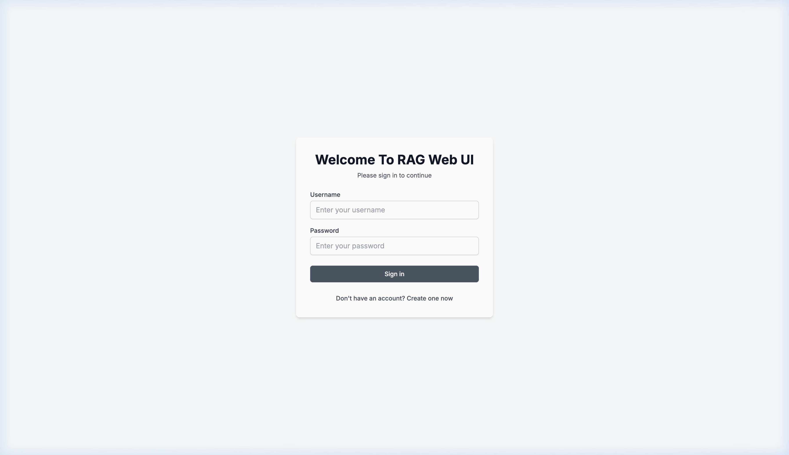
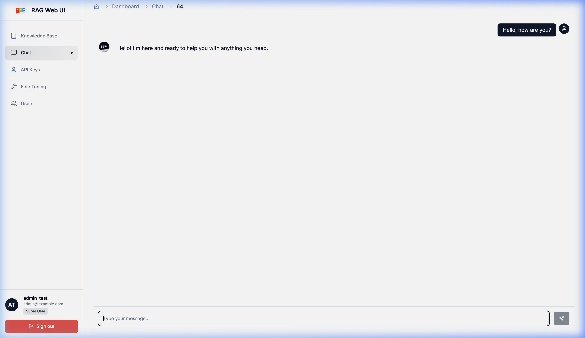

# User Guide: Akvo RAG

Welcome to Akvo RAG! This guide will help you get started with the chat interface and understanding how to interact with your knowledge bases.

## 1. Getting Started

### 1.1 Logging In
Access the Akvo RAG portal via your browser. You will be greeted with the login screen.

Enter your credentials to access the main dashboard.

## 2. The Chat Interface

The Chat Dashboard is where most of your interaction happens.

### 2.1 Starting a Conversation
1. **Select a Knowledge Base**: Before chatting, you usually need to select or ensure a Knowledge Base (KB) is active.
2. **Ask a Question**: Type your query in the input box at the bottom.
3. **Real-time Responses**: The system will stream the answer back to you.

### 2.2 Understanding Citations
Akvo RAG provides transparent answers. Every response generated from your documents will include citations.
- **Reference Links**: Clickable links or numbers that point to the specific document and chunk used.
- **Source Preview**: Hovering over or clicking a citation allows you to see the exact text the AI referenced from your files.

## 3. Query Modes
- **ASQ (Agent-Scoped Query)**: The system automatically picks the best Knowledge Base for your question.
- **USQ (User-Scoped Query)**: You manually select which set of documents the AI should look at.
