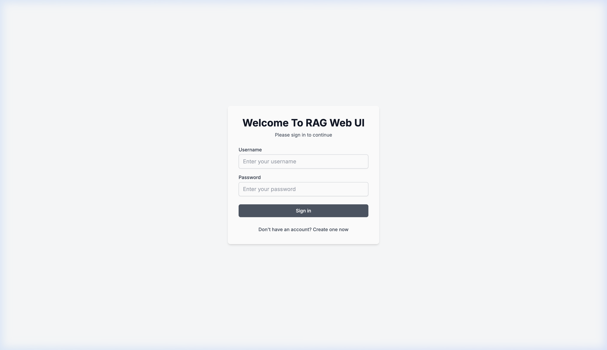

# User Guide: Akvo RAG

Welcome to Akvo RAG! This guide will help you get started with the chat interface and understanding how to interact with your knowledge bases.

## 1. Getting Started

### 1.1 Logging In
Access the Akvo RAG portal via your browser. You will be greeted with the login screen.

Enter your credentials to access the main dashboard.

## 2. The Chat Interface

The Chat Dashboard provides a 2-pane AI workspace designed for seamless document exploration and querying.

### 2.1 Starting a Conversation
1. **Select Knowledge Bases (Step 1)**: By default, chats search across **All Knowledge Bases**. You can optionally narrow the scope to specific knowledge bases using the searchable multi-select dropdown.
2. **Ask a Question or Select a Starter Prompt (Step 2)**: Type your question into the composer or click one of the pre-configured starter prompt chips (e.g., *Summarize Documents*, *Key Findings Analysis*, *Identify Action Items*).
3. **Session-Locked Retrieval**: Once a chat session starts, the knowledge base scope is locked in the thread header to ensure consistent context and retrieval precision.
4. **Persistent History Sidebar**: Past conversations are organized in the left collapsible sidebar, sorted with the newest threads at the top and searchable in real time.

### 2.2 Citations & Slide-Over Drawer
Akvo RAG guarantees transparent, vector-grounded responses with full citation traceability:
- **Clickable Citation Badges**: Numbered badges (e.g., `[1]`, `[2]`) appear directly inside the generated answer.
- **Slide-Over Citation Drawer**: Clicking any citation badge opens a right-side panel without interrupting your conversation view.
- **Source Inspection**: The drawer displays the source document filename, similarity match percentage, page number, chunk index, and the exact retrieved context excerpt passed to the LLM synthesis engine.

## 3. Query Modes
- **ASQ (Agent-Scoped Query)**: The system automatically picks the best Knowledge Base for your question.
- **USQ (User-Scoped Query)**: You manually select which set of documents the AI should look at.
